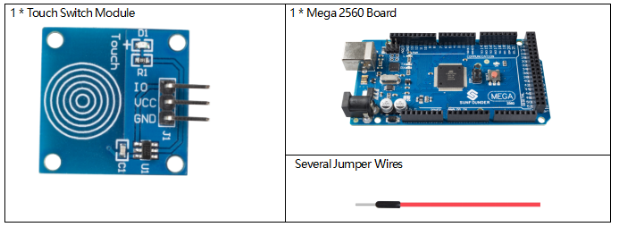
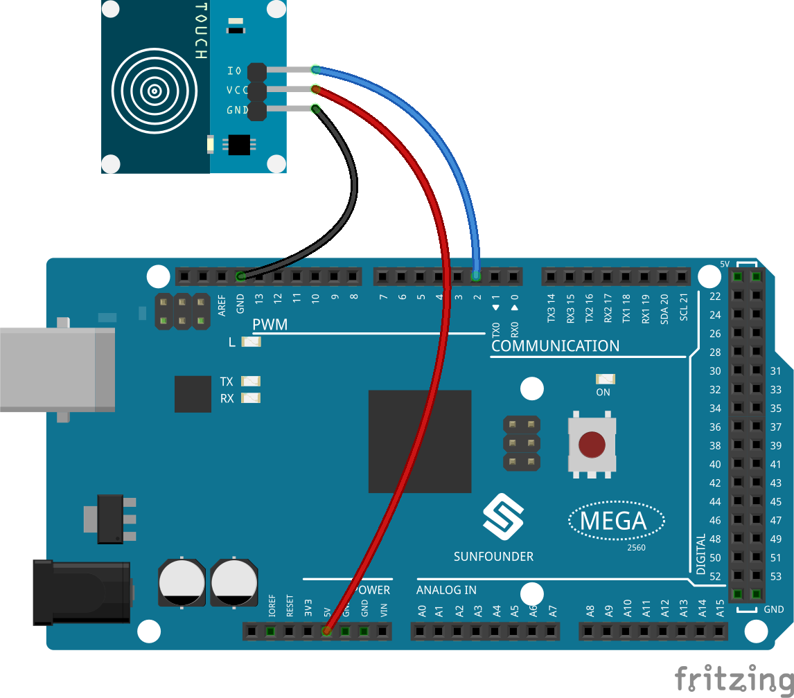
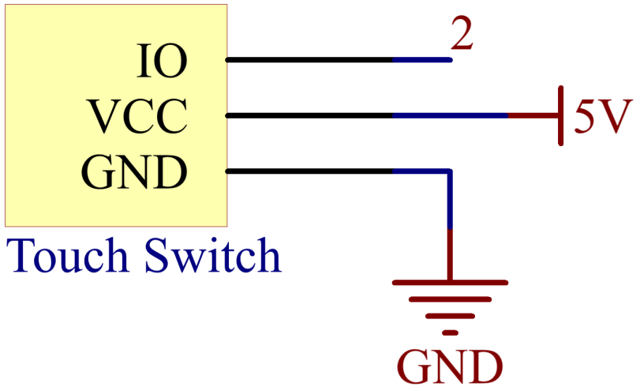
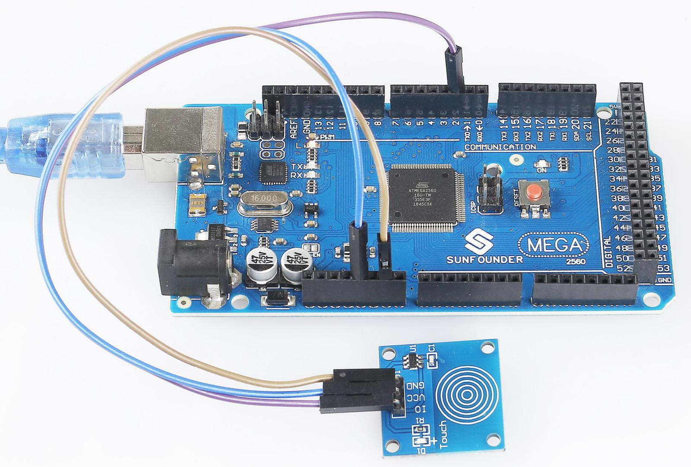

.. note:: 

    Hola, bienvenido a la Comunidad de Entusiastas de SunFounder Raspberry Pi, Arduino y ESP32 en Facebook. Profundiza en Raspberry Pi, Arduino y ESP32 junto a otros entusiastas.

    **¿Por qué unirte?**

    - **Soporte experto**: Resuelve problemas postventa y desafíos técnicos con la ayuda de nuestra comunidad y equipo.
    - **Aprende y comparte**: Intercambia consejos y tutoriales para mejorar tus habilidades.
    - **Avances exclusivos**: Obtén acceso anticipado a nuevos anuncios de productos y adelantos.
    - **Descuentos especiales**: Disfruta de descuentos exclusivos en nuestros productos más recientes.
    - **Promociones festivas y sorteos**: Participa en sorteos y promociones especiales de temporada.

    👉 ¿Listo para explorar y crear con nosotros? Haz clic en [|link_sf_facebook|] y únete hoy mismo.

.. _ar_touch:

2.18 Módulo de Interruptor Táctil
=====================================

Resumen
----------

En esta lección, aprenderás sobre el módulo de interruptor táctil. Este 
puede reemplazar los interruptores tradicionales con ventajas como operación 
conveniente, agradable al tacto, control preciso y mínimo desgaste mecánico.

Componentes necesarios
-------------------------

* :ref:`cpn_mega2560`
* :ref:`cpn_wires`
* :ref:`cpn_touch`

Circuito Fritzing
----------------------

En este ejemplo, el pin 2 se utiliza para leer la señal del módulo de 
interruptor táctil.

Diagrama esquemático
------------------------

Código
---------

.. note::

    * Puedes abrir el archivo ``2.18_touchSwitch.ino`` en la ruta ``sunfounder_vincent_kit_for_arduino\code\2.18_touchSwitch`` directamente.
    * O copiar este código en el IDE de Arduino.

.. raw:: html

    <iframe src=https://create.arduino.cc/editor/sunfounder01/526e6ca9-a140-48cc-9cfb-d8bc7f32cf6d/preview?embed style="height:510px;width:100%;margin:10px 0" frameborder=0></iframe>

Después de subir el código a la placa Mega2560, podrás ver las lecturas de 
los pines en el monitor serial.

Cuando tu dedo toca el módulo de interruptor táctil, el monitor serial mostrará 「1」; 
cuando retiras el dedo, se mostrará 「0」. Para una explicación detallada del 
código, consulta :ref:`ar_digital_read`.

Imagen del fenómeno
----------------------

