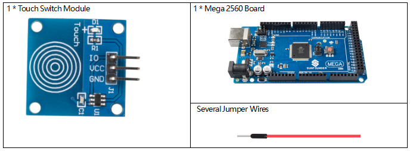
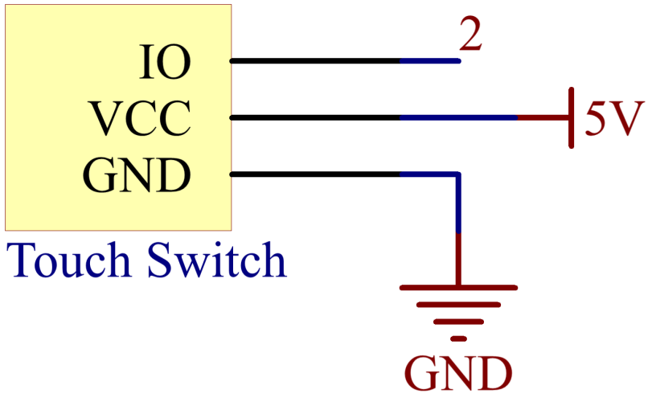

.. _ar_touch:

2.18 Touch Switch Module
========================

Overview
------------

In this lesson, you will learn about touch switch module. It can replace
the traditional kinds of switch with these advantages: convenient
operation, fine touch sense, precise control and least mechanical wear.

Components Required
------------------------

* :ref:`cpn_mega2560`
* :ref:`cpn_wires`
* :ref:`cpn_touch`

Fritzing Circuit
--------------------

In this example, pin 2 is used to read the signal of Touch Switch
Module.

.. image:: img/image170.png
   :align: center

Schematic Diagram
-----------------------

Code
---------

.. note::

    * You can open the file ``2.18_touchSwitch.ino`` under the path of ``sunfounder_vincent_kit_for_arduino\code\2.18_touchSwitch`` directly.
    * Or copy this code into Arduino IDE 1/2.
    * Or click **Open Code** to open it in `Web Editor <https://docs.arduino.cc/cloud/web-editor/tutorials/getting-started/getting-started-web-editor>`_.
    * Then :ref:`ar_upload_code` to the board.

.. raw:: html

    <iframe src=https://create.arduino.cc/editor/sunfounder01/526e6ca9-a140-48cc-9cfb-d8bc7f32cf6d/preview?embed style="height:510px;width:100%;margin:10px 0" frameborder=0></iframe>

Uploaded the codes to the Mega2560 board, you can see the readings of
pins displaying on the serial monitor.

When your finger tip touches the Touch switch module, 「1」will be
displayed on the serial monitor; and when you remove your finger, 「0」
will be be displayed. As for the detailed code explanation, you need to
turn to :ref:`digital_read`.

Phenomenon Picture
------------------------

.. image:: img/image172.jpeg
   :height: 4.74167in