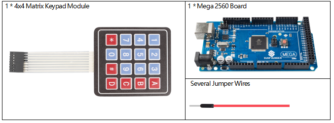
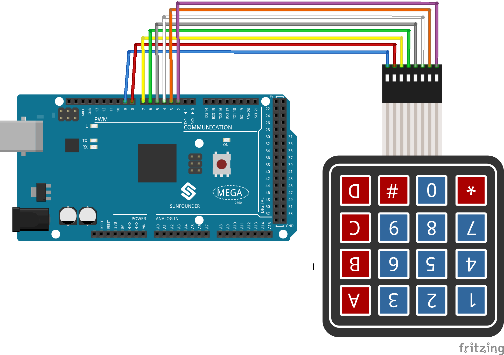
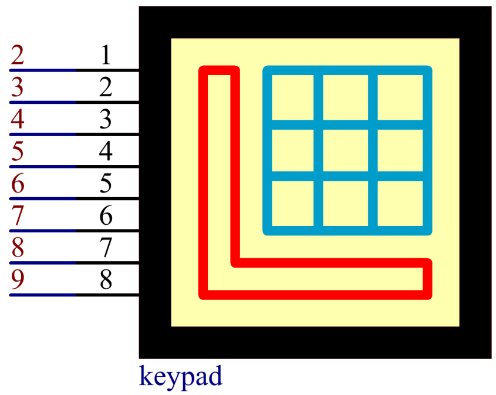
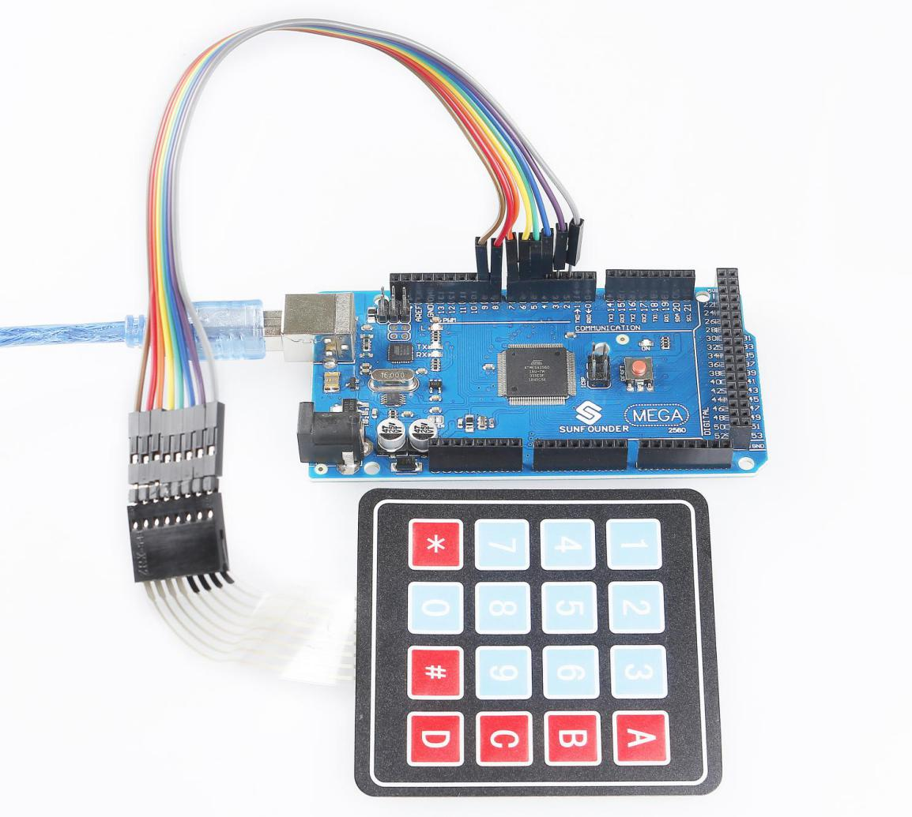

.. note::

    Ciao, benvenuto nella community di appassionati di SunFounder Raspberry Pi & Arduino & ESP32 su Facebook! Esplora più a fondo Raspberry Pi, Arduino ed ESP32 con altri appassionati.

    **Perché unirsi a noi?**

    - **Supporto esperto**: Risolvi problemi post-vendita e sfide tecniche grazie al supporto della nostra community e del nostro team.
    - **Impara e condividi**: Scambia suggerimenti e tutorial per migliorare le tue competenze.
    - **Anteprime esclusive**: Ottieni l'accesso anticipato a nuovi annunci di prodotto e anteprime.
    - **Sconti speciali**: Approfitta di sconti esclusivi sui nostri prodotti più recenti.
    - **Promozioni festive e omaggi**: Partecipa a giveaway e promozioni durante le festività.

    👉 Pronto a esplorare e creare con noi? Clicca [|link_sf_facebook|] e unisciti oggi stesso!

.. _ar_keypad:

2.19 Tastierino Numerico
==========================

Panoramica
-------------

In questa lezione imparerai a utilizzare un tastierino numerico. Questo 
dispositivo può essere applicato a una varietà di dispositivi, inclusi 
telefoni cellulari, fax, forni a microonde e molti altri. È comunemente 
usato per l'input utente.

Componenti necessari
----------------------

* :ref:`cpn_mega2560`
* :ref:`cpn_wires`
* :ref:`cpn_keypad`

Circuito Fritzing
--------------------

In questo esempio, estendiamo i pin da 1 a 8 del tastierino per collegarli 
ai pin digitali da 2 a 9.

Schema elettrico
-------------------

Codice
---------

.. note::

    * Puoi aprire direttamente il file ``2.19_keypad.ino`` nella cartella ``sunfounder_vincent_kit_for_arduino\code\2.19_keypad``.
    * Qui viene utilizzata la libreria ``Keypad``, che puoi installare tramite il **Library Manager**.

        .. image:: img/lib_keypad.png
            :align: center

.. raw:: html

    <iframe src=https://create.arduino.cc/editor/sunfounder01/89e21aab-1a9c-4bf7-a0b3-a9b80f4d2d96/preview?embed style="height:510px;width:100%;margin:10px 0" frameborder=0></iframe>

Dopo aver caricato il codice sulla scheda Mega2560, nel monitor seriale 
potrai vedere il valore del tasto attualmente premuto sul tastierino numerico.

Analisi del codice
----------------------

Utilizzando la libreria Keypad.h, puoi facilmente utilizzare il tastierino numerico.

.. code-block:: arduino

    #include <Keypad.h> 

**Funzioni della libreria:**

.. code-block:: arduino

    Keypad(char *userKeymap, byte *row, byte *col, byte numRows, byte numCols)

Inizializza la mappa interna dei tasti con la configurazione fornita da userKeymap.

* ``userKeymap``: I simboli sui tasti del tastierino.
* ``row, col``: Configurazione dei pin.
* ``numRows, numCols``: Dimensioni del tastierino.

.. code-block:: arduino

    char getKey()

Restituisce il tasto premuto, se presente. Questa funzione è non bloccante.

Immagine del risultato
---------------------------

