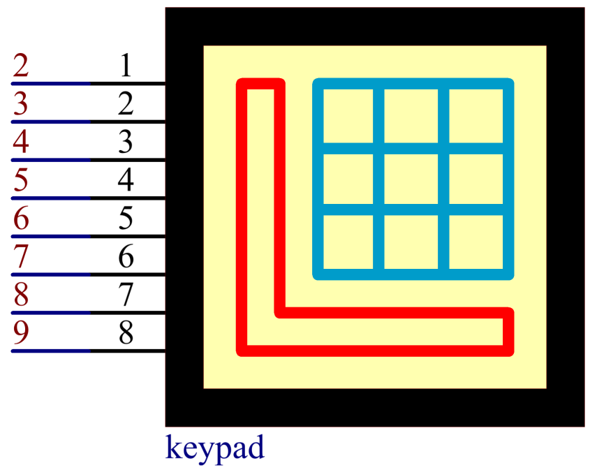

.. _ar_keypad:

2.19 Tastatur
=================

Überblick
-------------

In dieser Lektion lernen Sie, die Tastatur zu verwenden. Die Tastatur kann in verschiedene Arten von Geräten eingesetzt werden, darunter Mobiltelefone, Faxgeräte, Mikrowellenherde usw. Es wird häufig in Benutzereingaben verwendet.

Erforderliche Komponenten
-----------------------------

* :ref:`cpn_mega2560`
* :ref:`cpn_wires`
* :ref:`cpn_keypad`

Fritzing-Schaltung
-----------------------

In diesem Beispiel erweitern wir die Pins 1~8 des Keypads, um sie mit den digitalen Pins 2~9 zu verbinden.

Schematische Darstellung
-------------------------------

Code
-----------

.. note::

    * Sie können die Datei ``2.19_keypad.ino`` unter dem Pfad ``sunfounder_vincent_kit_for_arduino\code\2.19_keypad`` direkt öffnen.
    * Oder kopieren Sie diesen Code in Arduino IDE 1/2.
    * Laden Sie dann :ref:`ar_upload_code` auf das Board hoch.
    * Bitte stellen Sie sicher, dass Sie die Bibliothek ``Keypad`` hinzugefügt haben, detaillierte Anleitungen finden Sie unter :ref:`add_libraries_ar`.

.. raw:: html

    <iframe src=https://create.arduino.cc/editor/sunfounder01/89e21aab-1a9c-4bf7-a0b3-a9b80f4d2d96/preview?embed style="height:510px;width:100%;margin:10px 0" frameborder=0></iframe>

Nachdem Sie die Codes auf die Mega2560-Karte hochgeladen haben, können Sie auf dem seriellen Monitor den Wert der aktuell auf dem Keypad gedrückten Taste sehen.

Code-Analyse
-------------------

Durch Aufrufen der Keypad.h-Bibliothek können Sie Keypad einfach verwenden.

.. code-block:: arduino

    #include <Keypad.h> 

**Bibliotheksfunktionen：**

.. code-block:: arduino

    Keypad(char *userKeymap, byte *row, byte *col, byte numRows, byte numCols)

Initialisiert die interne Tastaturbelegung so, dass sie gleich der ``userKeymap`` ist.

* ``userKeymap``: Die Symbole auf den Tasten der Keypads.
* ``row, col``: Pin-Konfiguration.
* ``numRows, numCols``: Tastaturgrößen.

.. code-block:: arduino

    char getKey()

Gibt die gedrückte Taste zurück, falls vorhanden. Diese Funktion ist nicht blockierend.

Phänomen Bild
------------------------

