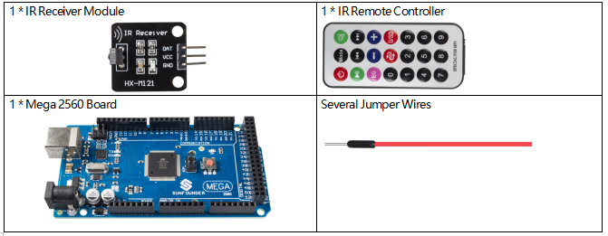
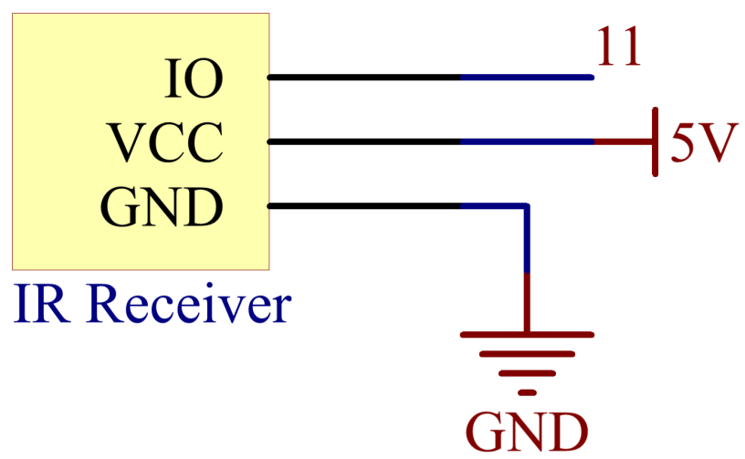
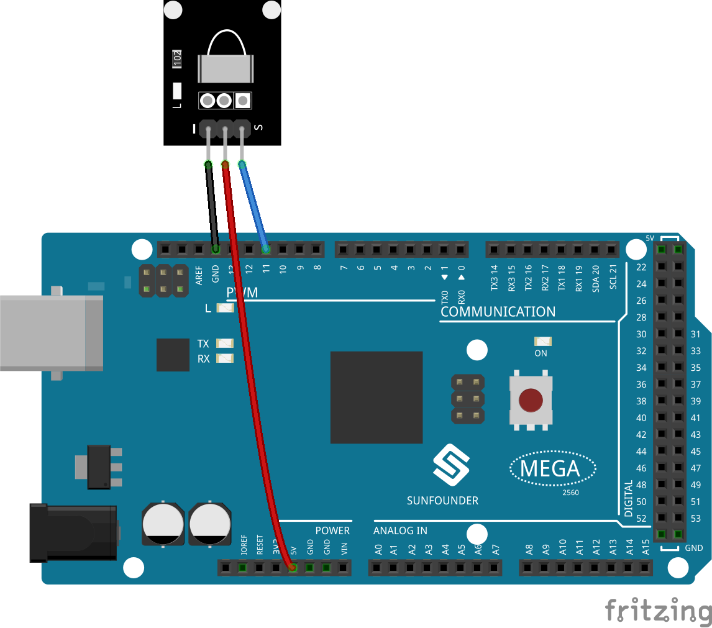

.. _ar_receive:

2.20 IR Receiver Module
=========================

Overview
-------------

In this lesson, you will learn to use IR Receiver Module. IR Receiver is
a component with photocell that is tuned to receive to infrared light.
It is almost always used for remote control detection - every TV and DVD
player has one of these in the front to receive for the IR signal from
the clicker. Inside the remote control is a matching IR LED, which emits
IR pulses to tell the TV to turn on, off or change channels.

Components Required
--------------------------

* :ref:`cpn_mega2560`
* :ref:`cpn_wires`
* :ref:`cpn_receive`

Schematic Diagram
---------------------------

Fritzing Circuit
---------------------

In this example, we wire up the left pin (-) of IR Receiver Module to
GND, the middle pin to 5V, and the right pin (S) to pin 11.

Code
----------

.. note::

    * You can open the file ``2.20_irReceiver.ino`` under the path of ``sunfounder_vincent_kit_for_arduino\code\2.20_irReceiver`` directly.
    * The ``IRremote`` library is used here, you can install it from the **Library Manager**.

        .. image:: img/lib_irremote.png
            :align: center

.. raw:: html

    <iframe src=https://create.arduino.cc/editor/sunfounder01/b1f07663-c4d5-4b0e-b0a7-b10ff96ee2ee/preview?embed style="height:510px;width:100%;margin:10px 0" frameborder=0></iframe>

After uploading the codes to the Mega2560 board, you can see that the
current value of the pressed button of IR Remote Controller displays on
the serial monitor.

Code Analysis
---------------------

This code is designed to work with an infrared (IR) remote control using the ``IRremote`` library. Here's the breakdown:

#. Include Libraries: This includes the IRremote library, which provides functions to work with IR remote controls.

    .. code-block:: arduino

        #include <IRremote.h>

#. Defines the Arduino pin to which the IR sensor's signal pin is connected and declares a variable to store the last decoded IR value.

    .. code-block:: arduino

        const int IR_RECEIVE_PIN = 11;  // Define the pin number for the IR Sensor
        String lastDecodedValue = "";  // Variable to store the last decoded value

#. Initializes serial communication at a baud rate of 9600. Initializes the IR receiver on the specified pin (``IR_RECEIVE_PIN``) and enables LED feedback (if applicable).

    .. code-block:: arduino

        void setup() {
            Serial.begin(9600);                                     // Start serial communication at 9600 baud rate
            IrReceiver.begin(IR_RECEIVE_PIN, ENABLE_LED_FEEDBACK);  // Start the IR receiver
        }

#. The loop runs continuously to process incoming IR remote signals.

    .. code-block:: arduino

        void loop() {
            if (IrReceiver.decode()) {
                String decodedValue = decodeKeyValue(IrReceiver.decodedIRData.command);
                if (decodedValue != "ERROR" && decodedValue != lastDecodedValue) {
                    Serial.println(decodedValue);
                    lastDecodedValue = decodedValue;  // Update the last decoded value
                }
                IrReceiver.resume();  // Enable receiving of the next value
            }
        }
    
    * Checks if an IR signal is received and successfully decoded.
    * Decodes the IR command and stores it in ``decodedValue`` using a custom ``decodeKeyValue()`` function.
    * Checks if the decoded value is not an error and is different from the last decoded value.
    * Prints the decoded IR value to the serial monitor.
    * Updates the ``lastDecodedValue`` with the new decoded value.
    * Resumes IR signal reception for the next signal.

Phenomenon Picture
------------------------

.. image:: img/image184.jpeg
   :align: center