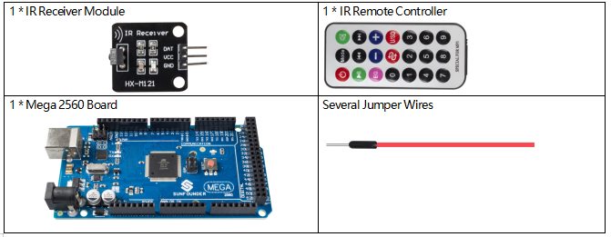
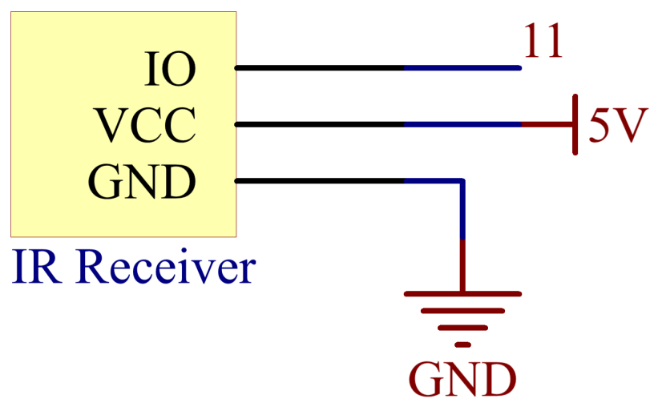
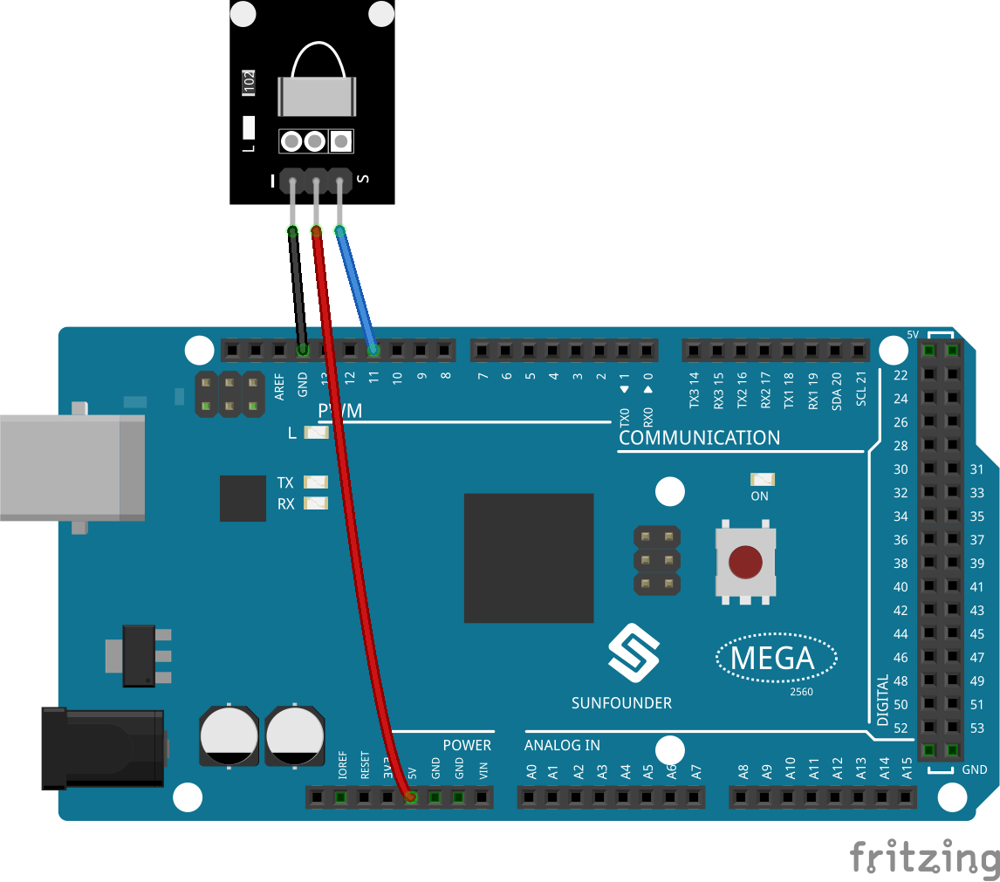

.. note:: 

    Bonjour et bienvenue dans la communauté des passionnés de Raspberry Pi, Arduino et ESP32 de SunFounder sur Facebook ! Plongez dans l’univers du Raspberry Pi, d'Arduino et de l'ESP32 avec d'autres passionnés.

    **Pourquoi nous rejoindre ?**

    - **Support d'experts** : Résolvez vos problèmes après-vente et relevez vos défis techniques avec l'aide de notre communauté et de notre équipe.
    - **Apprendre et partager** : Échangez des astuces et tutoriels pour enrichir vos compétences.
    - **Aperçus exclusifs** : Bénéficiez d'un accès anticipé aux nouvelles annonces de produits et à des aperçus exclusifs.
    - **Réductions spéciales** : Profitez de réductions exclusives sur nos derniers produits.
    - **Promotions festives et concours** : Participez à des concours et promotions lors des fêtes.

    👉 Prêt à explorer et créer avec nous ? Cliquez sur [|link_sf_facebook|] et rejoignez-nous dès aujourd'hui !

.. _ar_receive:

2.20 Module Récepteur IR
============================

Aperçu
--------

Dans cette leçon, vous allez apprendre à utiliser un module récepteur IR. 
Le récepteur IR est un composant doté d'une photocellule, spécialement 
conçu pour capter la lumière infrarouge. Il est presque toujours utilisé 
pour la détection des télécommandes – chaque télévision et lecteur DVD en 
possède un à l'avant pour capter le signal infrarouge de la télécommande. 
À l'intérieur de cette dernière se trouve une LED IR qui émet des impulsions 
infrarouges pour dire à la télévision de s’allumer, s’éteindre ou changer de 
chaîne.

Composants Requis
--------------------

* :ref:`cpn_mega2560`
* :ref:`cpn_wires`
* :ref:`cpn_receive`

Schéma de Connexion
---------------------

Circuit Fritzing
----------------

Dans cet exemple, nous connectons la broche gauche (-) du module récepteur 
IR à la masse (GND), la broche centrale au 5V, et la broche droite (S) à la 
broche 11.

Code
-------

.. note::

    * Vous pouvez ouvrir directement le fichier ``2.20_irReceiver.ino`` situé dans le chemin ``sunfounder_vincent_kit_for_arduino\code\2.20_irReceiver``.
    * La bibliothèque ``IRremote`` est utilisée ici ; vous pouvez l'installer depuis le **Gestionnaire de Bibliothèques**.

        .. image:: img/lib_irremote.png
            :align: center

.. raw:: html

    <iframe src=https://create.arduino.cc/editor/sunfounder01/b1f07663-c4d5-4b0e-b0a7-b10ff96ee2ee/preview?embed style="height:510px;width:100%;margin:10px 0" frameborder=0></iframe>

Après avoir téléversé le code sur la carte Mega2560, vous pourrez voir la valeur 
de la touche actuellement pressée sur la télécommande IR affichée dans le moniteur série.

Analyse du Code
------------------

Ce code est conçu pour fonctionner avec une télécommande infrarouge en utilisant la bibliothèque ``IRremote``. Voici les détails :

#. Inclure les Bibliothèques : Ce code inclut la bibliothèque IRremote, qui fournit les fonctions pour travailler avec des télécommandes infrarouges.

    .. code-block:: arduino

        #include <IRremote.h>

#. Définir la broche Arduino à laquelle le signal du capteur IR est connecté et déclarer une variable pour stocker la dernière valeur IR décodée.

    .. code-block:: arduino

        const int IR_RECEIVE_PIN = 11;  // Définir la broche du capteur IR
        String lastDecodedValue = "";   // Variable pour stocker la dernière valeur décodée

#. Initialiser la communication série à un débit de 9600 bauds. Initialiser le récepteur IR sur la broche spécifiée (``IR_RECEIVE_PIN``) et activer le retour LED (si applicable).

    .. code-block:: arduino

        void setup() {
            Serial.begin(9600);                                     // Démarrer la communication série à 9600 bauds
            IrReceiver.begin(IR_RECEIVE_PIN, ENABLE_LED_FEEDBACK);  // Démarrer le récepteur IR
        }

#. La boucle s'exécute en continu pour traiter les signaux entrants de la télécommande IR.

    .. code-block:: arduino

        void loop() {
            if (IrReceiver.decode()) {
                String decodedValue = decodeKeyValue(IrReceiver.decodedIRData.command);
                if (decodedValue != "ERROR" && decodedValue != lastDecodedValue) {
                    Serial.println(decodedValue);
                    lastDecodedValue = decodedValue;  // Mettre à jour la dernière valeur décodée
                }
                IrReceiver.resume();  // Réactiver la réception pour le prochain signal
            }
        }
    
    * Vérifie si un signal IR est reçu et correctement décodé.
    * Décode la commande IR et la stocke dans ``decodedValue`` en utilisant une fonction personnalisée ``decodeKeyValue()``.
    * Vérifie si la valeur décodée est correcte et différente de la dernière valeur décodée.
    * Affiche la valeur IR décodée sur le moniteur série.
    * Met à jour ``lastDecodedValue`` avec la nouvelle valeur décodée.
    * Réactive la réception des signaux IR pour le signal suivant.

Illustration du Phénomène
-----------------------------

.. image:: img/image184.jpeg
   :align: center