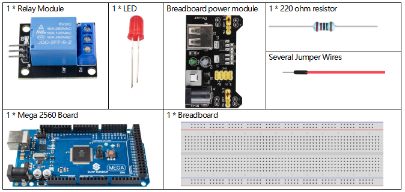
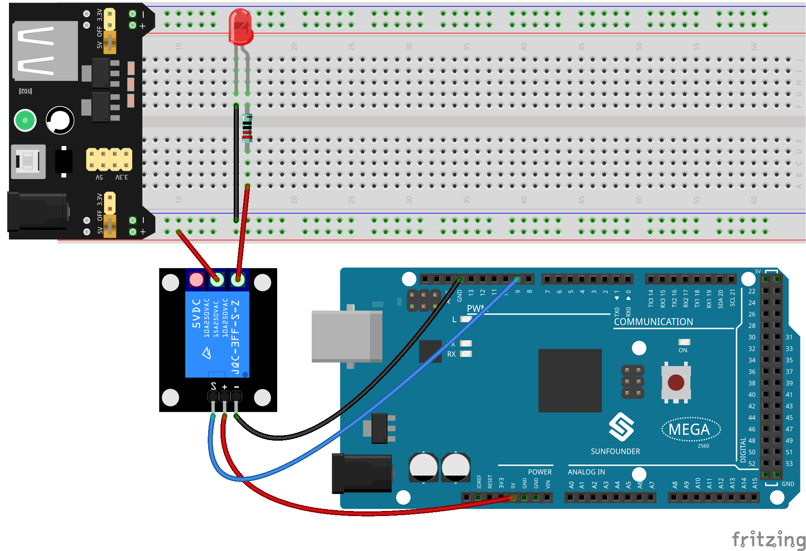
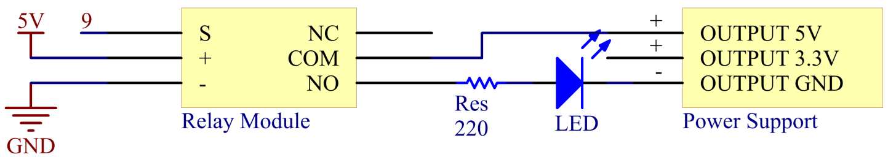
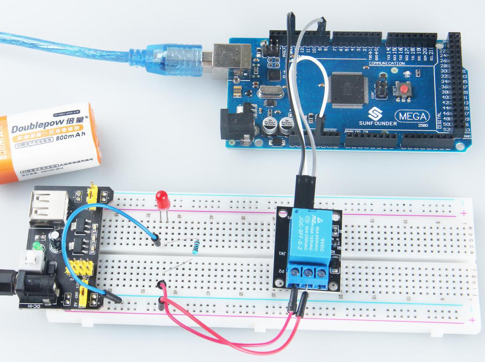

.. _ar_relay:

2.21 Relaismodul
====================

Überblick
--------------

In dieser Lektion lernen Sie das Relaismodul kennen.

Erforderliche Komponenten
------------------------------

* :ref:`cpn_mega2560`
* :ref:`cpn_breadboard`
* :ref:`cpn_wires`
* :ref:`cpn_led`
* :ref:`cpn_resistor`
* :ref:`cpn_power_module`

Fritzing-Schaltung
----------------------

In diesem Beispiel verwenden wir das Stromversorgungsmodul, um die Last mit Strom zu versorgen. Verwenden Sie die LED als Beispiel.

Schematische Darstellung
---------------------------

Code
----------

.. note::

    * Sie können die Datei ``2.21_relayModule.ino`` unter dem Pfad ``sunfounder_vincent_kit_for_arduino\code\2.21_relayModule`` direkt öffnen.
    * Oder kopieren Sie diesen Code in Arduino IDE. 

.. raw:: html

    <iframe src=https://create.arduino.cc/editor/sunfounder01/d6c0bde7-aa46-4900-9c11-0ca56832a962/preview?embed style="height:510px;width:100%;margin:10px 0" frameborder=0></iframe>

Sobald die Codes auf die Mega2560-Platine hochgeladen wurden, können Sie sehen, dass das Relaismodul das Schließen und Unterbrechen des externen Stromkreises steuert, was seinen Arbeitszustand eine Sekunde lang ändert. Für eine detaillierte Code-Erklärung siehe :ref:`ar_digital_write`.

Phänomen Bild
--------------------------

