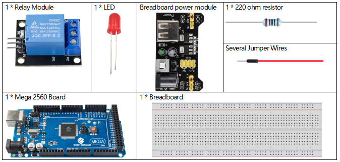
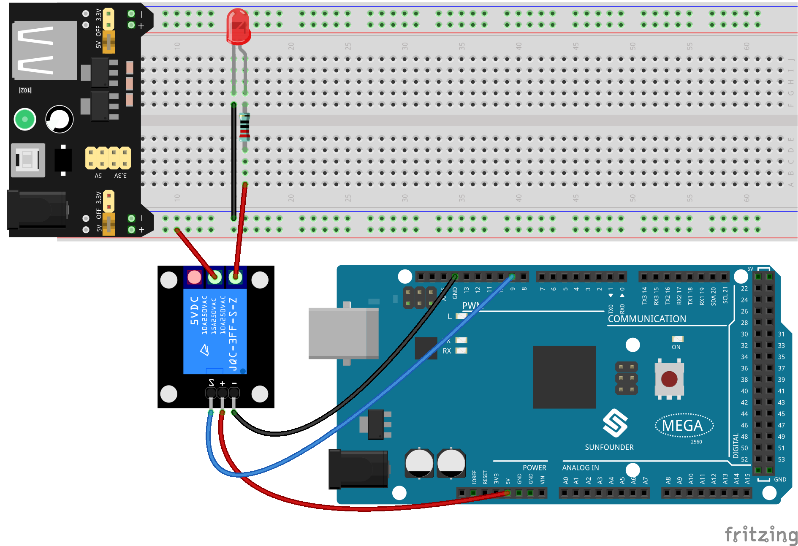
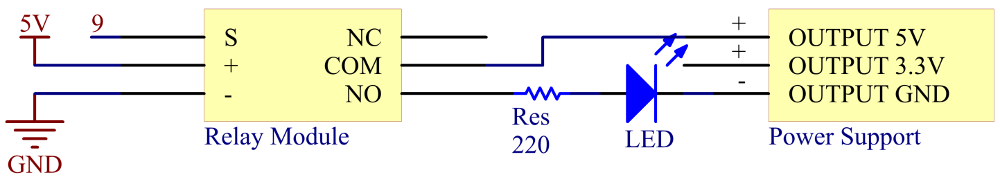
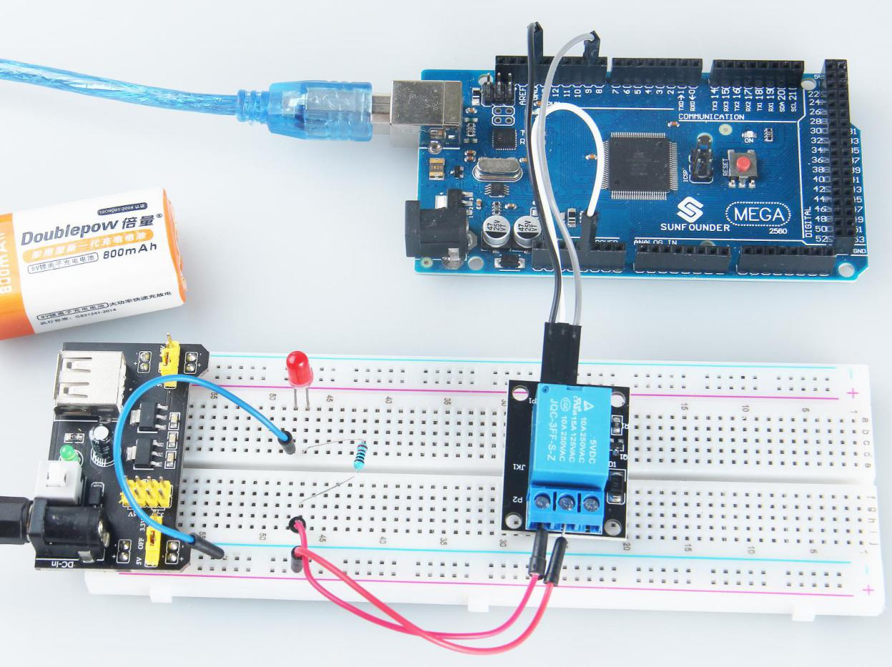

.. note:: 

    Bonjour et bienvenue dans la communauté SunFounder des passionnés de Raspberry Pi, Arduino et ESP32 sur Facebook ! Plongez au cœur des possibilités offertes par Raspberry Pi, Arduino et ESP32 en compagnie d'autres passionnés.

    **Pourquoi nous rejoindre ?**

    - **Support d'experts** : Résolvez vos problèmes après-vente et surmontez vos défis techniques grâce au soutien de notre communauté et de notre équipe.
    - **Apprendre et partager** : Échangez des astuces et des tutoriels pour perfectionner vos compétences.
    - **Aperçus exclusifs** : Bénéficiez d'un accès anticipé aux annonces de nouveaux produits et aux avant-premières.
    - **Réductions spéciales** : Profitez de réductions exclusives sur nos derniers produits.
    - **Promotions festives et concours** : Participez à des concours et à des promotions spéciales pendant les fêtes.

    👉 Prêt à explorer et créer avec nous ? Cliquez sur [|link_sf_facebook|] et rejoignez-nous dès aujourd'hui !

.. _ar_relay:

2.21 Module Relais
====================

Aperçu
--------

Dans cette leçon, vous allez découvrir le module relais.

Composants Requis
-------------------

* :ref:`cpn_mega2560`
* :ref:`cpn_breadboard`
* :ref:`cpn_wires`
* :ref:`cpn_led`
* :ref:`cpn_resistor`
* :ref:`cpn_power_module`

Circuit Fritzing
------------------

Dans cet exemple, nous utilisons le module d'alimentation pour alimenter la 
charge, avec une LED en guise d'exemple.

Schéma de Connexion
---------------------

Code
------

.. note::

    * Vous pouvez ouvrir directement le fichier ``2.21_relayModule.ino`` situé dans le dossier ``sunfounder_vincent_kit_for_arduino\code\2.21_relayModule``.
    * Ou bien copier ce code dans l'IDE Arduino.

.. raw:: html

    <iframe src=https://create.arduino.cc/editor/sunfounder01/d6c0bde7-aa46-4900-9c11-0ca56832a962/preview?embed style="height:510px;width:100%;margin:10px 0" frameborder=0></iframe>

Une fois le code téléversé sur la carte Mega2560, vous verrez le 
module relais contrôler la fermeture et l'ouverture du circuit externe, 
modifiant son état de fonctionnement toutes les secondes. Pour une explication 
détaillée du code, reportez-vous à :ref:`ar_digital_write`.

Illustration du Phénomène
----------------------------

