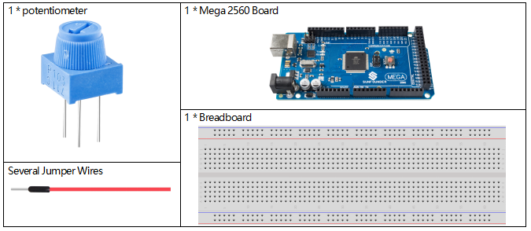
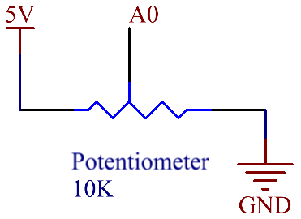
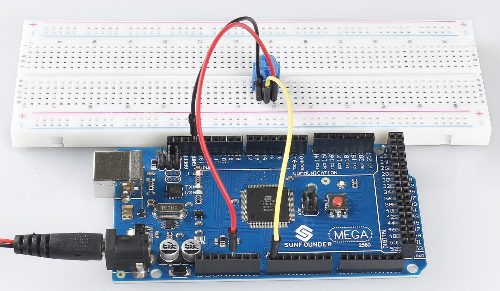

.. _ar_potentiometer:

2.22 Potentiometer
===================

Überblick
-------------

In dieser Lektion lernen Sie Potentiometer kennen. Das Potentiometer ist eine Widerstandskomponente mit 3 Anschlüssen und sein Widerstandswert kann entsprechend einer regelmäßigen Variation eingestellt werden.

Erforderliche Komponenten
--------------------------------

* :ref:`cpn_mega2560`
* :ref:`cpn_breadboard`
* :ref:`cpn_wires`
* :ref:`cpn_potentiometer`

Fritzing-Schaltung
----------------------

.. image:: img/Part_two_22_Circuit.png
    :align: center

In diesem Beispiel verwenden wir den analogen Pin (A0), um den Wert des Potentiometers zu lesen. Durch Drehen der Achse des Potentiometers können Sie die Widerstandsverteilung zwischen diesen drei Pins ändern, indem Sie die Spannung am mittleren Pin ändern. Wenn der Widerstand zwischen dem mittleren und einem äußeren Pin, der mit 5 V verbunden ist, nahe Null ist (und der Widerstand zwischen dem mittleren und dem anderen äußeren Pin nahe 10 kΩ liegt), liegt die Spannung am mittleren Pin nahe bei 5 V. Der umgekehrte Vorgang (der Widerstand zwischen dem mittleren und einem äußeren Pin, der mit 5 V verbunden ist, liegt nahe bei 10 kΩ) führt dazu, dass die Spannung am mittleren Pin nahe 0 V liegt.

Schematische Darstellung
-------------------------

Code
---------

.. note::

    * Sie können die Datei ``2.22_potentiometer.ino`` unter dem Pfad ``sunfounder_vincent_kit_for_arduino\code\2.22_potentiometer`` direkt öffnen.
    * Oder kopieren Sie diesen Code in Arduino IDE. 

.. raw:: html

    <iframe src=https://create.arduino.cc/editor/sunfounder01/bb9cc78f-0156-4c3e-8603-742e71ef692d/preview?embed style="height:510px;width:100%;margin:10px 0" frameborder=0></iframe>

Nachdem Sie die Codes auf das Mega2560-Board hochgeladen haben, können Sie den seriellen Monitor öffnen, um den Lesewert des Pins zu sehen. Beim Drehen der Achse des Potentiometers druckt der Monitor der seriellen Schnittstelle den Wert 「0」~「1023」. Für eine detaillierte Erklärung des Codes siehe :ref:`ar_analog_read`.

Phänomen Bild
------------------------

