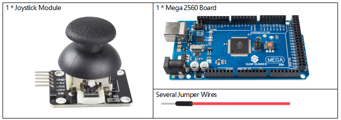
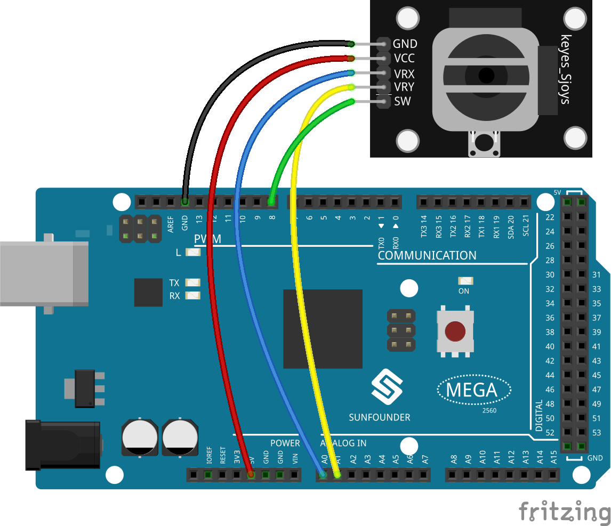
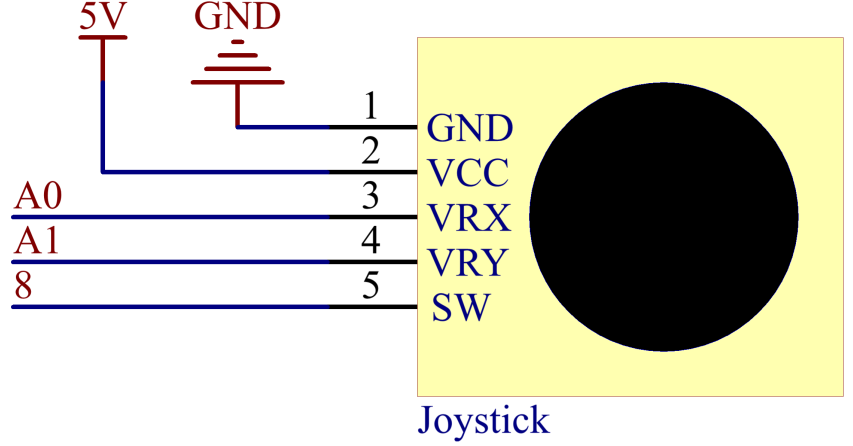
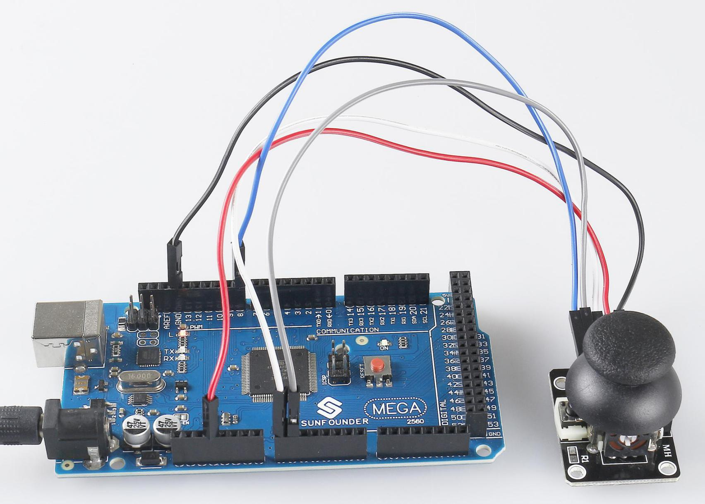

.. _ar_joystick:

2.23 Joystick Module
======================

Overview
--------------

In this lesson, you will learn something about Joystick. The basic idea
of a joystick is to translate the movement of a stick into electronic
information that a computer can process. It can be applied to work as
the controller of devices, such as robot.

Components Required
---------------------------

* :ref:`cpn_mega2560`
* :ref:`cpn_wires`
* :ref:`cpn_joystick`

Fritzing Circuit
---------------------

In this example, we get the GND of the Joystick extended to connect with
GND, VCC with 5V, VRX with pin A0. After that, we make VRY connect with
pin A1, SW connect with pin 8.

Schematic Diagram
------------------------

Code
------------

.. note::

    * You can open the file ``2.23_joystick.ino`` under the path of ``sunfounder_vincent_kit_for_arduino\code\2.23_joystick`` directly.
    * Or copy this code into Arduino IDE 1/2.
    * Or click **Open Code** to open it in `Web Editor <https://docs.arduino.cc/cloud/web-editor/tutorials/getting-started/getting-started-web-editor>`_.
    * Then :ref:`ar_upload_code` to the board.

.. raw:: html

    <iframe src=https://create.arduino.cc/editor/sunfounder01/0ce9568f-02d7-4b7e-8aef-975abb24566b/preview?embed style="height:510px;width:100%;margin:10px 0" frameborder=0></iframe>

Uploaded the codes to the Mega2560 board, you can open the serial
monitor to see readings on the X-axis and Y-axis of Joystick, as well as
the button status of Z-axis. The values of the X-axis and Y-axis are the
analog values, which vary within the range「0」~「1023」. The Z-axis
shows numerical value and the state is either 「1」 or 「0」. Refer to
:ref:`ar_analog_read` and :ref:`ar_digital_read` to check the code
explanation.

Phenomenon Picture
-------------------------

