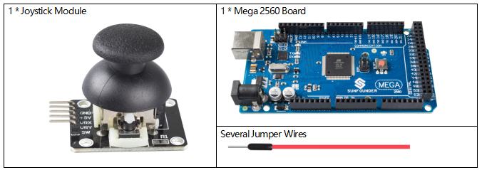
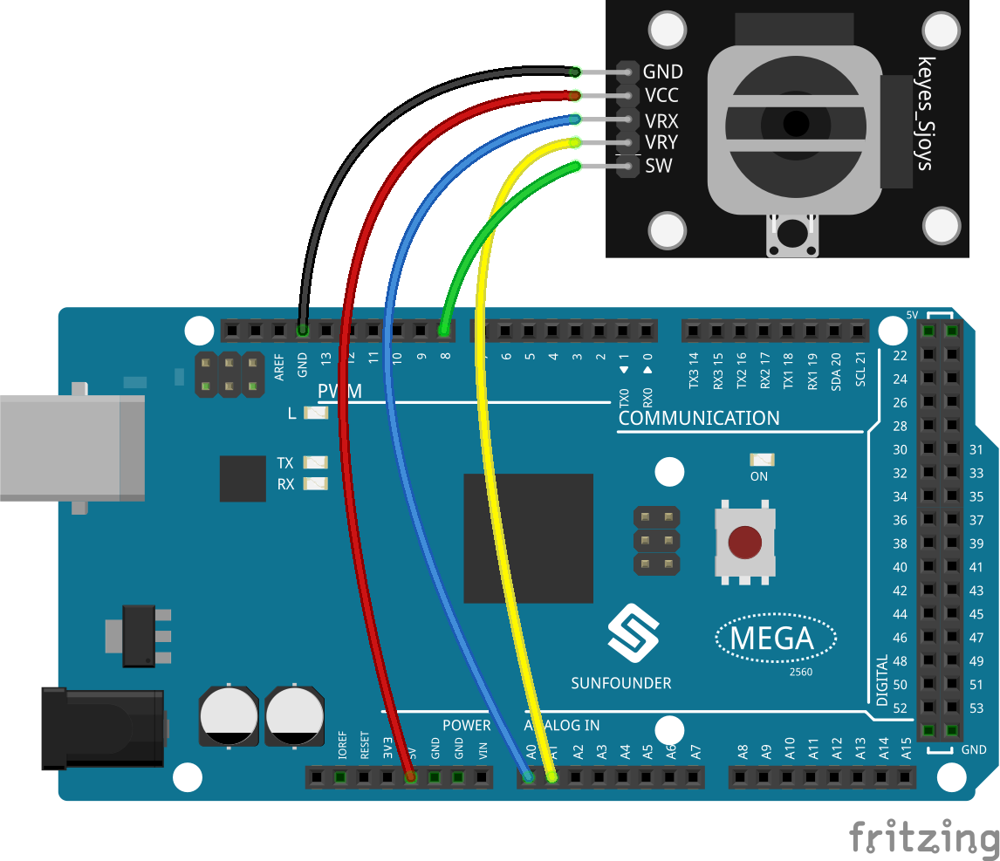
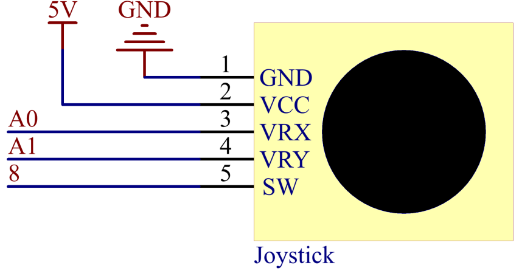
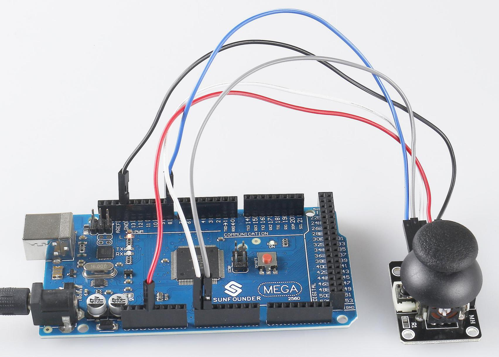

.. note:: 

    Hola, bienvenido a la Comunidad de Entusiastas de SunFounder para Raspberry Pi, Arduino y ESP32 en Facebook. Sumérgete junto a otros entusiastas en el fascinante mundo de Raspberry Pi, Arduino y ESP32.

    **¿Por qué unirte?**

    - **Soporte experto**: Resuelve problemas postventa y desafíos técnicos con la ayuda de nuestra comunidad y equipo.
    - **Aprende y comparte**: Intercambia consejos y tutoriales para mejorar tus habilidades.
    - **Avances exclusivos**: Accede anticipadamente a anuncios de nuevos productos y adelantos.
    - **Descuentos especiales**: Disfruta de descuentos exclusivos en nuestros productos más recientes.
    - **Promociones festivas y sorteos**: Participa en sorteos y promociones especiales en días festivos.

    👉 ¿Listo para explorar y crear con nosotros? Haz clic en [|link_sf_facebook|] y únete hoy mismo.

.. _ar_joystick:

2.23 Módulo de Joystick
=========================

Resumen
----------

En esta lección, aprenderás sobre el módulo de joystick. La idea básica 
de un joystick es traducir el movimiento de una palanca en información 
electrónica que una computadora puede procesar. Se puede utilizar como 
controlador de dispositivos, como un robot.

Componentes necesarios
------------------------

* :ref:`cpn_mega2560`
* :ref:`cpn_wires`
* :ref:`cpn_joystick`

Circuito Fritzing
--------------------

En este ejemplo, conectamos el GND del Joystick a GND, VCC a 5V y VRX al pin A0. 
Luego conectamos VRY al pin A1 y SW al pin 8.

Diagrama esquemático
------------------------

Código
----------

.. note::

    * Puedes abrir el archivo ``2.23_joystick.ino`` en la ruta ``sunfounder_vincent_kit_for_arduino\code\2.23_joystick`` directamente.
    * O copia este código en el IDE de Arduino.

.. raw:: html

    <iframe src=https://create.arduino.cc/editor/sunfounder01/0ce9568f-02d7-4b7e-8aef-975abb24566b/preview?embed style="height:510px;width:100%;margin:10px 0" frameborder=0></iframe>

Una vez cargado el código en la placa Mega2560, puedes abrir el monitor 
serial para ver las lecturas de los ejes X e Y del Joystick, así como el 
estado del botón en el eje Z. Los valores de los ejes X e Y son analógicos 
y varían dentro del rango de 「0」~「1023」. El eje Z muestra un valor numérico 
que indica su estado, ya sea 「1」 o 「0」. Consulta :ref:`ar_analog_read` y :ref:`ar_digital_read` 
para una explicación detallada del código.

Imagen del fenómeno
-----------------------

