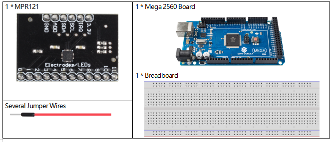
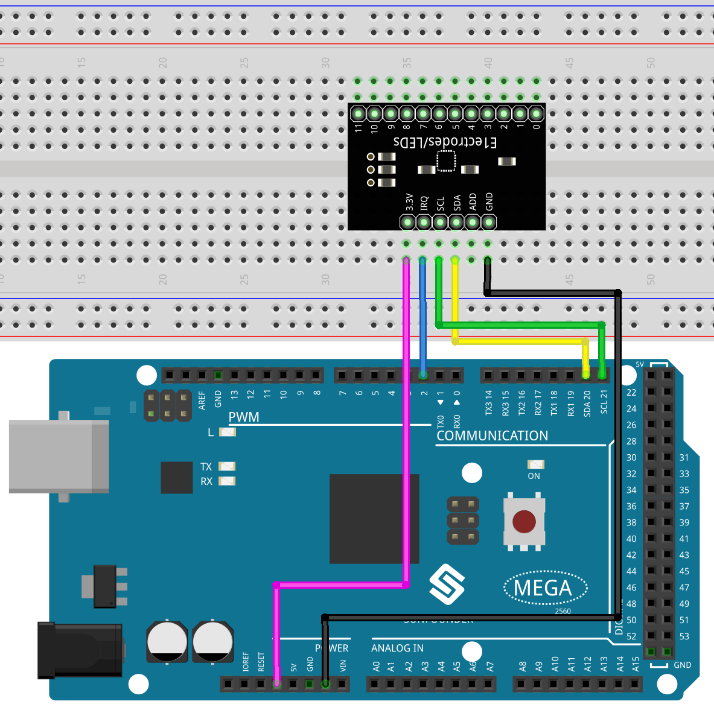
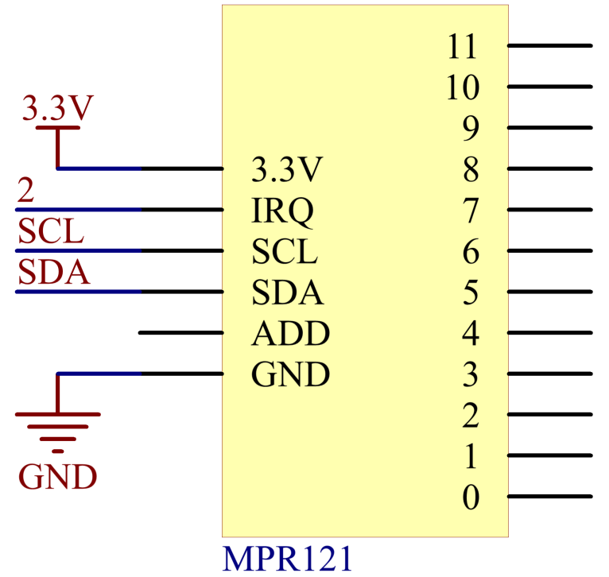
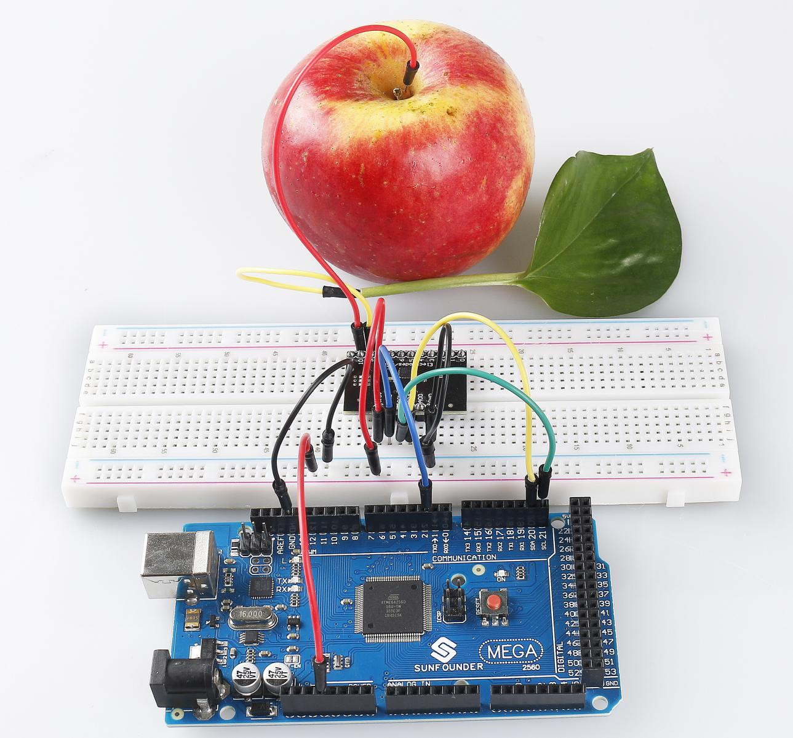

.. _ar_mpr121:

2.24 MPR121-Modul
====================

Überblick
---------------

In dieser Lektion lernen Sie, wie Sie MPR121 verwenden. Dies ist eine gute Option, wenn Sie Ihrem Projekt viele Berührungsschalter hinzufügen möchten. Die Elektrode des MPR121 kann mit einem Leiter verlängert werden. Wenn Sie einen Draht mit einer Banane verbinden, können Sie die Banane in einen Berührungsschalter verwandeln und so Projekte wie ein Fruchtklavier realisieren.

Erforderliche Komponenten
----------------------------

* :ref:`cpn_mega2560`
* :ref:`cpn_breadboard`
* :ref:`cpn_wires`
* :ref:`cpn_mpr121`

Fritzing-Schaltung
----------------------

In diesem Beispiel setzen wir MPR121 in das Steckbrett ein. Verbinden Sie GND von MPR121 mit GND, 3,3 V mit 3 V3, IRQ mit dem digitalen Pin 2, SCL mit Pin SCL (21) und SDA mit Pin SDA (20). Es gibt 12 Elektroden für die Berührungserkennung. Hinweis: Der MPR121 wird mit 3.3V versorgt, nicht mit 5V.

Schematische Darstellung
---------------------------------

Code
--------

.. note::

    * Sie können die Datei ``2.24_mpr121.ino`` unter dem Pfad ``sunfounder_vincent_kit_for_arduino\code\2.24_mpr121`` direkt öffnen.
    * Oder kopieren Sie diesen Code in Arduino IDE. 
    * Die Bibliothek ``Adafruit MPR121`` wird hier verwendet. Sie können sie über den **Library Manager** installieren.

        .. image:: img/lib_mpr121.png
            :align: center

.. raw:: html

    <iframe src=https://create.arduino.cc/editor/sunfounder01/92bbae94-2807-4207-b0ac-393d89189517/preview?embed style="height:510px;width:100%;margin:10px 0" frameborder=0></iframe>

Nach dem Hochladen der Codes auf die Mega2560-Platine wird der Berührungszustand der Pins von MPR121 「1」 und 「0」 in einem booleschen 12-Bit-Array aufgezeichnet, das auf dem seriellen Monitor gedruckt wird.

Code-Analyse
--------------------
Dieser Code ermöglicht die Kommunikation und den Betrieb des MPR121-Touchsensors. Er kann den Status von Berührungselektroden erkennen und Informationen über berührte oder freigegebene Elektroden an der seriellen Schnittstelle ausgeben. Falls detaillierte Sensordaten erforderlich sind, kann der entsprechende Code auskommentiert werden.

Hier eine Analyse des Codes:

#. Bibliotheken importieren:

    .. code-block:: arduino

        #include <Wire.h>
        #include "Adafruit_MPR121.h"

    * ``Wire.h``: Wird für die I2C-Kommunikation verwendet.
    * ``Adafruit_MPR121.h``: Adafruits MPR121-Bibliothek zum Betreiben des MPR121-Touchsensors.

#. Das ``_BV`` Makro definieren:

    .. code-block:: arduino

        #ifndef _BV
        #define _BV(bit) (1 << (bit)) 
        #endif

    ``_BV(bit)`` definiert ein Makro, das ein gegebenes Bit in den entsprechenden Binärwert umwandelt, ähnlich 1 << bit.

#. Instanz der Klasse ``Adafruit_MPR121`` initialisieren:

    .. code-block:: arduino

        Adafruit_MPR121 cap = Adafruit_MPR121();

    Eine Instanz der Klasse ``Adafruit_MPR121`` namens ``cap`` erstellen. Das Objekt ``cap`` wird verwendet, um mit dem MPR121-Touchsensor zu kommunizieren und ihn zu betreiben.

#. Funktion ``setup()``:

    Serielle Kommunikation mit einer Baudrate von 9600 initialisieren. Anschließend den MPR121-Touchsensor mit der Standard-I2C-Adresse 0x5A initialisieren. Falls die Initialisierung fehlschlägt, eine Fehlermeldung ausgeben und eine Endlosschleife starten.

    .. code-block:: arduino

        void setup() {
            Serial.begin(9600);

            while (!Serial) { 
                delay(10);
            }

            Serial.println("Adafruit MPR121 Capacitive Touch sensor test"); 

            if (!cap.begin(0x5A)) {
                Serial.println("MPR121 nicht gefunden, Verkabelung überprüfen?");
                while (1);
            }
            Serial.println("MPR121 gefunden!");

#. Funktion ``loop()``:

    * Den aktuellen Berührungsstatus abrufen, der als 16-Bit-Integer zurückgegeben wird.

        .. code-block:: arduino

            currtouched = cap.touched();

    * Durch den Status von 12 Elektroden iterieren (nummeriert von 0 bis 11).

        .. code-block:: arduino

            for (uint8_t i=0; i<12; i++) {
                if ((currtouched & _BV(i)) && !(lasttouched & _BV(i)) ) {
                    Serial.print(i); Serial.println(" berührt");
                }
                if (!(currtouched & _BV(i)) && (lasttouched & _BV(i)) ) {
                    Serial.print(i); Serial.println(" freigegeben");
                }
            }

        * Wenn eine Elektrode berührt wird und vorher nicht berührt wurde, ``x touched`` ausgeben, wobei x die Elektrodennummer ist.
        * Wenn eine Elektrode zuvor berührt wurde, aber jetzt nicht mehr berührt wird, ``x released`` ausgeben.

    * ``lasttouched`` aktualisieren, um den aktuellen Berührungsstatus für den Vergleich in der nächsten Iteration zu speichern.

        .. code-block:: arduino

            lasttouched = currtouched;

    * Debug-Informationen (Optional):

        .. code-block:: arduino

            Serial.print("\t\t\t\t\t\t\t\t\t\t\t\t\t 0x"); Serial.println(cap.touched(), HEX);
            Serial.print("Filt: ");
            for (uint8_t i=0; i<12; i++) {
                Serial.print(cap.filteredData(i)); Serial.print("\t");
            }
            Serial.println();
            Serial.print("Base: ");
            for (uint8_t i=0; i<12; i++) {
                Serial.print(cap.baselineData(i)); Serial.print("\t");
            }
            Serial.println();

            // Verzögerung einfügen, um nicht zu überwältigen
            delay(100);

Phänomen Bild
-------------------------

