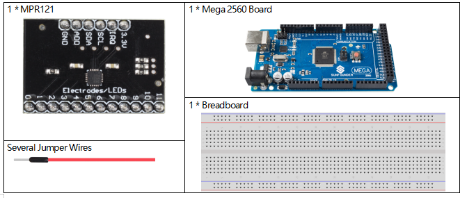
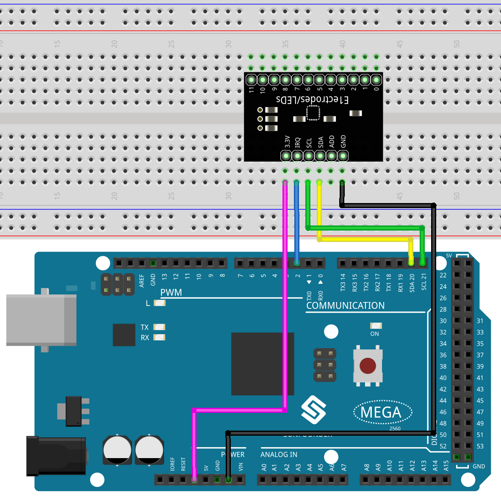
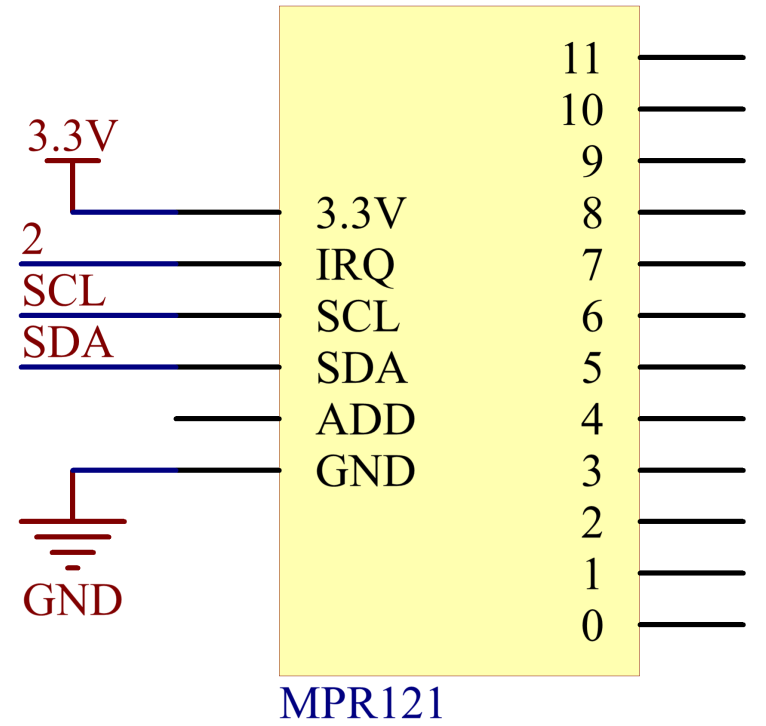
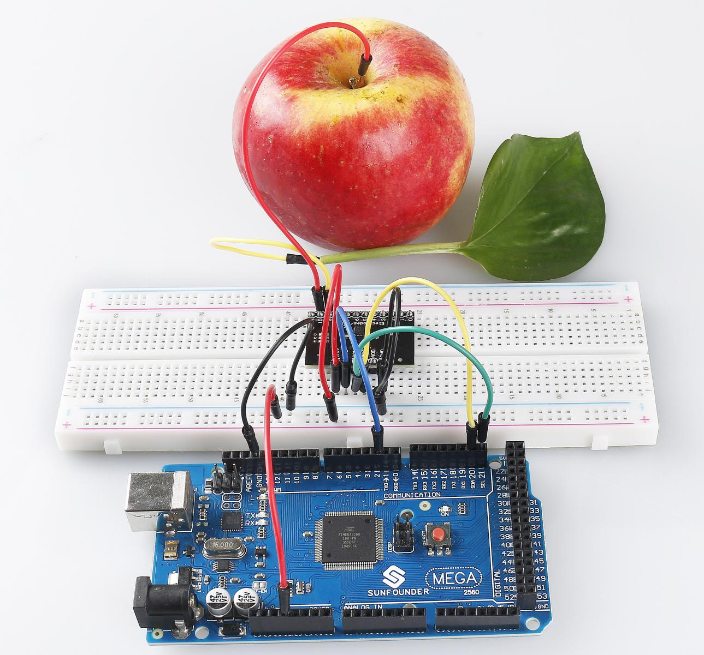

.. note:: 

    Hola, bienvenido a la Comunidad de Entusiastas de SunFounder para Raspberry Pi, Arduino y ESP32 en Facebook. Sumérgete junto a otros entusiastas en el fascinante mundo de Raspberry Pi, Arduino y ESP32.

    **¿Por qué unirte?**

    - **Soporte experto**: Resuelve problemas postventa y desafíos técnicos con la ayuda de nuestra comunidad y equipo.
    - **Aprende y comparte**: Intercambia consejos y tutoriales para mejorar tus habilidades.
    - **Avances exclusivos**: Accede anticipadamente a anuncios de nuevos productos y adelantos.
    - **Descuentos especiales**: Disfruta de descuentos exclusivos en nuestros productos más recientes.
    - **Promociones festivas y sorteos**: Participa en sorteos y promociones especiales en días festivos.

    👉 ¿Listo para explorar y crear con nosotros? Haz clic en [|link_sf_facebook|] y únete hoy mismo.

.. _ar_mpr121:

2.24 Módulo MPR121
====================

Resumen
---------

En esta lección, aprenderás a utilizar el MPR121. Es una excelente opción 
cuando quieres añadir múltiples interruptores táctiles a tu proyecto. El 
electrodo del MPR121 se puede extender con un conductor; por ejemplo, si 
conectas un cable a un plátano, puedes convertirlo en un interruptor táctil, 
permitiendo crear proyectos como un piano de frutas.

Componentes necesarios
-------------------------

* :ref:`cpn_mega2560`
* :ref:`cpn_breadboard`
* :ref:`cpn_wires`
* :ref:`cpn_mpr121`

Circuito Fritzing
--------------------

En este ejemplo, insertamos el MPR121 en la placa de pruebas. Conecta el GND 
del MPR121 a GND, 3.3V a 3V3, IRQ al pin digital 2, SCL al pin SCL (21) y SDA 
al pin SDA (20). Hay 12 electrodos para la detección táctil. Nota: el MPR121 
funciona con 3.3V, no con 5V.

Diagrama esquemático
----------------------

Código
---------

.. note::

    * Puedes abrir el archivo ``2.24_mpr121.ino`` en la ruta ``sunfounder_vincent_kit_for_arduino\code\2.24_mpr121`` directamente.
    * La librería ``Adafruit MPR121`` es necesaria aquí y puedes instalarla desde el **Administrador de librerías**.

        .. image:: img/lib_mpr121.png
            :align: center

.. raw:: html

    <iframe src=https://create.arduino.cc/editor/sunfounder01/92bbae94-2807-4207-b0ac-393d89189517/preview?embed style="height:510px;width:100%;margin:10px 0" frameborder=0></iframe>

Una vez que subas el código a la placa Mega2560, el estado táctil de los 
pines del MPR121, representado como「1」y「0」, se registrará en un arreglo 
de tipo booleano de 12 bits que se imprimirá en el monitor serial.

Análisis del código
-----------------------

Este código facilita la comunicación y operación del sensor táctil MPR121. Puede detectar el estado de los electrodos de contacto y mostrar información sobre los electrodos tocados o liberados en la interfaz serial. Si se requieren datos detallados del sensor, el código correspondiente puede ser descomentado.

A continuación, un análisis del código:

#. Importación de librerías:

    .. code-block:: arduino

        #include <Wire.h>
        #include "Adafruit_MPR121.h"

    * ``Wire.h``: Utilizada para la comunicación I2C.
    * ``Adafruit_MPR121.h``: Librería de Adafruit para operar el sensor táctil MPR121.

#. Definición del Macro ``_BV``:

    .. code-block:: arduino

        #ifndef _BV
        #define _BV(bit) (1 << (bit)) 
        #endif
    
    ``_BV(bit)`` define un macro que convierte un bit dado en el valor binario correspondiente, similar a 1 << bit.

#. Inicialización de la instancia ``Adafruit_MPR121``:

    .. code-block:: arduino

        Adafruit_MPR121 cap = Adafruit_MPR121();

    Crea una instancia de la clase ``Adafruit_MPR121`` llamada ``cap``. El objeto ``cap`` se usará para comunicarse y operar el sensor táctil MPR121.

#. Función ``setup()``:

    Inicializa la comunicación serial a una velocidad de 9600 baudios y el sensor táctil MPR121 con la dirección I2C predeterminada de 0x5A. Si la inicialización falla, muestra un mensaje de error y entra en un bucle infinito.

    .. code-block:: arduino

        void setup() {
            Serial.begin(9600);
            
            while (!Serial) { // necesario para evitar que leonardo/micro inicie demasiado rápido
                delay(10);
            }
            
            Serial.println("Adafruit MPR121 Capacitive Touch sensor test"); 
            
            // La dirección predeterminada es 0x5A; si está conectado a 3.3V es 0x5B
            // Si está conectado a SDA es 0x5C y si es SCL, 0x5D
            if (!cap.begin(0x5A)) {
                Serial.println("MPR121 not found, check wiring?");
                while (1);
            }
            Serial.println("MPR121 found!");
        }

#. Función ``loop()``:

    * Obtiene el estado táctil actual, retornado como un entero de 16 bits.

        .. code-block:: arduino

            currtouched = cap.touched();

    * Itera a través del estado de los 12 electrodos (numerados del 0 al 11).

        .. code-block:: arduino

            for (uint8_t i=0; i<12; i++) {
                // si *está* tocado y *no estaba* tocado antes, alerta
                if ((currtouched & _BV(i)) && !(lasttouched & _BV(i)) ) {
                    Serial.print(i); Serial.println(" touched");
                }
                // si *estaba* tocado y ahora *no está*, alerta
                if (!(currtouched & _BV(i)) && (lasttouched & _BV(i)) ) {
                    Serial.print(i); Serial.println(" released");
                }
            }

        * Si un electrodo está tocado y no estaba tocado antes, imprime "x tocado", donde x es el número de electrodo.
        * Si un electrodo estaba tocado antes y ahora no está tocado, imprime "x liberado".

    * Actualiza ``lasttouched`` para almacenar el estado táctil actual para la comparación en la próxima iteración.

        .. code-block:: arduino

            lasttouched = currtouched;

    * Información de depuración (sección opcional):

        .. code-block:: arduino

            // información de depuración
            Serial.print("\t\t\t\t\t\t\t\t\t\t\t\t\t 0x"); Serial.println(cap.touched(), HEX);
            Serial.print("Filt: ");
            for (uint8_t i=0; i<12; i++) {
                Serial.print(cap.filteredData(i)); Serial.print("\t");
            }
            Serial.println();
            Serial.print("Base: ");
            for (uint8_t i=0; i<12; i++) {
                Serial.print(cap.baselineData(i)); Serial.print("\t");
            }
            Serial.println();
            
            // pone un retardo para no abrumar la salida
            delay(100);

Imagen del fenómeno
----------------------

