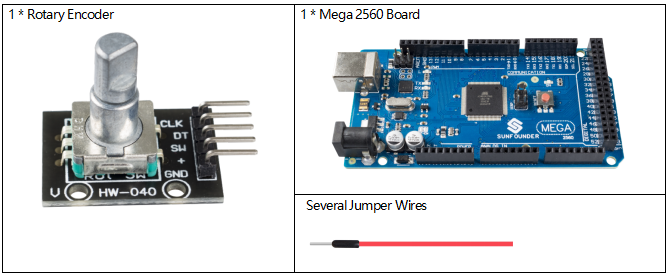
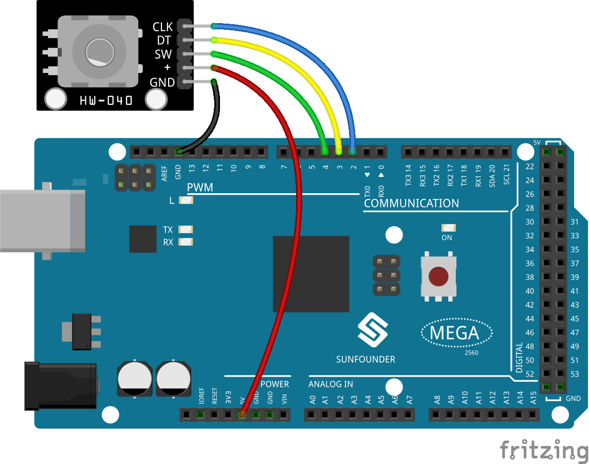
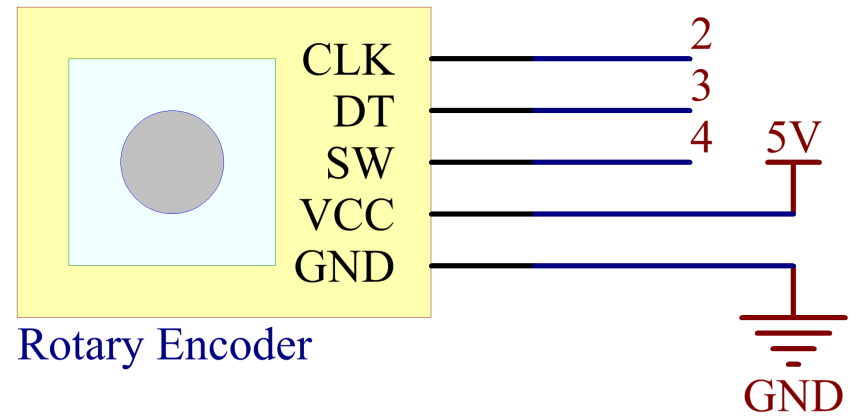
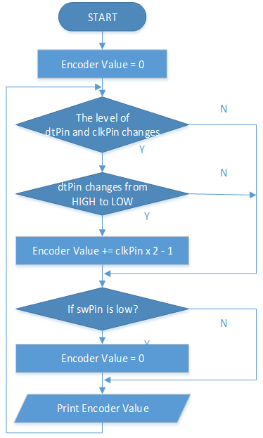
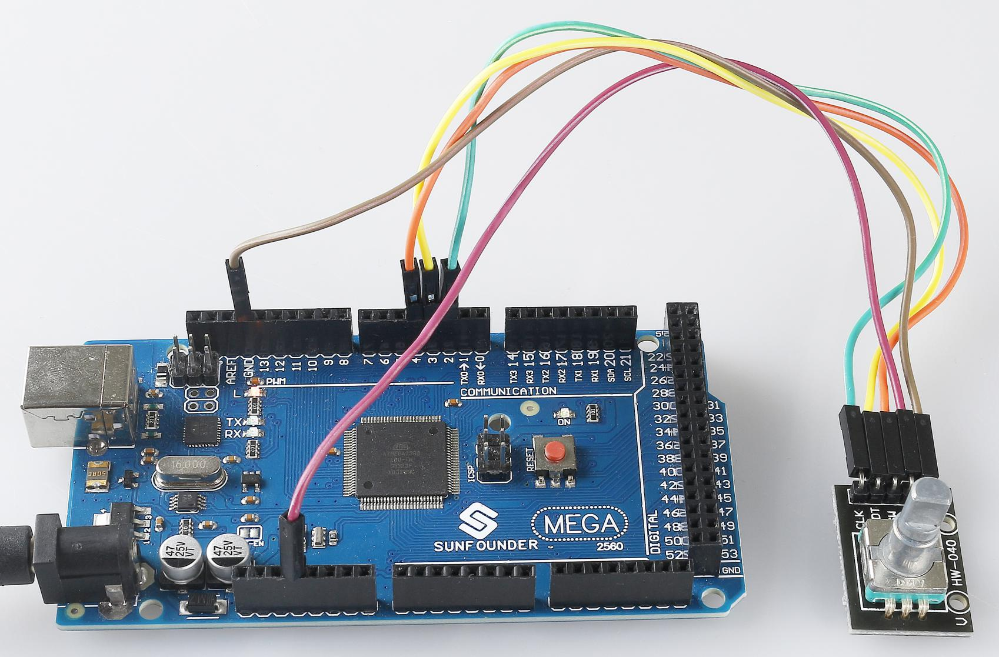

.. note:: 

    Ciao, benvenuto nella community SunFounder Raspberry Pi & Arduino & ESP32 su Facebook! Approfondisci Raspberry Pi, Arduino ed ESP32 insieme ad altri appassionati.

    **Perché unirsi?**

    - **Supporto esperto**: Risolvi problemi post-vendita e sfide tecniche con l'aiuto della nostra community e del nostro team.
    - **Impara e condividi**: Scambia suggerimenti e tutorial per migliorare le tue competenze.
    - **Anteprime esclusive**: Accedi in anteprima agli annunci di nuovi prodotti.
    - **Sconti speciali**: Approfitta di sconti esclusivi sui nostri prodotti più recenti.
    - **Promozioni e omaggi festivi**: Partecipa a omaggi e promozioni speciali durante le festività.

    👉 Pronto per esplorare e creare con noi? Clicca [|link_sf_facebook|] e unisciti oggi stesso!

.. _ar_rotary_encoder:

2.25 Modulo Encoder Rotativo
==============================

Panoramica
------------------

In questa lezione imparerai a utilizzare l'Encoder Rotativo. Un encoder 
rotativo è un interruttore elettronico che genera una sequenza regolare 
di impulsi temporizzati con precisione. Quando viene utilizzato con un 
circuito integrato (IC), può consentire operazioni come incremento, 
decremento, cambio pagina e altre funzioni come lo scorrimento del mouse 
o la selezione di menu.

Componenti necessari
------------------------

* :ref:`cpn_mega2560`
* :ref:`cpn_wires`
* :ref:`cpn_rotary`

Circuito Fritzing
-----------------------

In questo esempio, possiamo collegare direttamente il pin dell'Encoder 
Rotativo alla scheda Mega 2560. Collega il GND dell'Encoder Rotativo al 
GND, 「+」 a 5V, SW al pin digitale 4, DT al pin digitale 3 e CLK al pin 
digitale 2.

Schema elettrico
------------------------

Codice
------------

.. note::

    * Puoi aprire direttamente il file ``2.25_rotaryEncoder.ino`` nella cartella ``sunfounder_vincent_kit_for_arduino\code\2.25_rotaryEncoder``.
    * Oppure copia questo codice nell'IDE di Arduino.

.. raw:: html

    <iframe src=https://create.arduino.cc/editor/sunfounder01/b54bd8df-96a1-40e5-a091-13e24c7179e4/preview?embed style="height:510px;width:100%;margin:10px 0" frameborder=0></iframe>

Sul Monitor Seriale vedrai stampato lo spostamento angolare dell'encoder 
rotativo. Quando ruoti l'encoder in senso orario, lo spostamento angolare 
aumenta; ruotandolo in senso antiorario, lo spostamento diminuisce. Se premi 
l'interruttore sull'encoder rotativo, le letture torneranno a zero.

Analisi del codice
---------------------

Quando si utilizza l'Encoder Rotativo, si verificheranno le seguenti situazioni 
di livello dei pin:

1. Durante la rotazione dell'asse, dtPin passa da livello alto a livello basso.

2. clkPin rimarrà a livello alto quando l'asse ruota in senso orario; 
   altrimenti passa a livello basso.

3. Quando l'asse viene premuto, swPin assume un livello basso.

Da queste informazioni, il flusso del programma è illustrato nella figura a destra.

Per un'analisi dettagliata dei cambiamenti di stato potenziali, consulta :ref:`ar_state_change`.

Immagine del fenomeno
-------------------------

