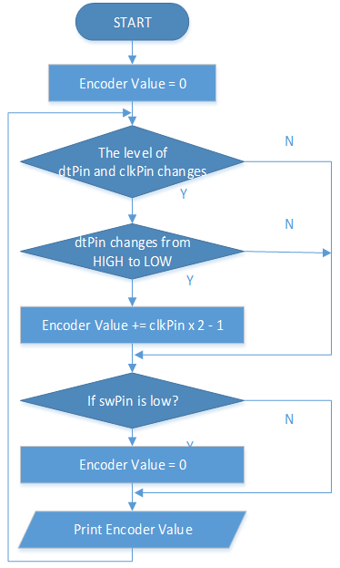

.. _ar_rotary_encoder:

2.25 Drehgebermodul
===========================

Überblick
--------------

In dieser Lektion lernen Sie den Drehgeber kennen. Ein Drehgeber ist ein elektronischer Schalter mit einer Reihe regelmäßiger Impulse in streng zeitlicher Abfolge. Wenn es mit IC verwendet wird, kann es inkrementieren, dekrementieren, Seiten umblättern und andere Operationen wie Scrollen mit der Maus, Menüauswahl und so weiter ausführen.

Erforderliche Komponenten
---------------------------------

.. image:: img/Part_two_25.png

* :ref:`cpn_mega2560`
* :ref:`cpn_wires`
* :ref:`cpn_rotary`

Fritzing-Schaltung
-----------------------

In diesem Beispiel können wir den Rotary Encoder Pin direkt mit dem Mega 2560 Board Pin verbinden, GND des Rotary Encoders mit GND verbinden, 「+」 mit 5V, SW mit Digital Pin 4, DT mit Digital Pin 3 und CLK mit Digitalstift 2.

.. image:: img/image207.png
   :align: center

Schematische Darstellung
---------------------------

.. image:: img/image208.png
   :align: center

Code
------------

.. note::

    * Sie können die Datei ``2.25_rotaryEncoder.ino`` unter dem Pfad ``sunfounder_vincent_kit_for_arduino\code\2.25_rotaryEncoder`` direkt öffnen.
    * Oder kopieren Sie diesen Code in Arduino IDE 1/2.
    * Oder klicken Sie auf Code öffnen, um ihn im `Web Editor <https://docs.arduino.cc/cloud/web-editor/tutorials/getting-started/getting-started-web-editor>`_ zu öffnen .
    * Laden Sie dann :ref:`ar_upload_code` auf das Board hoch.

.. raw:: html

    <iframe src=https://create.arduino.cc/editor/sunfounder01/b54bd8df-96a1-40e5-a091-13e24c7179e4/preview?embed style="height:510px;width:100%;margin:10px 0" frameborder=0></iframe>

Sie sehen die Winkelverschiebung des Drehgebers, die auf Serial Monitor gedruckt wird. Wenn Sie den Drehgeber im Uhrzeigersinn drehen, wird die Winkelverschiebung erhöht; Wenn Sie ihn gegen den Uhrzeigersinn drehen, wird die Verschiebung verringert. Wenn Sie den Schalter am Drehgeber drücken, werden die Messwerte auf Null zurückgesetzt.

Code-Analyse
------------------

Wenn ein Drehgeber verwendet wird, treten die folgenden Pin-Pegel-Situationen auf.

1. Beim Drehen der Welle wechselt dtPin von High-Pegel auf Low-Pegel.

2. clkPin bleibt auf High-Pegel, wenn sich die Welle im Uhrzeigersinn dreht, andernfalls geht er auf Low-Pegel.

3. Wenn die Welle gedrückt wird, hat swPin einen niedrigen Pegel.

Daraus ist rechts der Programmablauf dargestellt.

Für eine detaillierte Analyse der möglichen Zustandsänderungsbeurteilung siehe :ref:`ar_state_change`.

Phänomen Bild
-------------------------

.. image:: img/image210.jpeg
   :align: center