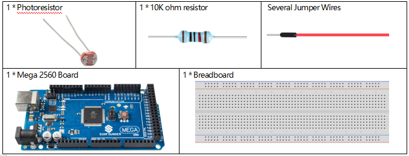
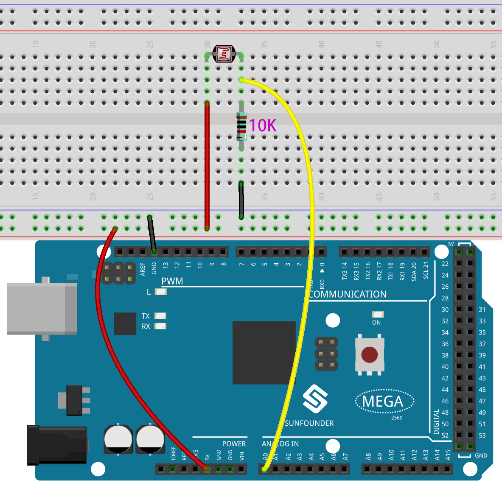
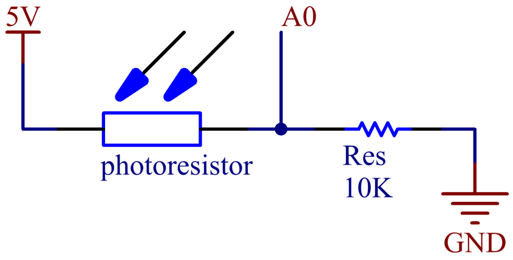
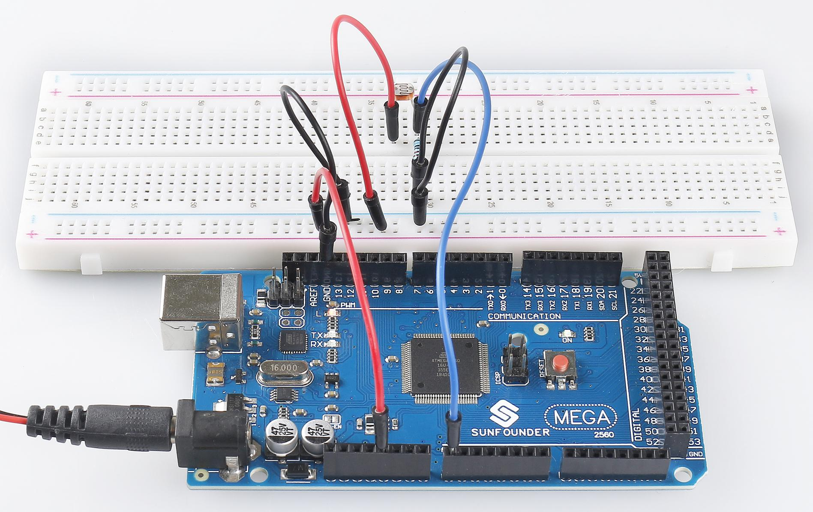

.. note:: 

    Ciao, benvenuto nella community SunFounder Raspberry Pi & Arduino & ESP32 su Facebook! Approfondisci Raspberry Pi, Arduino ed ESP32 insieme ad altri appassionati.

    **Perché unirsi?**

    - **Supporto esperto**: Risolvi problemi post-vendita e sfide tecniche con l'aiuto della nostra community e del nostro team.
    - **Impara e condividi**: Scambia suggerimenti e tutorial per migliorare le tue competenze.
    - **Anteprime esclusive**: Accedi in anteprima agli annunci di nuovi prodotti.
    - **Sconti speciali**: Approfitta di sconti esclusivi sui nostri prodotti più recenti.
    - **Promozioni e omaggi festivi**: Partecipa a omaggi e promozioni speciali durante le festività.

    👉 Pronto per esplorare e creare con noi? Clicca [|link_sf_facebook|] e unisciti oggi stesso!

.. _ar_photoresistor:

2.26 Fotoresistenza
=====================

Panoramica
------------------

In questa lezione imparerai a utilizzare la Fotoresistenza. La fotoresistenza 
è applicata in molti dispositivi elettronici, come misuratori delle fotocamere, 
radio sveglie, dispositivi d'allarme (come rivelatori a fascio), piccole luci 
notturne, orologi esterni, lampioni solari, ecc. Una fotoresistenza può essere 
inserita in un lampione stradale per controllare l'accensione della luce. La 
luce ambientale che colpisce la fotoresistenza causa l'accensione o lo spegni0mento 
delle luci stradali.

Componenti necessari
-------------------------

* :ref:`cpn_mega2560`
* :ref:`cpn_breadboard`
* :ref:`cpn_wires`
* :ref:`cpn_resistor`
* :ref:`cpn_photoresistor`

Circuito Fritzing
----------------------

In questo esempio, utilizziamo il pin analogico (A0) per leggere il valore 
della fotoresistenza. Un terminale della fotoresistenza è collegato a 5V, 
l'altro è connesso ad A0. Inoltre, è necessario un resistore da 10kΩ prima 
che l'altro terminale venga connesso a GND.

Schema elettrico
-----------------------

Codice
---------------

.. note::

    * Puoi aprire direttamente il file ``2.26_photoresistor.ino`` nella cartella ``sunfounder_vincent_kit_for_arduino\code\2.26_photoresistor``.
    * Oppure copia questo codice nell'IDE di Arduino.

.. raw:: html

    <iframe src=https://create.arduino.cc/editor/sunfounder01/c04e97d3-635a-4be6-9d35-9dae005331ae/preview?embed style="height:510px;width:100%;margin:10px 0" frameborder=0></iframe>

Dopo aver caricato il codice sulla scheda Mega2560, puoi aprire il monitor 
seriale per visualizzare i valori letti dal pin. Quando la luce ambientale 
diventa più forte, la lettura aumenterà di conseguenza e il range di lettura 
del pin sarà tra 「0」~「1023」. Tuttavia, in base alle condizioni ambientali 
e alle caratteristiche della fotoresistenza, il range effettivo potrebbe essere 
inferiore a quello teorico. Per una spiegazione dettagliata del codice, fai 
riferimento a :ref:`ar_analog_read`.

Immagine del fenomeno
--------------------------

