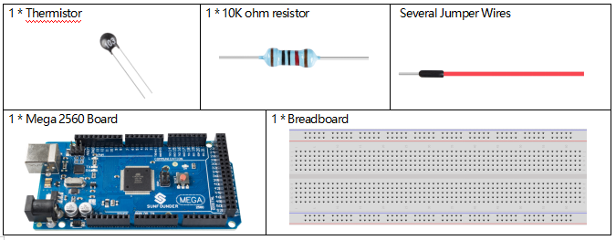
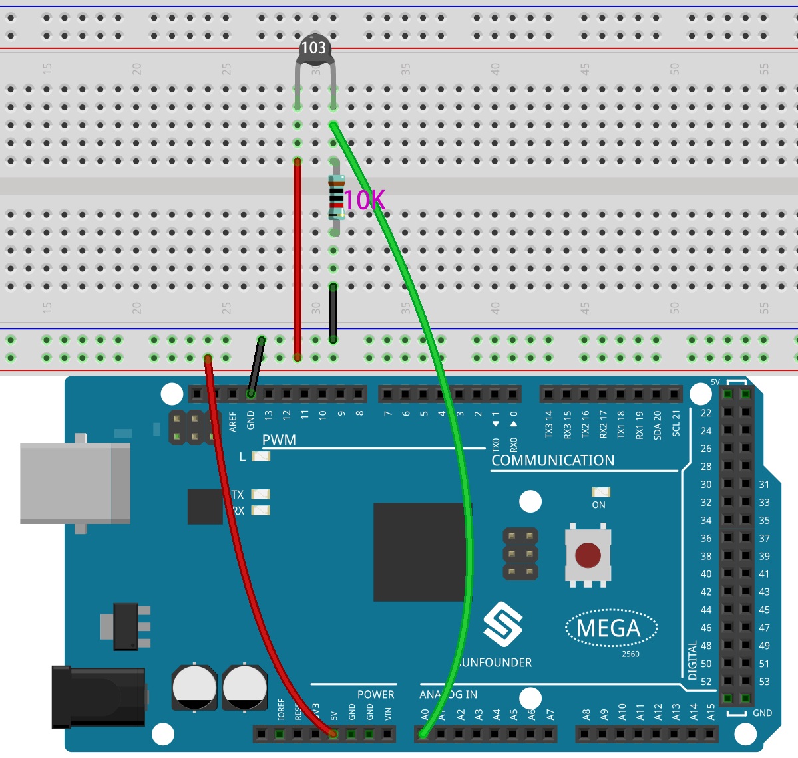
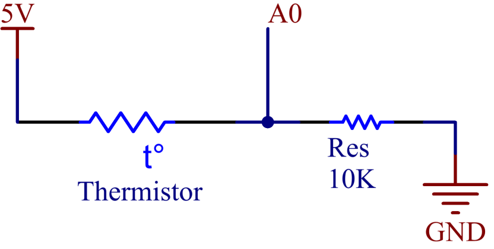
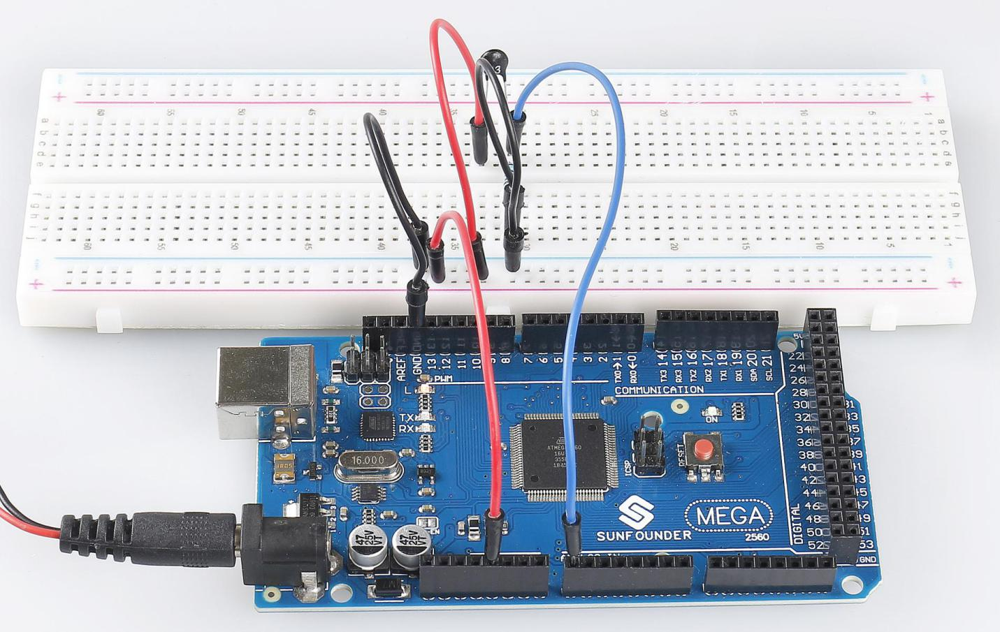

.. _ar_thermistor:

2.27 Thermistor
===============

Überblick
-------------

In dieser Lektion lernen Sie, wie man Thermistoren verwendet. Thermistoren können als elektronische Schaltungskomponenten zur Temperaturkompensation von Instrumentenschaltungen verwendet werden. Im Stromzähler, Durchflussmesser, Gasanalysator und anderen Geräten. Es kann auch für Überhitzungsschutz, kontaktloses Relais, konstante Temperatur, automatische Verstärkungsregelung, Motorstart, Zeitverzögerung, automatische Entmagnetisierung des Farbfernsehers, Feueralarm und Temperaturkompensation verwendet werden.

Erforderliche Komponenten
-----------------------------

* :ref:`cpn_mega2560`
* :ref:`cpn_breadboard`
* :ref:`cpn_wires`
* :ref:`cpn_resistor`
* :ref:`cpn_thermistor`

Fritzing-Schaltung
----------------------

In diesem Beispiel verwenden wir den analogen Pin A0, um den Wert des Thermistors zu erhalten. Ein Pin des Thermistors ist mit 5 V verbunden und der andere ist mit A0 verdrahtet. Gleichzeitig wird ein 10kΩ-Widerstand mit dem anderen Pin verbunden, bevor er mit GND verbunden wird.

Schematische Darstellung
------------------------------

Code
-----------

.. note::

    * Sie können die Datei ``2.27_thermistor.ino`` unter dem Pfad ``sunfounder_vincent_kit_for_arduino\code\2.27_thermistor`` direkt öffnen.
    * Oder kopieren Sie diesen Code in Arduino IDE 1/2.
    * Oder klicken Sie auf Code öffnen, um ihn im `Web Editor <https://docs.arduino.cc/cloud/web-editor/tutorials/getting-started/getting-started-web-editor>`_ zu öffnen .
    * Laden Sie dann :ref:`ar_upload_code` auf das Board hoch.

.. raw:: html

    <iframe src=https://create.arduino.cc/editor/sunfounder01/b4d8972d-3667-477e-b152-e87656b6f578/preview?embed style="height:510px;width:100%;margin:10px 0" frameborder=0></iframe>

Nachdem Sie den Code auf das Mega2560-Board hochgeladen haben, können Sie den seriellen Monitor öffnen, um die aktuelle Temperatur zu überprüfen. Die Kelvin-Temperatur wird nach der Formel ``TK=1/(ln(RT/RN)/B+1/TN)`` berechnet.

Phänomen Bild
------------------------

