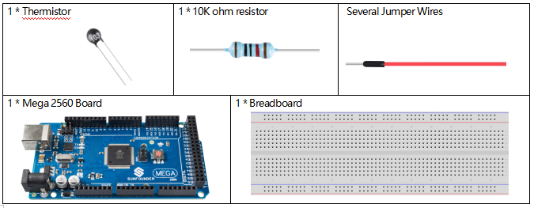
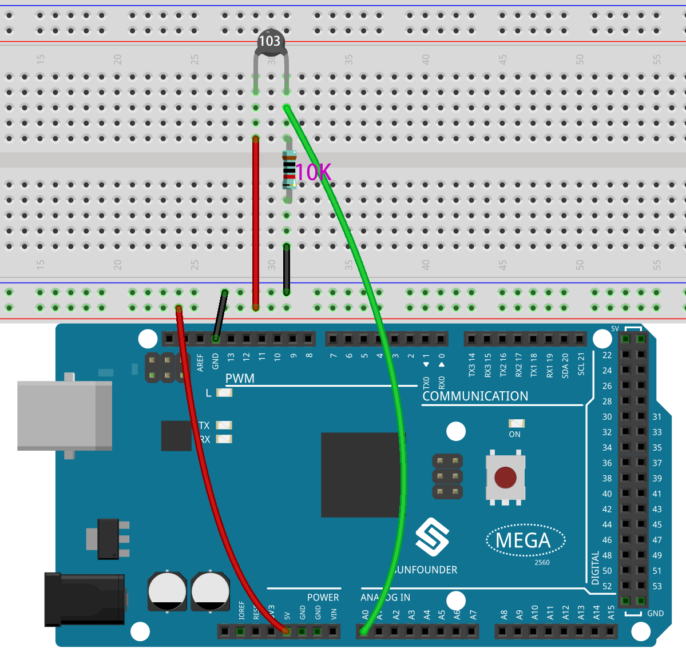
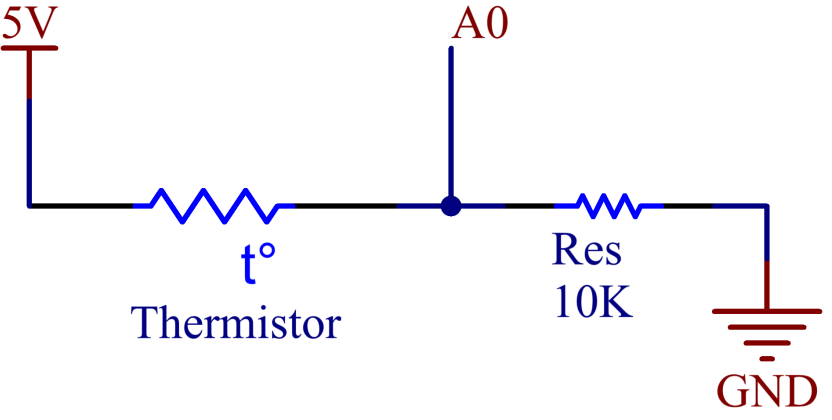
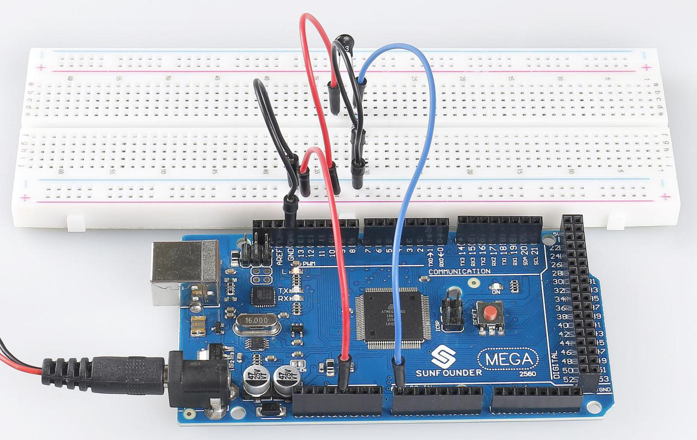

.. note:: 

    Hola, ¡bienvenido a la Comunidad de Entusiastas de SunFounder para Raspberry Pi, Arduino y ESP32 en Facebook! Únete a otros entusiastas para profundizar en el mundo de Raspberry Pi, Arduino y ESP32.

    **¿Por qué unirte?**

    - **Soporte experto**: Resuelve problemas postventa y desafíos técnicos con la ayuda de nuestra comunidad y equipo.
    - **Aprende y comparte**: Intercambia consejos y tutoriales para mejorar tus habilidades.
    - **Avances exclusivos**: Accede anticipadamente a anuncios de nuevos productos y adelantos.
    - **Descuentos especiales**: Disfruta de descuentos exclusivos en nuestros productos más recientes.
    - **Promociones festivas y sorteos**: Participa en sorteos y promociones especiales en días festivos.

    👉 ¿Listo para explorar y crear con nosotros? Haz clic en [|link_sf_facebook|] y únete hoy mismo.

.. _ar_thermistor:

2.27 Termistor
================

Resumen
----------

En esta lección, aprenderás cómo utilizar un termistor. Este componente 
se puede emplear como parte de circuitos electrónicos para compensación 
de temperatura en instrumentos de medición. Se utiliza en dispositivos 
como amperímetros, caudalímetros, analizadores de gas, y otros. También 
puede usarse para protección contra sobrecalentamiento, relés sin contacto, 
control de temperatura constante, control de ganancia automático, arranque 
de motores, retardo de tiempo, desmagnetización automática en televisores 
de color, alarmas contra incendios y compensación de temperatura.

Componentes necesarios
-------------------------

* :ref:`cpn_mega2560`
* :ref:`cpn_breadboard`
* :ref:`cpn_wires`
* :ref:`cpn_resistor`
* :ref:`cpn_thermistor`

Circuito Fritzing
------------------

En este ejemplo, utilizamos el pin analógico A0 para obtener el valor del 
termistor. Un pin del termistor se conecta a 5V y el otro a A0. Además, una 
resistencia de 10kΩ se conecta entre el otro pin del termistor y GND.

Diagrama esquemático
-----------------------

Código
---------

.. note::

    * Puedes abrir el archivo ``2.27_thermistor.ino`` en la ruta ``sunfounder_vincent_kit_for_arduino\code\2.27_thermistor`` directamente.
    * O copia este código en el IDE de Arduino.

.. raw:: html

    <iframe src=https://create.arduino.cc/editor/sunfounder01/b4d8972d-3667-477e-b152-e87656b6f578/preview?embed style="height:510px;width:100%;margin:10px 0" frameborder=0></iframe>

Una vez subido el código a la placa Mega2560, puedes abrir el monitor 
serial para ver la temperatura actual. La temperatura en Kelvin se calcula 
de acuerdo a la fórmula **T\ K\ =1/(ln(R\ T/R\ N)/B+1/T\ N).**

Imagen del fenómeno
----------------------

