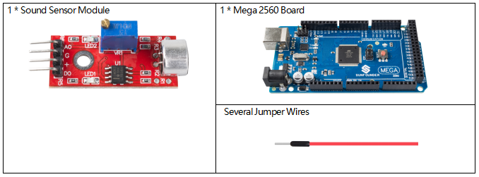
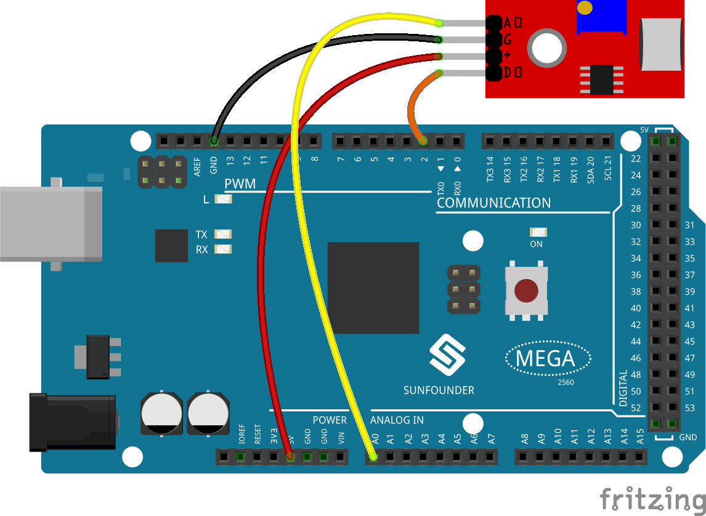
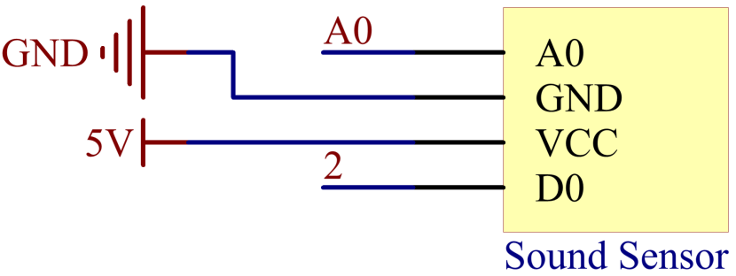
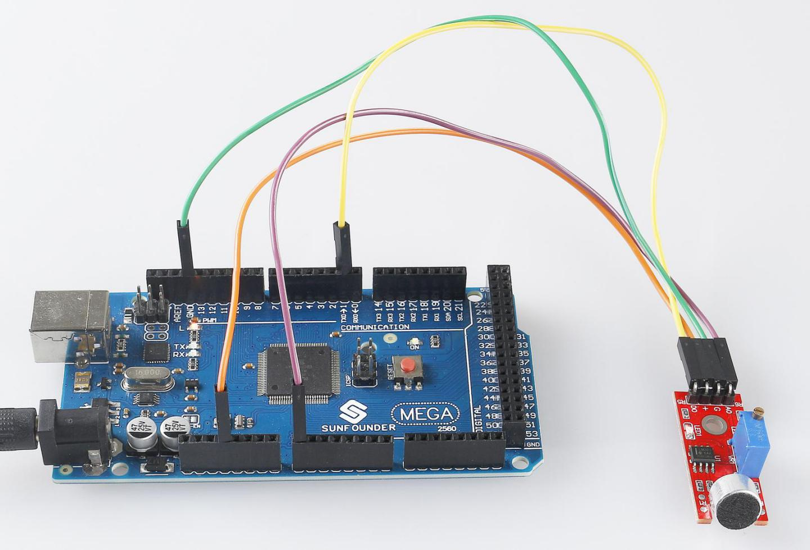

.. _ar_sound:

2.28 Sound Sensor Module
=========================

Overview
------------

In this lesson, you will learn how to use a sound sensor module. The
sound sensor module provides an easy way to detect sound and is
generally used for detecting sound intensity.

Components Required
------------------------

* :ref:`cpn_mega2560`
* :ref:`cpn_wires`
* :ref:`cpn_sound`

Fritzing Circuit
-----------------------

In this example, we can directly connect the pin of Sound
Sensor Module to the pin of Mega 2560 Board, connect the pin「G」 of
Sound Sensor Module to GND, the pin 「+」to 5V, AO to analog pin A0, and
D0 to digital pin 2.

Schematic Diagram
----------------------

Code
----------

.. note::

    * You can open the file ``2.28_soundSensorModule.ino`` under the path of ``sunfounder_vincent_kit_for_arduino\code\2.28_soundSensorModule`` directly.
    * Or copy this code into Arduino IDE.

.. raw:: html

    <iframe src=https://create.arduino.cc/editor/sunfounder01/42164fe5-5ae0-4e26-bee8-e1f085e863e2/preview?embed style="height:510px;width:100%;margin:10px 0" frameborder=0></iframe>

After uploading the code to the Mega2560 board, you can open the serial
monitor to see the read value of the pin. When the ambient sound gets
louder, the digital reading is 「1」 (adjust the potentiometer of the
module to modify the threshold to trigger the high level), and the
reading value of the analog pin will change significantly; when the
environment is quiet, the digital reading is 「0」 and the analog
reading changes smoothly.

The range of analog reading is「0」~「1023」, but influenced by the the
environmental condition and the characteristics of sound sensor, the
actual reading range may be smaller than the theoretical one. If an
oscilloscope is used, the changing of analog reading of the sound sensor
will be more obvious.

About the detail code explanation, refer to :ref:`ar_analog_read` and
:ref:`ar_digital_read`.

Phenomenon Picture
------------------------

