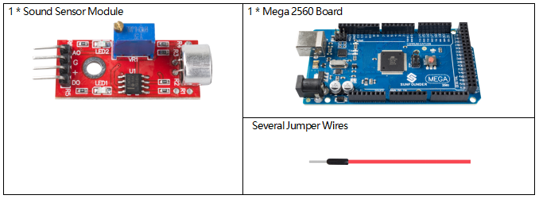
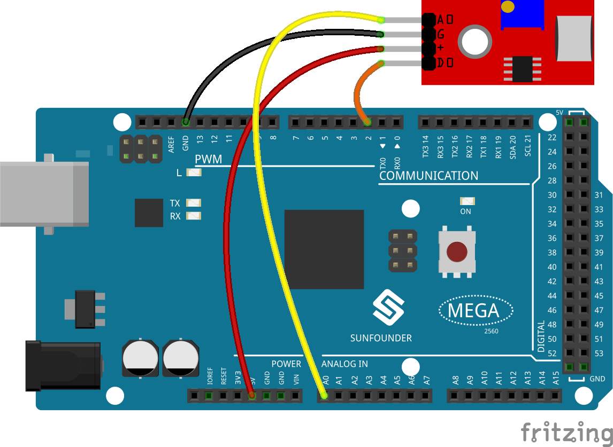
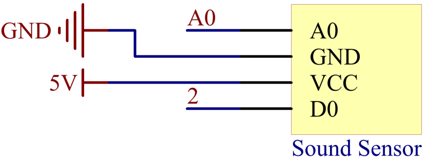
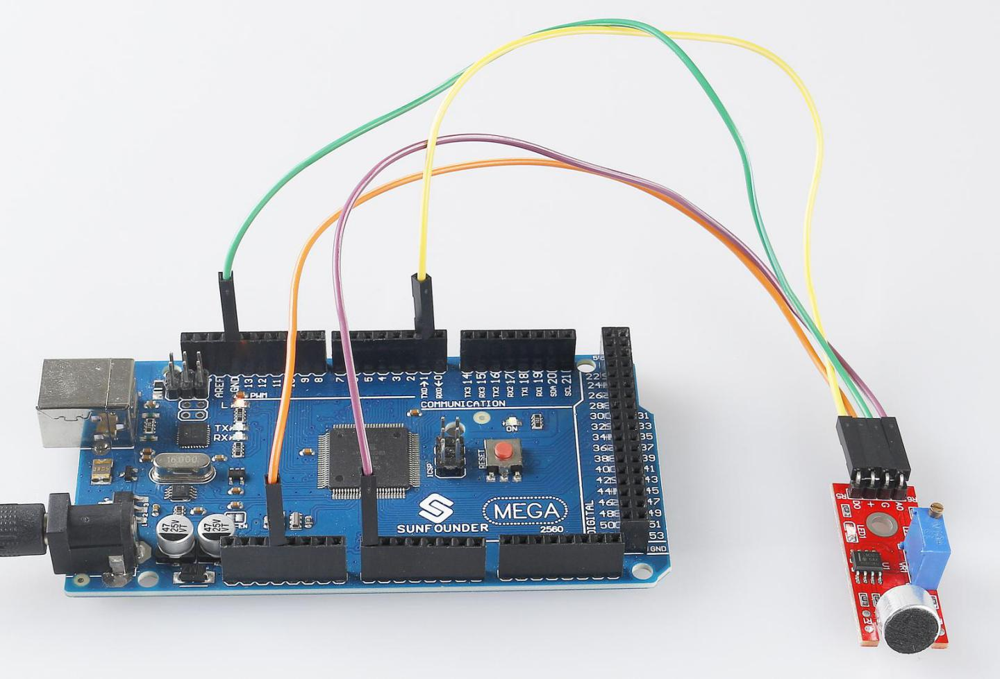

.. note:: 

    Hola, ¡bienvenido a la Comunidad de Entusiastas de SunFounder para Raspberry Pi, Arduino y ESP32 en Facebook! Únete a otros entusiastas para profundizar en el mundo de Raspberry Pi, Arduino y ESP32.

    **¿Por qué unirte?**

    - **Soporte experto**: Resuelve problemas postventa y desafíos técnicos con la ayuda de nuestra comunidad y equipo.
    - **Aprende y comparte**: Intercambia consejos y tutoriales para mejorar tus habilidades.
    - **Avances exclusivos**: Accede anticipadamente a anuncios de nuevos productos y adelantos.
    - **Descuentos especiales**: Disfruta de descuentos exclusivos en nuestros productos más recientes.
    - **Promociones festivas y sorteos**: Participa en sorteos y promociones especiales en días festivos.

    👉 ¿Listo para explorar y crear con nosotros? Haz clic en [|link_sf_facebook|] y únete hoy mismo.

.. _ar_sound:

2.28 Módulo Sensor de Sonido
===============================

Resumen
----------

En esta lección, aprenderás cómo utilizar un módulo sensor de sonido. 
Este módulo proporciona una manera sencilla de detectar el sonido y se 
utiliza generalmente para medir la intensidad del sonido.

Componentes necesarios
-------------------------

* :ref:`cpn_mega2560`
* :ref:`cpn_wires`
* :ref:`cpn_sound`

Circuito Fritzing
--------------------

En este ejemplo, conectaremos directamente el pin del módulo sensor de 
sonido al pin de la placa Mega 2560. Conecta el pin「G」del módulo sensor 
de sonido a GND, el pin「+」a 5V, AO al pin analógico A0, y D0 al pin digital 2.

Diagrama esquemático
-----------------------

Código
----------

.. note::

    * Puedes abrir el archivo ``2.28_soundSensorModule.ino`` en la ruta ``sunfounder_vincent_kit_for_arduino\code\2.28_soundSensorModule`` directamente.
    * O copia este código en el IDE de Arduino.

.. raw:: html

    <iframe src=https://create.arduino.cc/editor/sunfounder01/42164fe5-5ae0-4e26-bee8-e1f085e863e2/preview?embed style="height:510px;width:100%;margin:10px 0" frameborder=0></iframe>

Una vez cargado el código en la placa Mega2560, puedes abrir el monitor 
serial para ver el valor leído del pin. Cuando el sonido ambiente aumenta, 
la lectura digital muestra 「1」 (ajusta el potenciómetro del módulo para 
modificar el umbral que dispara el nivel alto), y el valor de lectura del 
pin analógico cambia significativamente; cuando el ambiente está en silencio, 
la lectura digital es 「0」 y la lectura analógica cambia de manera suave.

El rango de lectura analógica es de「0」a「1023」, pero, debido a las condiciones 
ambientales y las características del sensor de sonido, el rango real puede ser 
menor que el teórico. Con un osciloscopio, el cambio en la lectura analógica 
del sensor de sonido será aún más evidente.

Para la explicación detallada del código, consulta :ref:`ar_analog_read` y :ref:`ar_digital_read`.

Imagen del fenómeno
----------------------

