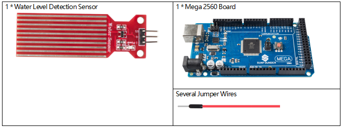
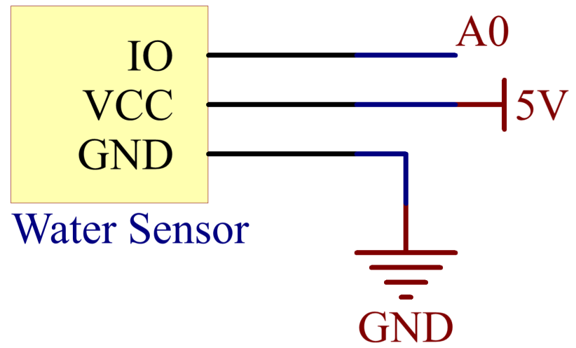
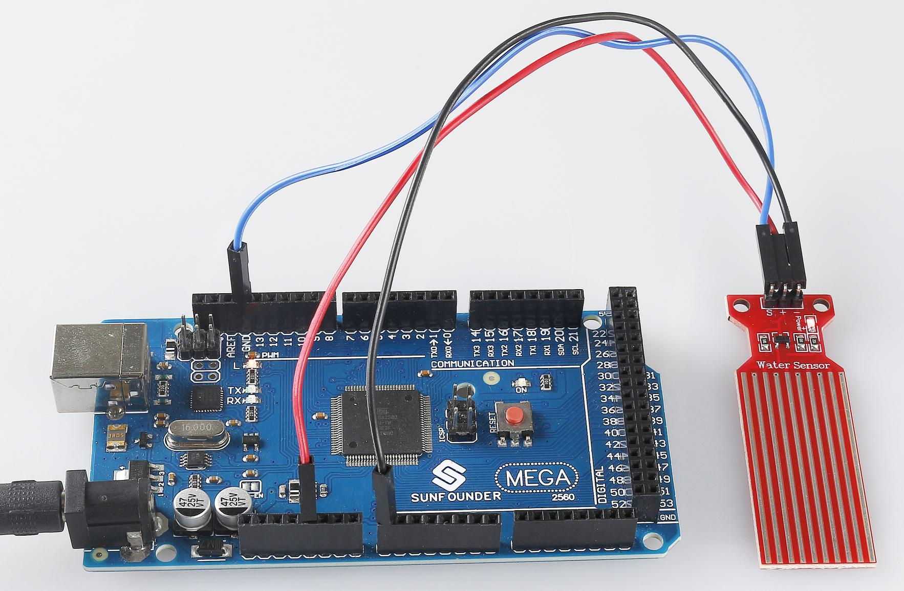

.. _ar_water:

2.29 Water Sensor Module
=========================

Overview
--------------

In this lesson, you will learn how to use a water sensor module. A water
sensor module is designed for water detection, which can be widely used
in sensing the rainfall, water level, even the liquid leakage.

Components Required
--------------------------

* :ref:`cpn_mega2560`
* :ref:`cpn_wires`
* :ref:`cpn_water`

Fritzing Circuit
------------------------

In this example, we directly connect the pins of Water Sensor Module to
pins of Mega 2560 Board. We use analog A0 to get the value of Water
Sensor Module, and get the pin「S」of Water Sensor Module to A0, 「-」to
GND, 「+」to 5V.

.. image:: img/image227.png
   :align: center

Schematic Diagram
-----------------------

Code
--------------

.. note::

    * You can open the file ``2.29_waterSensorModule.ino`` under the path of ``sunfounder_vincent_kit_for_arduino\code\2.29_waterSensorModule`` directly.
    * Or copy this code into Arduino IDE 1/2.
    * Or click **Open Code** to open it in `Web Editor <https://docs.arduino.cc/cloud/web-editor/tutorials/getting-started/getting-started-web-editor>`_.
    * Then :ref:`ar_upload_code` to the board.

.. raw:: html

    <iframe src=https://create.arduino.cc/editor/sunfounder01/afccb53e-02c3-41ea-b365-c5c21c9a74b1/preview?embed style="height:510px;width:100%;margin:10px 0" frameborder=0></iframe>

After uploading the code to the Mega2560 board, you can open the serial
monitor to see the read value of the pin. As the water level rises, the
readings increase. Readings vary within the range 「0」~「1023」, but
influenced by the environmental condition and the characteristics of
water level sensor, the actual reading range may be smaller than the
theoretical range. Refer to Part 1-1.5 Analog Read to check the detail
code explanation.

Phenomenon Picture
------------------------

