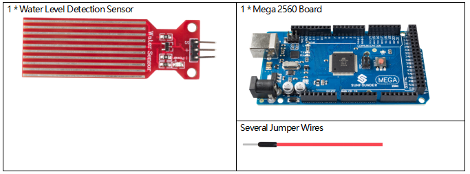
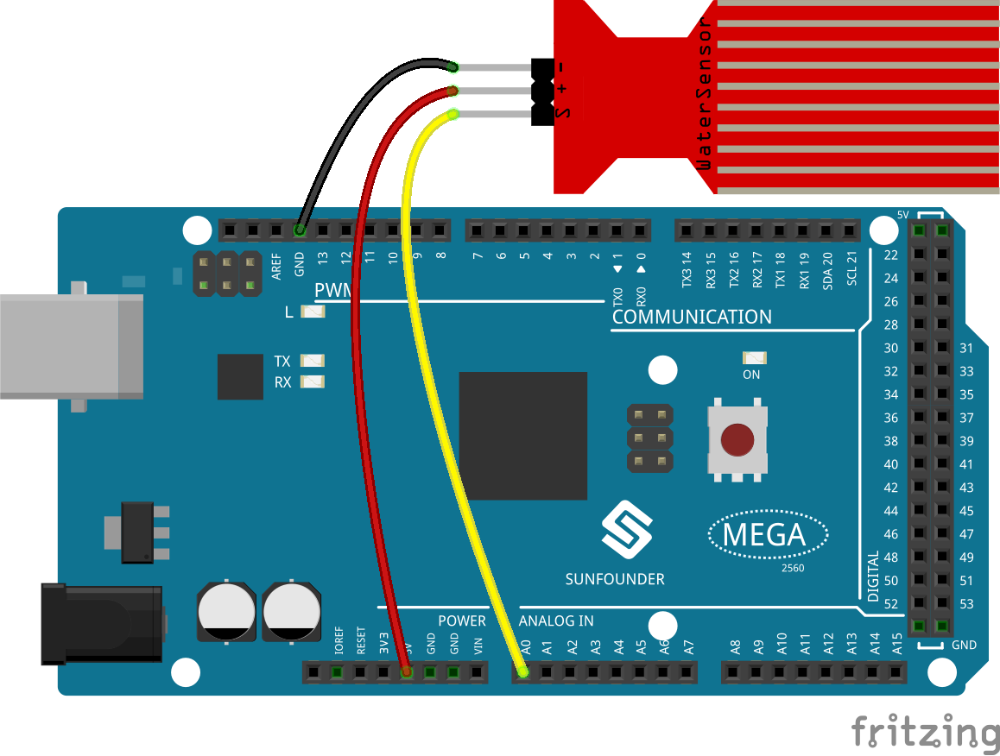
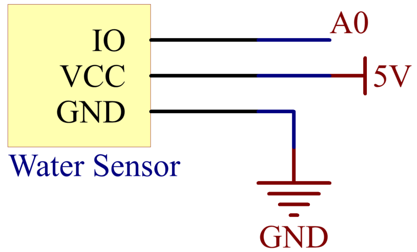
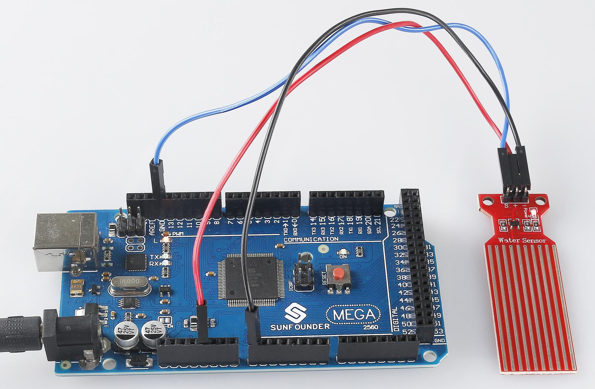

.. note:: 

    Bonjour et bienvenue dans la communauté des passionnés de Raspberry Pi, Arduino et ESP32 sur Facebook, animée par SunFounder ! Plongez dans l'univers de Raspberry Pi, Arduino et ESP32 avec d'autres passionnés.

    **Pourquoi nous rejoindre ?**

    - **Support d'experts** : Résolvez vos problèmes après-vente et vos défis techniques avec l'aide de notre communauté et de notre équipe.
    - **Apprendre et partager** : Échangez des conseils et des tutoriels pour améliorer vos compétences.
    - **Aperçus exclusifs** : Bénéficiez d'un accès anticipé aux annonces de nouveaux produits et d'aperçus exclusifs.
    - **Réductions spéciales** : Profitez de réductions exclusives sur nos derniers produits.
    - **Promotions festives et concours** : Participez à des concours et des promotions pendant les fêtes.

    👉 Prêt à explorer et créer avec nous ? Cliquez sur [|link_sf_facebook|] et rejoignez-nous dès aujourd'hui !

.. _ar_water:

2.29 Module de capteur de niveau d'eau
=========================================

Aperçu
----------

Dans cette leçon, vous apprendrez à utiliser un module de capteur de niveau 
d'eau. Ce module est conçu pour la détection d'eau et peut être largement 
utilisé pour mesurer les niveaux d'eau, détecter la pluie, ou encore les 
fuites de liquide.

Composants requis
-------------------

* :ref:`cpn_mega2560`
* :ref:`cpn_wires`
* :ref:`cpn_water`

Circuit Fritzing
-------------------

Dans cet exemple, nous connectons directement les broches du module de 
capteur de niveau d'eau aux broches de la carte Mega 2560. Nous utilisons 
la broche analogique A0 pour obtenir la valeur du capteur de niveau d'eau, 
en connectant la broche « S » du capteur à A0, la broche « - » à GND, et la 
broche « + » à 5V.

Schéma de connexion
---------------------

Code
--------

.. note::

    * Vous pouvez ouvrir directement le fichier ``2.29_waterSensorModule.ino`` situé dans le dossier ``sunfounder_vincent_kit_for_arduino\code\2.29_waterSensorModule``.
    * Ou copiez ce code dans l'IDE Arduino.

.. raw:: html

    <iframe src=https://create.arduino.cc/editor/sunfounder01/afccb53e-02c3-41ea-b365-c5c21c9a74b1/preview?embed style="height:510px;width:100%;margin:10px 0" frameborder=0></iframe>

Après avoir téléchargé le code sur la carte Mega2560, vous pouvez ouvrir le 
moniteur série pour voir la valeur lue de la broche. À mesure que le niveau 
d'eau monte, les valeurs lues augmentent. Les lectures varient dans la plage 
de « 0 » à « 1023 », mais en fonction des conditions environnementales et des 
caractéristiques du capteur de niveau d'eau, la plage réelle des lectures peut 
être plus petite que la plage théorique. Consultez la section 1-1.5 « Lecture 
analogique » pour plus de détails sur l'explication du code.

Illustration du phénomène
------------------------------

