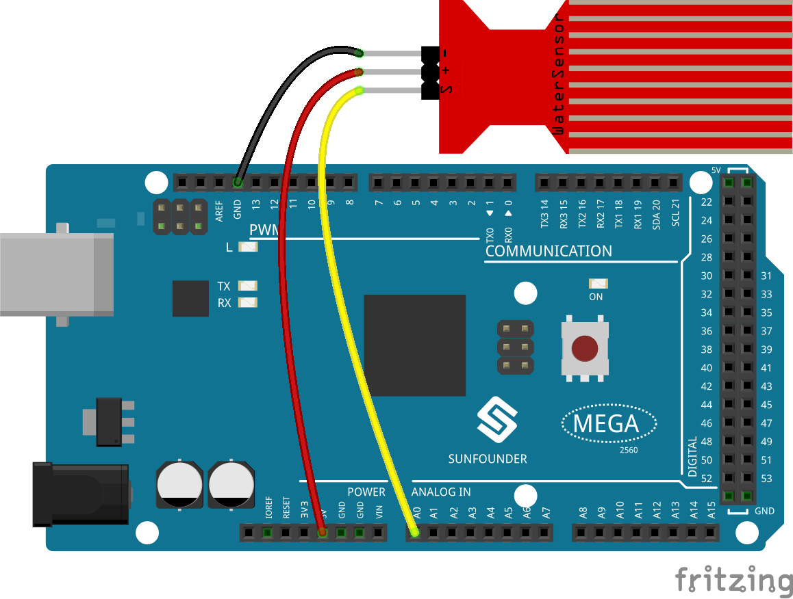

.. _ar_water:

2.29 Wassersensormodul
=========================

Überblick
--------------

In dieser Lektion lernen Sie, wie Sie ein Wassersensormodul verwenden. Ein Wassersensormodul ist für die Wassererkennung konzipiert, die häufig zur Erfassung des Niederschlags, des Wasserstands und sogar des Flüssigkeitsaustritts verwendet werden kann.

Erforderliche Komponenten
-----------------------------

.. image:: img/Part_two_29.png

* :ref:`cpn_mega2560`
* :ref:`cpn_wires`
* :ref:`cpn_water`

Fritzing-Schaltung
------------------------

In this example, we direkt connect the pins of Water Sensor Module to
pins of Mega 2560 Board. We use analog A0 to get the value of Water
Sensor Module, and get the pin「S」of Water Sensor Module to A0, 「-」to
GND, 「+」to 5V.

Schematische Darstellung
--------------------------

.. image:: img/image228.png
   :align: center

Code
--------------

.. note::

    * Sie können die Datei ``2.29_waterSensorModule.ino`` unter dem Pfad ``sunfounder_vincent_kit_for_arduino\code\2.29_waterSensorModule`` direkt öffnen.
    * Oder kopieren Sie diesen Code in Arduino IDE. 

.. raw:: html

    <iframe src=https://create.arduino.cc/editor/sunfounder01/afccb53e-02c3-41ea-b365-c5c21c9a74b1/preview?embed style="height:510px;width:100%;margin:10px 0" frameborder=0></iframe>

Nachdem Sie den Code auf das Mega2560-Board hochgeladen haben, können Sie den seriellen Monitor öffnen, um den gelesenen Wert des Pins zu sehen. Mit steigendem Wasserstand steigen die Messwerte. Die Messwerte variieren innerhalb des Bereichs 「0」~「1023」, aber abhängig von den Umgebungsbedingungen und den Eigenschaften des Wasserstandssensors kann der tatsächliche Lesebereich kleiner als der theoretische Bereich sein. Siehe Teil 1-1.5 Analog Read, um die detaillierte Code-Erklärung zu überprüfen.

Phänomen Bild
------------------------

.. image:: img/image229.jpeg
   :align: center