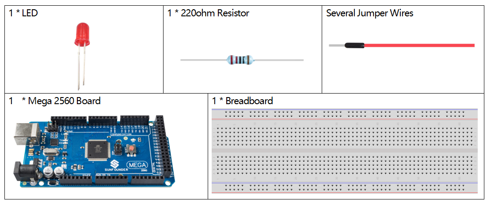

.. _ar_led:

2.2 LED
=========

Overview
--------

In this lesson, you will learn how to use LED. LED is a kind of common
light-emitting device that works according to the principle that the
recombination of electron and hole releases energy to give out light.
This component is used widely in the current society, such as
illumination, panel display, medical device and so on.

Components Required
-------------------

* :ref:`cpn_mega2560`
* :ref:`cpn_breadboard`
* :ref:`cpn_wires`
* :ref:`cpn_led`
* :ref:`cpn_resistor`

Schematic Diagram
-----------------

.. image:: img/image401.png

Fritzing Circuit
----------------

In this example, we use pin 9 to drive LED. Insert one side of the
resistor in the digital pin 9 and connect the longer pin (a positive
electrode, referred to as anode) of the LED with the other side of the
resistor. Extend the shorter pin (a negative electrode, referred to as
cathode) of the LED to GND.

.. image:: img/image30.png

Code
----

.. note::

    * You can open the file ``2.2_led.ino`` under the path of ``sunfounder_vincent_kit_for_arduino\code\2.2_led`` directly.
    * Or copy this code into Arduino IDE.

**Example 1：**

.. raw:: html

    <iframe src=https://create.arduino.cc/editor/sunfounder01/6932f77a-37ea-422d-be9f-9b4d2eaa3571/preview?embed style="height:510px;width:100%;margin:10px 0" frameborder=0></iframe>

Finished uploading the codes to the Mega2560 board, you can see the LED flashing. Refer to :ref:`ar_digital_write` to check the detail code explanation.

**Example 2:**

.. note::

    * You can open the file ``2.2_led_2.ino`` under the path of ``sunfounder_vincent_kit_for_arduino\code\2.2_led_2`` directly.
    * Or copy this code into Arduino IDE.

.. raw:: html

    <iframe src=https://create.arduino.cc/editor/sunfounder01/ba7aa4c7-7537-40af-bb9e-e849d6a722b5/preview?embed style="height:510px;width:100%;margin:10px 0" frameborder=0></iframe>

After uploading the codes to the Mega2560 board, you can see the LED
getting brighter, then turning off, getting brighter, then turning off
again...this loop will continue in this way. About the detail code
explanation, please refer to :ref:`ar_analog_write`.

Phenomenon Picture
------------------

.. image:: img/image36.jpeg