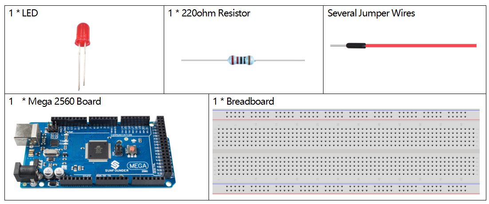

.. note:: 

    ¡Hola, bienvenido a la Comunidad de Entusiastas de Raspberry Pi, Arduino y ESP32 en Facebook! Profundiza en Raspberry Pi, Arduino y ESP32 junto a otros entusiastas.

    **¿Por qué unirse?**

    - **Soporte experto**: Resuelve problemas postventa y desafíos técnicos con la ayuda de nuestra comunidad y equipo.
    - **Aprender y compartir**: Intercambia consejos y tutoriales para mejorar tus habilidades.
    - **Vistas previas exclusivas**: Obtén acceso anticipado a nuevos anuncios de productos y avances.
    - **Descuentos especiales**: Disfruta de descuentos exclusivos en nuestros productos más nuevos.
    - **Promociones festivas y sorteos**: Participa en sorteos y promociones especiales de temporada.

    👉 ¿Listo para explorar y crear con nosotros? Haz clic en [|link_sf_facebook|] y únete hoy mismo.

.. _ar_led:

2.2 LED
==========

Resumen
----------

En esta lección, aprenderás cómo utilizar un LED. Un LED es un dispositivo 
común de emisión de luz que funciona según el principio de que la recombinación 
de electrones y huecos libera energía en forma de luz. Este componente se 
utiliza ampliamente en la sociedad actual, en aplicaciones como iluminación, 
pantallas de panel, dispositivos médicos, entre otros.

Componentes necesarios
------------------------

* :ref:`cpn_mega2560`
* :ref:`cpn_breadboard`
* :ref:`cpn_wires`
* :ref:`cpn_led`
* :ref:`cpn_resistor`

Diagrama esquemático
-----------------------

.. image:: img/image401.png

Circuito Fritzing
--------------------

En este ejemplo, usamos el pin 9 para controlar el LED. Inserta un lado de 
la resistencia en el pin digital 9 y conecta el pin más largo (el ánodo, que 
es el electrodo positivo) del LED al otro lado de la resistencia. Extiende el 
pin más corto (el cátodo, que es el electrodo negativo) del LED hacia GND.

.. image:: img/image30.png

Código
---------

.. note::

    * Puedes abrir el archivo ``2.2_led.ino`` en la ruta ``sunfounder_vincent_kit_for_arduino\code\2.2_led`` directamente.
    * O copiar este código en el IDE de Arduino.

**Ejemplo 1:**

.. raw:: html

    <iframe src=https://create.arduino.cc/editor/sunfounder01/6932f77a-37ea-422d-be9f-9b4d2eaa3571/preview?embed style="height:510px;width:100%;margin:10px 0" frameborder=0></iframe>

Después de cargar el código en la placa Mega2560, podrás ver cómo el LED parpadea. Consulta :ref:`ar_digital_write` para obtener la explicación detallada del código.

**Ejemplo 2:**

.. note::

    * Puedes abrir el archivo ``2.2_led_2.ino`` en la ruta ``sunfounder_vincent_kit_for_arduino\code\2.2_led_2`` directamente.
    * O copiar este código en el IDE de Arduino.

.. raw:: html

    <iframe src=https://create.arduino.cc/editor/sunfounder01/ba7aa4c7-7537-40af-bb9e-e849d6a722b5/preview?embed style="height:510px;width:100%;margin:10px 0" frameborder=0></iframe>

Después de cargar el código en la placa Mega2560, podrás ver cómo el LED se 
va iluminando, luego se apaga, se ilumina nuevamente y se apaga otra vez... 
este ciclo continuará de esta forma. Para obtener la explicación detallada del 
código, consulta :ref:`ar_analog_write`.

Imagen del fenómeno
----------------------

.. image:: img/image36.jpeg