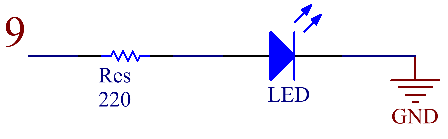

.. _ar_led:

2.2 LED
=========

Überblick
------------

In dieser Lektion lernen Sie, wie man LED verwendet. LED ist eine Art übliches lichtemittierendes Gerät, das nach dem Prinzip arbeitet, dass die Rekombination von Elektron und Loch Energie freisetzt, um Licht abzugeben. Diese Komponente wird in der gegenwärtigen Gesellschaft häufig verwendet, wie z. B. Beleuchtung, Panel-Display, medizinisches Gerät und so weiter.

Erforderliche Komponenten
-------------------------------

.. image:: img/list_2.2.png

* :ref:`cpn_mega2560`
* :ref:`cpn_breadboard`
* :ref:`cpn_wires`
* :ref:`cpn_led`
* :ref:`cpn_resistor`

Schematische Darstellung
--------------------------------------

Fritzing-Schaltung
--------------------------

In diesem Beispiel verwenden wir Pin 9, um die LED anzusteuern. Stecken Sie eine Seite des Widerstands in den digitalen Pin 9 und verbinden Sie den längeren Pin (eine positive Elektrode, als Anode bezeichnet) der LED mit der anderen Seite des Widerstands. Verlängern Sie den kürzeren Stift (eine negative Elektrode, die als Kathode bezeichnet wird) der LED auf GND.

.. image:: img/image30.png

Code
----

.. note::

    * Sie können die Datei ``2.2_led.ino`` unter dem Pfad ``sunfounder_vincent_kit_for_arduino\code\2.2_led`` direkt öffnen.
    * Oder kopieren Sie diesen Code in Arduino IDE 1/2.
    * Oder klicken Sie auf Code öffnen, um ihn im `Web Editor <https://docs.arduino.cc/cloud/web-editor/tutorials/getting-started/getting-started-web-editor>`_ zu öffnen .
    * Laden Sie dann :ref:`ar_upload_code` auf das Board hoch.

**Beispiel 1：**

.. raw:: html

    <iframe src=https://create.arduino.cc/editor/sunfounder01/6932f77a-37ea-422d-be9f-9b4d2eaa3571/preview?embed style="height:510px;width:100%;margin:10px 0" frameborder=0></iframe>

Nachdem Sie die Codes auf das Mega2560-Board hochgeladen haben, können Sie die LED blinken sehen. Siehe :ref:`ar_digital_write` , um die detaillierte Code-Erklärung zu überprüfen.

**Beispiel 2:**

.. note::

    * Sie können die Datei ``2.2_led_2.ino`` unter dem Pfad ``sunfounder_vincent_kit_for_arduino\code\2.2_led_2`` direkt öffnen.
    * Oder kopieren Sie diesen Code in Arduino IDE 1/2.
    * Oder klicken Sie auf Code öffnen, um ihn im `Web Editor <https://docs.arduino.cc/cloud/web-editor/tutorials/getting-started/getting-started-web-editor>`_ zu öffnen .
    * Laden Sie dann :ref:`ar_upload_code` auf das Board hoch.

.. raw:: html

    <iframe src=https://create.arduino.cc/editor/sunfounder01/ba7aa4c7-7537-40af-bb9e-e849d6a722b5/preview?embed style="height:510px;width:100%;margin:10px 0" frameborder=0></iframe>

Nachdem Sie die Codes auf das Mega2560-Board hochgeladen haben, können Sie sehen, dass die LED heller wird, dann ausschaltet, heller wird und dann wieder ausschaltet ... diese Schleife wird auf diese Weise fortgesetzt. Bezüglich der detaillierten Code-Erklärung siehe :ref:`ar_analog_write`.

Phänomen Bild
------------------

.. image:: img/image36.jpeg