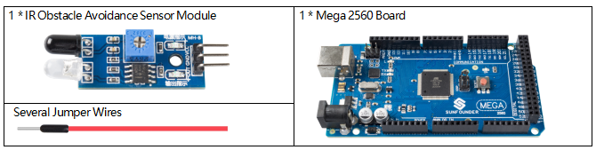
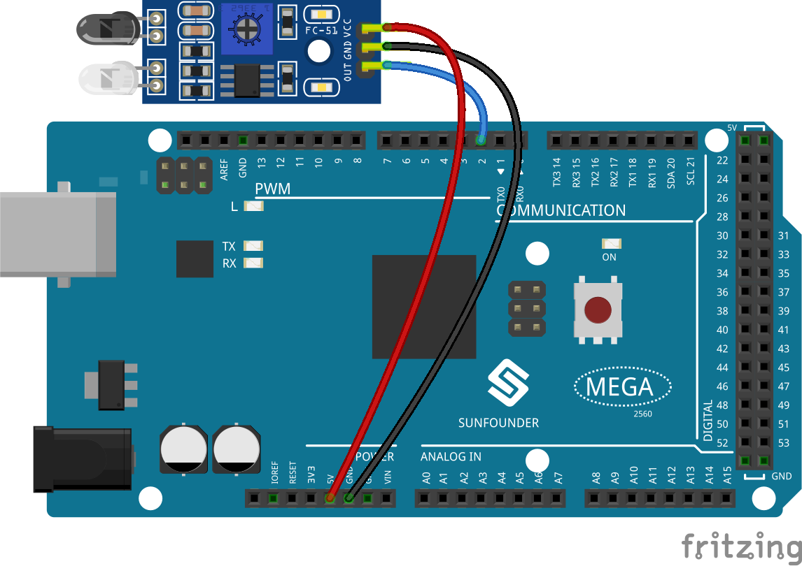
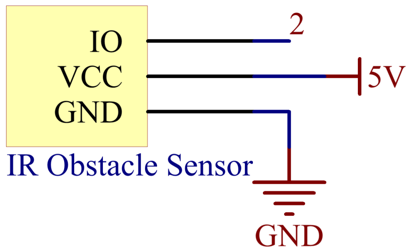
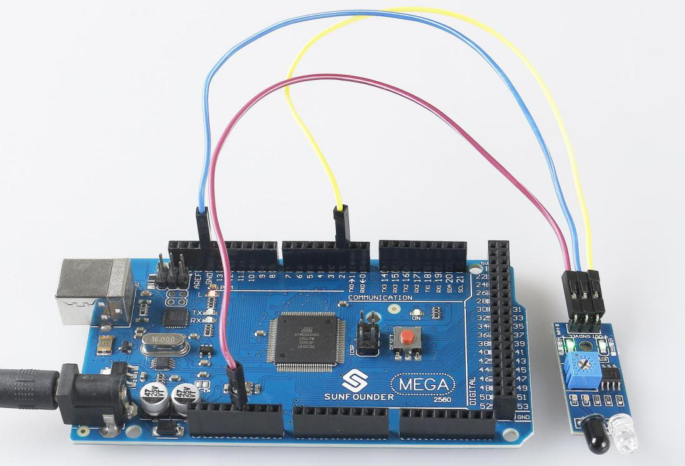

.. note:: 

    Bonjour et bienvenue dans la communauté des passionnés de Raspberry Pi, Arduino et ESP32 sur Facebook, animée par SunFounder ! Explorez davantage l'univers de Raspberry Pi, Arduino et ESP32 avec d'autres passionnés.

    **Pourquoi nous rejoindre ?**

    - **Support d'experts** : Résolvez vos problèmes après-vente et vos défis techniques avec l'aide de notre communauté et de notre équipe.
    - **Apprendre et partager** : Échangez des conseils et des tutoriels pour améliorer vos compétences.
    - **Aperçus exclusifs** : Bénéficiez d'un accès anticipé aux annonces de nouveaux produits et d'aperçus exclusifs.
    - **Réductions spéciales** : Profitez de réductions exclusives sur nos derniers produits.
    - **Promotions festives et concours** : Participez à des concours et des promotions pendant les fêtes.

    👉 Prêt à explorer et créer avec nous ? Cliquez sur [|link_sf_facebook|] et rejoignez-nous dès aujourd'hui !

.. _ar_avoid:

2.30 Capteur de détection d'obstacles IR
==========================================

Aperçu
--------

Dans cette leçon, vous apprendrez à utiliser le capteur de détection 
d'obstacles IR. Ce module est couramment installé sur des véhicules et 
des robots pour détecter la présence d'obstacles devant eux. Il est 
également largement utilisé dans des dispositifs portables, des robinets 
et autres applications similaires.

Composants requis
--------------------

* :ref:`cpn_mega2560`
* :ref:`cpn_wires`
* :ref:`cpn_avoid`

Circuit Fritzing
-----------------

Nous pouvons connecter directement les broches du module de capteur d'obstacles 
IR aux broches de la carte Mega 2560. La broche numérique 2 est utilisée pour 
lire le signal du module de détection d'obstacles IR. Nous connectons le VCC du 
module IR à 5V, GND à GND, et OUT à la broche numérique 2.

Schéma de connexion
--------------------

Code
------

.. note::

    * Vous pouvez ouvrir directement le fichier ``2.30_irSensorModule.ino`` situé dans le dossier ``sunfounder_vincent_kit_for_arduino\code\2.30_irSensorModule``.
    * Ou copiez ce code dans l'IDE Arduino.

.. raw:: html

    <iframe src=https://create.arduino.cc/editor/sunfounder01/918a1cfa-eade-48f4-b998-542765ff65cd/preview?embed style="height:510px;width:100%;margin:10px 0" frameborder=0></iframe>

Après avoir téléchargé le code sur la carte Mega2560, vous pouvez consulter 
les lectures des broches sur le moniteur série. Lorsque le module de détection 
d'obstacles IR détecte un obstacle, le moniteur série affiche « 0 » ; sinon, 
« 1 » est affiché. Consultez :ref:`ar_digital_read` pour plus de détails sur 
l'explication du code.

Illustration du phénomène
---------------------------

