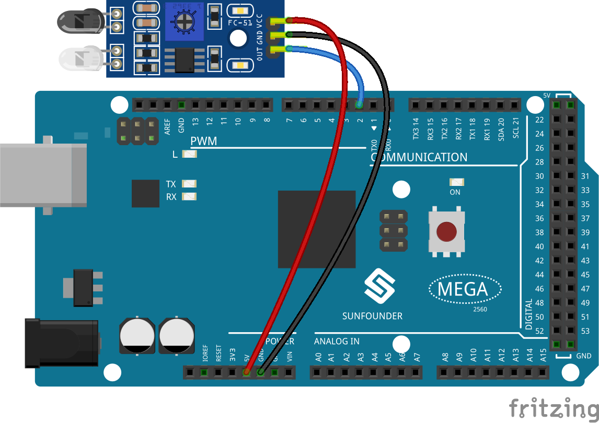

.. _ar_avoid:

2.30 Hindernisvermeidungssensor
===================================

Überblick
----------------

In dieser Lektion lernen Sie, wie Sie den IR-Hindernisvermeidungssensor verwenden. Dieses Modul wird üblicherweise auf dem Auto und dem Roboter installiert, um das Vorhandensein von Hindernissen vor ihnen zu beurteilen. Es wird auch häufig in Handgeräten, Wasserhähnen usw. verwendet.

Erforderliche Komponenten
---------------------------------

* :ref:`cpn_mega2560`
* :ref:`cpn_wires`
* :ref:`cpn_avoid`

Fritzing-Schaltung
-------------------------
Wir können die Pins des IR-Hindernissensormoduls direkt mit den Pins der Mega 2560-Platine verbinden. Der digitale Stift 2 wird verwendet, um das Signal des IR-Hindernisvermeidungssensormoduls zu lesen. Wir verbinden den VCC des IR-Sensormoduls mit 5 V, GND mit GND, OUT mit Digital Pin 2.

Schematische Darstellung
------------------------

Code
-----------

.. note::

    * Sie können die Datei ``2.30_irSensorModule.ino`` unter dem Pfad ``sunfounder_vincent_kit_for_arduino\code\2.30_irSensorModule`` direkt öffnen.
    * Oder kopieren Sie diesen Code in Arduino IDE. 

.. raw:: html

    <iframe src=https://create.arduino.cc/editor/sunfounder01/918a1cfa-eade-48f4-b998-542765ff65cd/preview?embed style="height:510px;width:100%;margin:10px 0" frameborder=0></iframe>

Wenn Sie die Codes auf die Mega2560-Platine hochgeladen haben, können Sie die Messwerte der Pins auf dem seriellen Monitor sehen. Wenn das IR-Hindernisvermeidungssensormodul erkennt, dass etwas voraus liegt, erscheint 「0」 auf dem seriellen Monitor; andernfalls wird「1」angezeigt. Siehe :ref:`ar_digital_read`, um die detaillierte Code-Erklärung zu überprüfen.

Phänomen Bild
-----------------------

