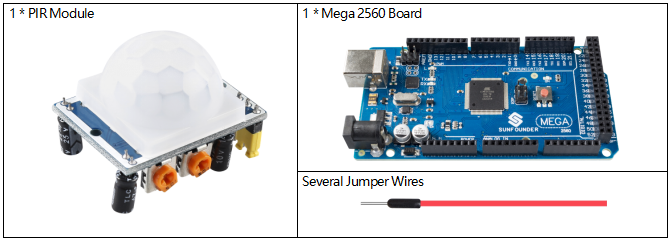

.. _ar_pir:

2.31 PIR Module
================

Overview
--------------

In this lesson, you will learn how to use PIR Module. The PIR sensor
detects infrared heat radiation or the presence of organisms that emit
infrared heat radiation. This module is widely used in daily life for
our intruder alarm and visiting prompt.

Components Required
-------------------------

* :ref:`cpn_mega2560`
* :ref:`cpn_wires`
* :ref:`cpn_pir`

Fritzing Circuit
----------------------

In this example, we can connect the pins of Sound Sensor
Module to the pins of Mega 2560 Board directly, and we use digital pin 2
to read the signal of PIR Module. Connect the VCC of PIR Module to 5V,
GND to GND, and OUT to digital pin NOTE: you can remove the PIR cover to
see the pin mark.

.. image:: img/image236.png
   :align: center

Schematic Diagram

.. image:: img/image237.png 
   :align: center

Code
-------------

.. note::

    * You can open the file ``2.31_pirModule.ino`` under the path of ``sunfounder_vincent_kit_for_arduino\code\2.31_pirModule`` directly.
    * Or copy this code into Arduino IDE 1/2.
    * Or click **Open Code** to open it in `Web Editor <https://docs.arduino.cc/cloud/web-editor/tutorials/getting-started/getting-started-web-editor>`_.
    * Then :ref:`ar_upload_code` to the board.

.. raw:: html

    <iframe src=https://create.arduino.cc/editor/sunfounder01/7d331c91-94eb-4284-b288-5260521505fc/preview?embed style="height:510px;width:100%;margin:10px 0" frameborder=0></iframe>

After the codes are uploaded to the Mega2560 board, you can open the
serial monitor to see the reading value of the pin. When PIR Module
detects activity nearby, the serial monitor will display 「1」;
otherwise, it will display 「0」. Check :ref:`ar_digital_read` 
detail code explanation.

There are two potentiometers on the PIR module: one is to adjust
**sensitivity** and the other is to adjust the **detection distance**.
In order to make the PIR module work better, you need to try to adjust
these two potentiometers.

Phenomenon Picture
------------------------

.. image:: img/image238.jpeg
