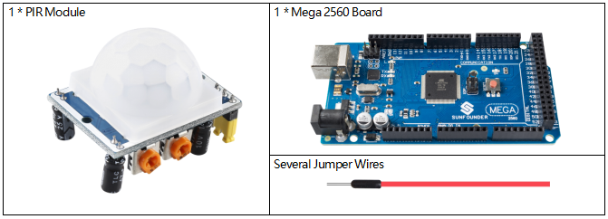
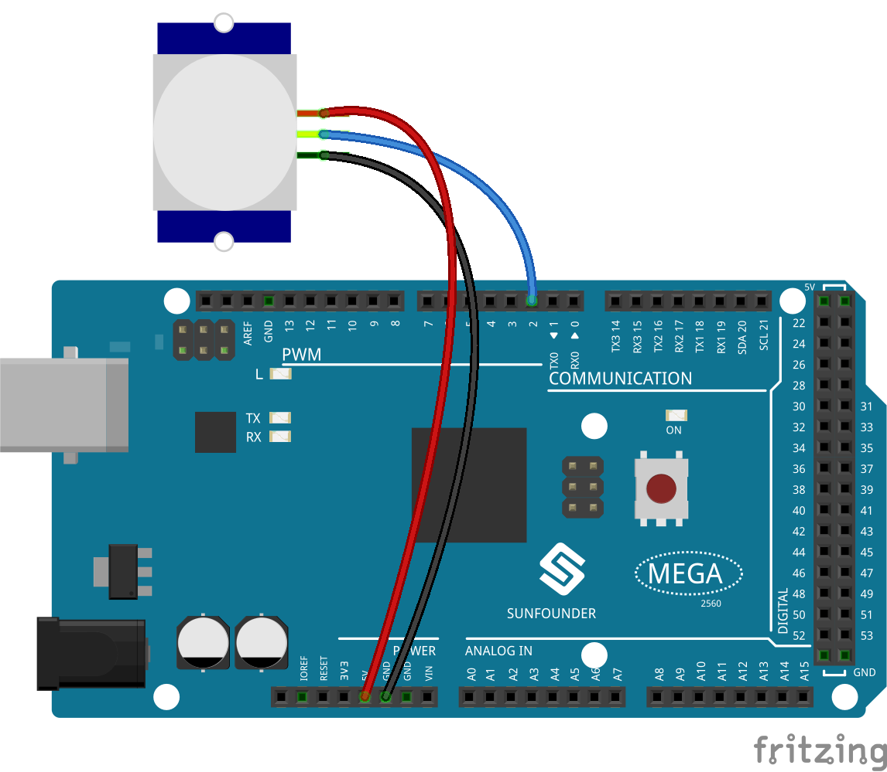
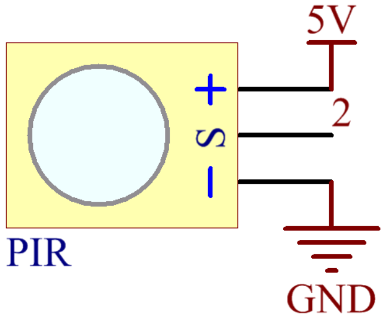
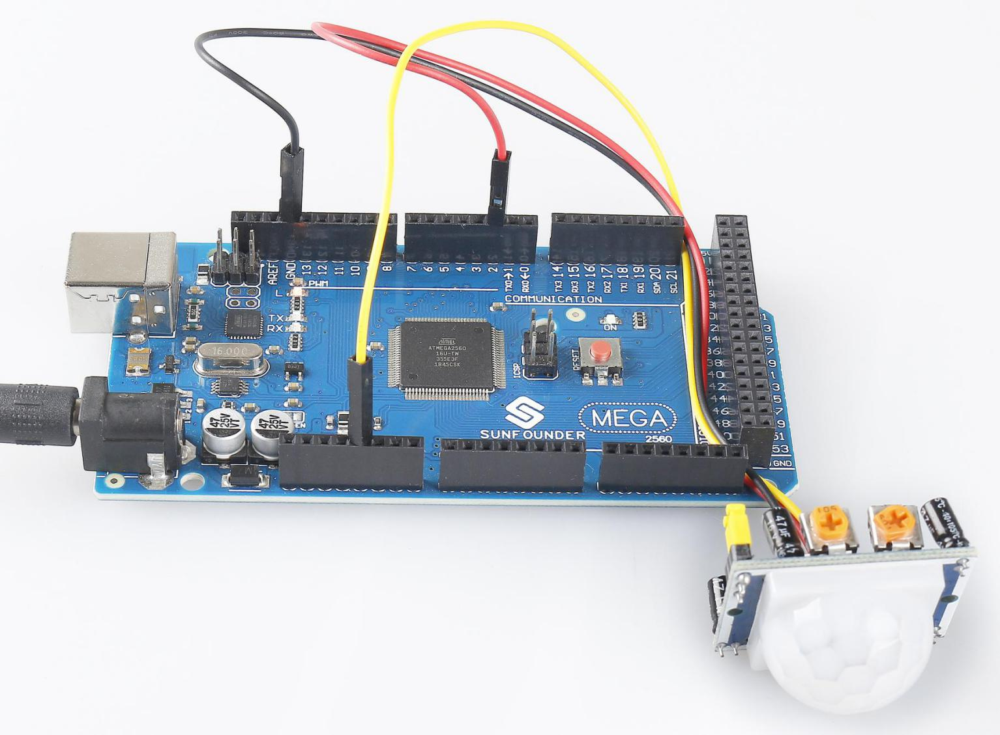

.. note:: 

    Hola, ¡bienvenido a la comunidad de entusiastas de SunFounder Raspberry Pi, Arduino y ESP32 en Facebook! Profundiza en Raspberry Pi, Arduino y ESP32 junto a otros entusiastas.

    **¿Por qué unirse?**

    - **Soporte de expertos**: Resuelve problemas posventa y desafíos técnicos con ayuda de nuestra comunidad y equipo.
    - **Aprende y Comparte**: Intercambia consejos y tutoriales para mejorar tus habilidades.
    - **Avances exclusivos**: Accede anticipadamente a anuncios de nuevos productos y adelantos.
    - **Descuentos especiales**: Disfruta de descuentos exclusivos en nuestros productos más recientes.
    - **Promociones y sorteos festivos**: Participa en sorteos y promociones especiales por festividades.

    👉 ¿Listo para explorar y crear con nosotros? Haz clic en [|link_sf_facebook|] y únete hoy mismo.

.. _ar_pir:

2.31 Módulo PIR
==================

Descripción general
-----------------------

En esta lección, aprenderás a utilizar el módulo PIR. El sensor PIR detecta 
radiación de calor infrarrojo o la presencia de organismos que emiten radiación 
de calor infrarrojo. Este módulo se utiliza ampliamente en la vida diaria para 
alarmas de intrusión y alertas de visita.

Componentes necesarios
-------------------------

* :ref:`cpn_mega2560`
* :ref:`cpn_wires`
* :ref:`cpn_pir`

Circuito Fritzing
----------------------

En este ejemplo, conectamos los pines del módulo sensor de sonido directamente 
a los pines de la placa Mega 2560, y usamos el pin digital 2 para leer la señal 
del módulo PIR. Conecta el VCC del módulo PIR a 5V, GND a GND y OUT al pin digital. 
NOTA: puedes retirar la cubierta del PIR para ver la marca de los pines.

Diagrama esquemático

Código
--------------

.. note::

    * Puedes abrir el archivo ``2.31_pirModule.ino`` en la ruta ``sunfounder_vincent_kit_for_arduino\code\2.31_pirModule`` directamente.
    * O copia este código en el IDE de Arduino.

.. raw:: html

    <iframe src=https://create.arduino.cc/editor/sunfounder01/7d331c91-94eb-4284-b288-5260521505fc/preview?embed style="height:510px;width:100%;margin:10px 0" frameborder=0></iframe>

Después de cargar el código en la placa Mega2560, puedes abrir el monitor 
serial para ver el valor de lectura del pin. Cuando el módulo PIR detecta 
actividad cercana, el monitor serial mostrará 「1」; de lo contrario, 
mostrará 「0」. Consulta :ref:`ar_digital_read` para la explicación detallada 
del código.

El módulo PIR tiene dos potenciómetros: uno para ajustar la **sensibilidad** 
y otro para ajustar la **distancia de detección**. Para que el módulo PIR 
funcione de manera óptima, debes ajustar ambos potenciómetros.

Imagen del Fenómeno
------------------------

