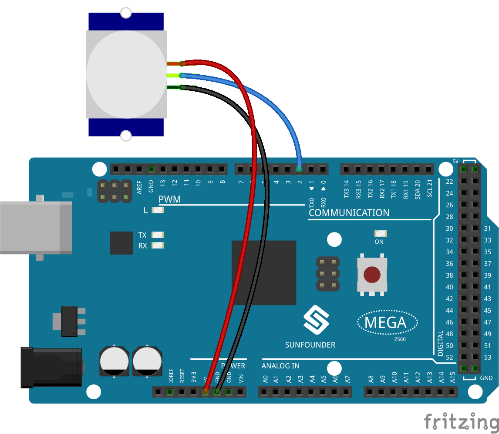
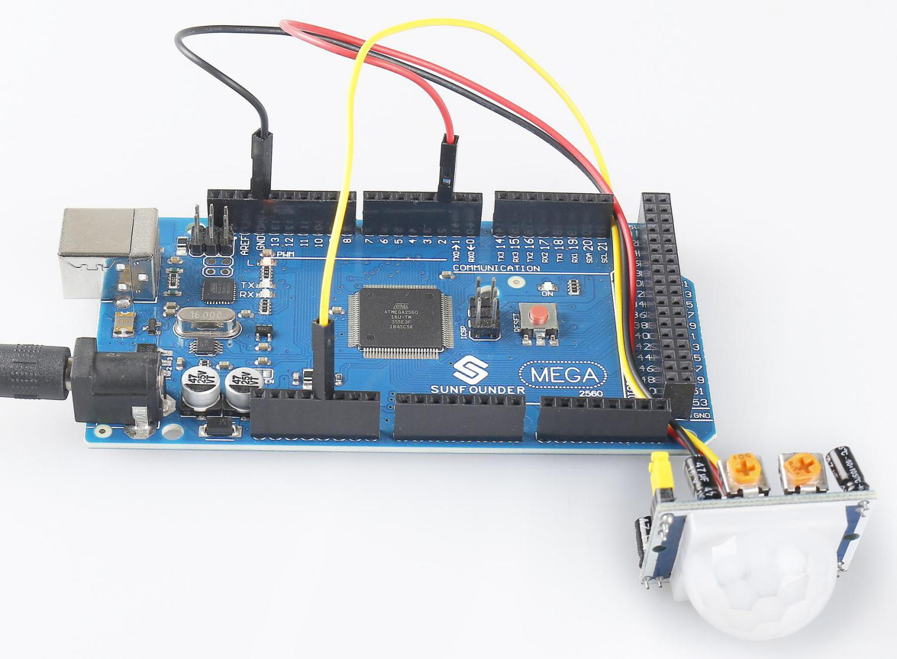

.. _ar_pir:

2.31 PIR-Modul
================

Überblick
--------------

In dieser Lektion lernen Sie, wie Sie das PIR-Modul verwenden. Der PIR-Sensor erkennt Infrarot-Wärmestrahlung oder das Vorhandensein von Organismen, die Infrarot-Wärmestrahlung aussenden. Dieses Modul wird im täglichen Leben häufig für unsere Einbruchmelde- und Besuchsaufforderung verwendet.

Erforderliche Komponenten
----------------------------

.. image:: img/Part_two_31.png

* :ref:`cpn_mega2560`
* :ref:`cpn_wires`
* :ref:`cpn_pir`

Fritzing-Schaltung
----------------------

In diesem Beispiel können wir die Pins des Soundsensormoduls direkt mit den Pins der Mega 2560-Platine verbinden, und wir verwenden den digitalen Pin 2, um das Signal des PIR-Moduls zu lesen. Verbinden Sie den VCC des PIR-Moduls mit 5 V, GND mit GND und OUT mit dem Digitalstift. HINWEIS: Sie können die PIR-Abdeckung entfernen, um die Stiftmarkierung zu sehen.

Schematische Darstellung
--------------------------------

.. image:: img/image237.png 
   :align: center

Code
-------------

.. note::

    * Sie können die Datei ``2.31_pirModule.ino`` unter dem Pfad ``sunfounder_vincent_kit_for_arduino\code\2.31_pirModule`` direkt öffnen.
    * Oder kopieren Sie diesen Code in Arduino IDE 1/2.
    * Oder klicken Sie auf Code öffnen, um ihn im `Web Editor <https://docs.arduino.cc/cloud/web-editor/tutorials/getting-started/getting-started-web-editor>`_ zu öffnen .
    * Laden Sie dann :ref:`ar_upload_code` auf das Board hoch.

.. raw:: html

    <iframe src=https://create.arduino.cc/editor/sunfounder01/7d331c91-94eb-4284-b288-5260521505fc/preview?embed style="height:510px;width:100%;margin:10px 0" frameborder=0></iframe>

Nachdem die Codes auf die Mega2560-Platine hochgeladen wurden, können Sie den seriellen Monitor öffnen, um den Lesewert des Pins zu sehen. Wenn das PIR-Modul Aktivitäten in der Nähe erkennt, zeigt der serielle Monitor 「1」 an; andernfalls wird 「0」 angezeigt. Siehe :ref:`ar_digital_read`.

Auf dem PIR-Modul befinden sich zwei Potentiometer: eines dient zum Einstellen der Empfindlichkeit und das andere zum Einstellen des Erfassungsabstands . Damit das PIR-Modul besser funktioniert, müssen Sie versuchen, diese beiden Potentiometer einzustellen.

Phänomen Bild
------------------------

