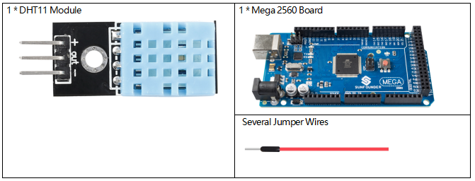
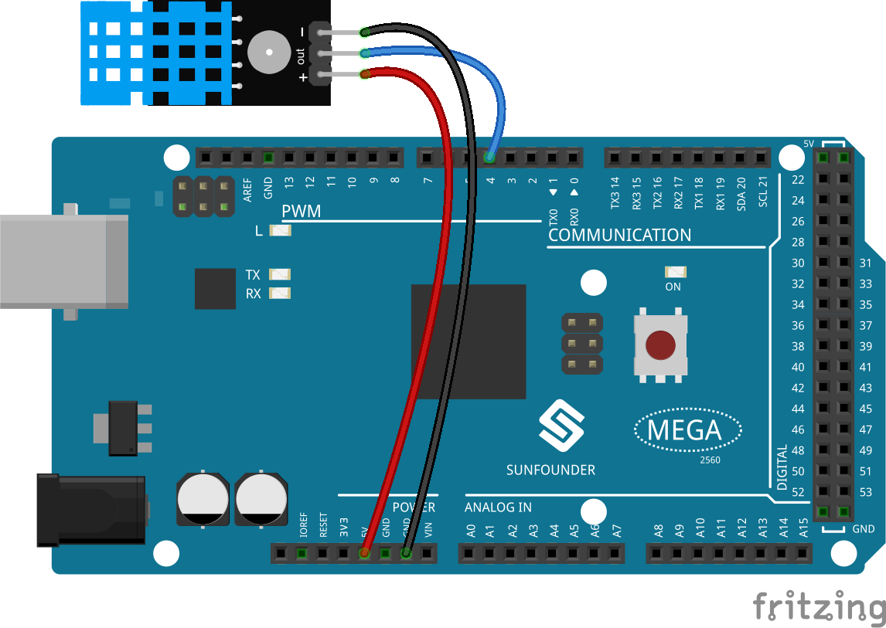
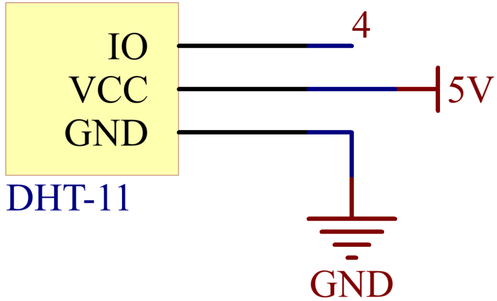
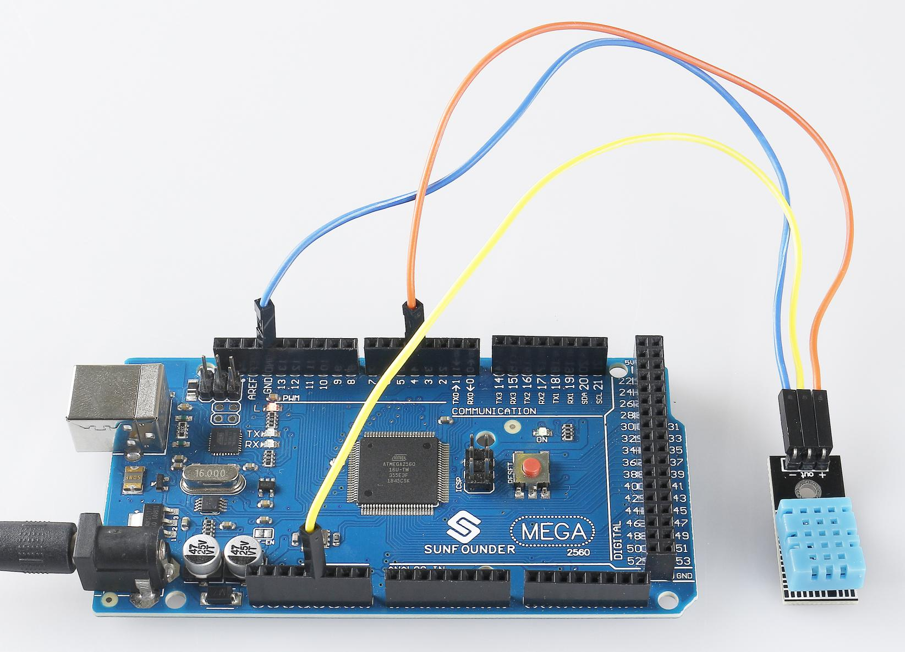

.. _ar_humiture:

2.32 DHT11 Module
==================

Overview
--------------

In this lesson, you will learn how to use DHT11 Module. The DHT11 is a
basic, ultra low-cost digital temperature and humidity sensor. It uses a
capacitive humidity sensor and a thermistor to measure the surrounding
air, and spits out a digital signal on the data pin (no analog input
pins are needed).

Components Required
-----------------------

* :ref:`cpn_mega2560`
* :ref:`cpn_wires`
* :ref:`cpn_humiture`

Fritzing Circuit
----------------------

In this example, we can directly connect the pins of DHT11
Module to the pins of Mega 2560 Board, and we use pin 4 to read the
signal of DHT11 Module. Connect the pin「+」of DHT11 Module to 5V, the
pin「-」 to GND, and the pin OUT to pin 4.

**Wiring Diagram**
--------------------

Code
----------

.. note::

    * You can open the file ``2.32_dhtModule.ino`` under the path of ``sunfounder_vincent_kit_for_arduino\code\2.32_dhtModule`` directly.
    * The ``DHT sensor library`` library is used here, you can install it from the **Library Manager**.

        .. image:: img/lib_dht11.png
            :align: center

.. raw:: html

    <iframe src=https://create.arduino.cc/editor/sunfounder01/f8605323-827f-4741-b414-10241e4c9afa/preview?embed style="height:510px;width:100%;margin:10px 0" frameborder=0></iframe>

After the codes are uploaded to the Mega2560 board, the serial monitor
will continue to output the current temperature and humidity values of
the environment.

Code Analysis
-------------------

#.  Includes the ``DHT.h`` library, which provides functions to interact with the DHT sensors. Then, set the pin and type for the DHT sensor.

    .. code-block:: arduino

        #include "DHT.h"

        #define DHTPIN 4  // Set the pin connected to the DHT11 data pin
        #define DHTTYPE DHT11 // DHT 11 

        DHT dht(DHTPIN, DHTTYPE);

#. Initializes serial communication at a baud rate of 115200 and initializes the DHT sensor.

    .. code-block:: arduino

        void setup() {
            Serial.begin(115200);
            Serial.println("DHT11 test!");
            dht.begin();
        }

#. In the ``loop()`` function, read temperature and humidity values from the DHT11 sensor, and print them to the serial monitor.

    .. code-block:: arduino

        void loop() {
            // Wait a few seconds between measurements.
            delay(2000);

            // Reading temperature or humidity takes about 250 milliseconds!
            // Sensor readings may also be up to 2 seconds 'old' (it's a very slow sensor)
            float humidity = dht.readHumidity();
            // Read temperature as Celsius (the default)
            float temperture = dht.readTemperature();

            // Check if any reads failed and exit early (to try again).
            if (isnan(humidity) || isnan(temperture)) {
                Serial.println("Failed to read from DHT sensor!");
                return;
            }
            // Print the humidity and temperature
            Serial.print("Humidity: "); 
            Serial.print(humidity);
            Serial.print(" %\t");
            Serial.print("Temperature: "); 
            Serial.print(temperture);
            Serial.println(" *C");
        }

    * The ``dht.readHumidity()`` function is called to read the humidity value from the DHT sensor.
    * The ``dht.readTemperature()`` function is called to read the temperature value from the DHT sensor.
    * The ``isnan()`` function is used to check if the readings are valid. If either the humidity or temperature value is NaN (not a number), it indicates a failed reading from the sensor, and an error message is printed.

Phenomenon Picture
-----------------------

