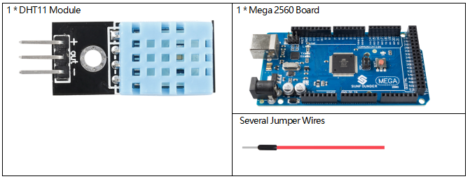
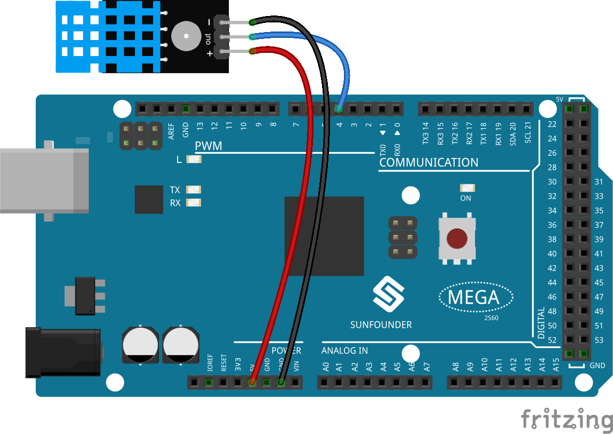
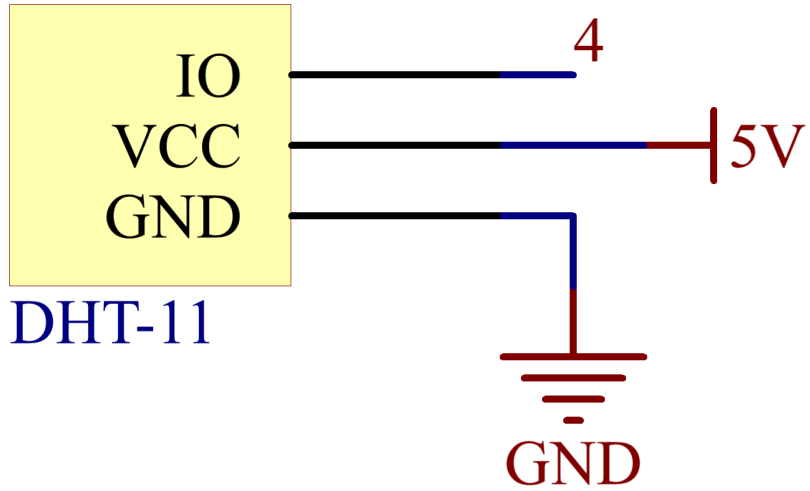
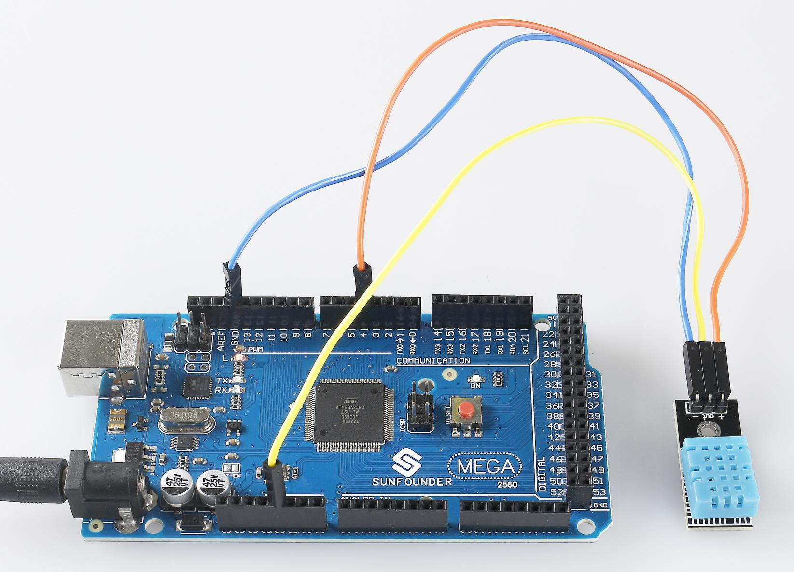

.. note:: 

    Bonjour et bienvenue dans la communauté des passionnés de Raspberry Pi, Arduino et ESP32 sur Facebook, animée par SunFounder ! Explorez plus en profondeur l'univers de Raspberry Pi, Arduino et ESP32 avec d'autres passionnés.

    **Pourquoi nous rejoindre ?**

    - **Support d'experts** : Résolvez vos problèmes après-vente et vos défis techniques avec l'aide de notre communauté et de notre équipe.
    - **Apprendre et partager** : Échangez des conseils et des tutoriels pour améliorer vos compétences.
    - **Aperçus exclusifs** : Bénéficiez d'un accès anticipé aux annonces de nouveaux produits et d'aperçus exclusifs.
    - **Réductions spéciales** : Profitez de réductions exclusives sur nos derniers produits.
    - **Promotions festives et concours** : Participez à des concours et des promotions pendant les fêtes.

    👉 Prêt à explorer et créer avec nous ? Cliquez sur [|link_sf_facebook|] et rejoignez-nous dès aujourd'hui !

.. _ar_humiture:

2.32 Module DHT11
================

Aperçu
-------

Dans cette leçon, vous apprendrez à utiliser le module DHT11. Le DHT11 est 
un capteur numérique de température et d'humidité à très bas coût. Il utilise 
un capteur capacitif pour l'humidité et un thermistor pour mesurer l'air ambiant, 
et transmet un signal numérique sur la broche de données (aucune entrée analogique 
n'est nécessaire).

Composants requis
--------------------

* :ref:`cpn_mega2560`
* :ref:`cpn_wires`
* :ref:`cpn_humiture`

Circuit Fritzing
-------------------

Dans cet exemple, nous pouvons connecter directement les broches du module 
DHT11 aux broches de la carte Mega 2560, et nous utilisons la broche 4 pour 
lire le signal du module DHT11. Connectez la broche「+」du module DHT11 à 5V, 
la broche「-」à GND, et la broche OUT à la broche 4.

**Schéma de câblage**
------------------------

Code
------

.. note::

    * Vous pouvez ouvrir directement le fichier ``2.32_dhtModule.ino`` situé dans le dossier ``sunfounder_vincent_kit_for_arduino\code\2.32_dhtModule``.
    * La bibliothèque ``DHT sensor library`` est utilisée ici, vous pouvez l'installer via le **Gestionnaire de bibliothèques**.

        .. image:: img/lib_dht11.png
            :align: center

.. raw:: html

    <iframe src=https://create.arduino.cc/editor/sunfounder01/f8605323-827f-4741-b414-10241e4c9afa/preview?embed style="height:510px;width:100%;margin:10px 0" frameborder=0></iframe>

Une fois le code téléchargé sur la carte Mega2560, le moniteur série continuera 
d'afficher les valeurs actuelles de la température et de l'humidité de l'environnement.

Analyse du code
-----------------

#.  Le fichier inclut la bibliothèque ``DHT.h``, qui fournit des fonctions pour interagir avec les capteurs DHT. Ensuite, on définit la broche et le type pour le capteur DHT.

    .. code-block:: arduino

        #include "DHT.h"

        #define DHTPIN 4  // Définir la broche connectée à la broche de données du DHT11
        #define DHTTYPE DHT11 // DHT 11 

        DHT dht(DHTPIN, DHTTYPE);

#. Initialise la communication série à un débit de 115200 et initialise le capteur DHT.

    .. code-block:: arduino

        void setup() {
            Serial.begin(115200);
            Serial.println("DHT11 test!");
            dht.begin();
        }

#. Dans la fonction ``loop()``, les valeurs de température et d'humidité sont lues à partir du capteur DHT11 et affichées dans le moniteur série.

    .. code-block:: arduino

        void loop() {
            // Attendre quelques secondes entre chaque mesure.
            delay(2000);

            // La lecture de la température ou de l'humidité prend environ 250 millisecondes !
            // Les lectures peuvent aussi être jusqu'à 2 secondes "anciennes" (c'est un capteur assez lent)
            float humidity = dht.readHumidity();
            // Lire la température en Celsius (par défaut)
            float temperture = dht.readTemperature();

            // Vérifier si l'une des lectures a échoué et sortir si nécessaire (pour réessayer).
            if (isnan(humidity) || isnan(temperture)) {
                Serial.println("Failed to read from DHT sensor!");
                return;
            }
            // Afficher l'humidité et la température
            Serial.print("Humidity: "); 
            Serial.print(humidity);
            Serial.print(" %\t");
            Serial.print("Temperature: "); 
            Serial.print(temperture);
            Serial.println(" *C");
        }

    * La fonction ``dht.readHumidity()`` est utilisée pour lire la valeur d'humidité du capteur DHT.
    * La fonction ``dht.readTemperature()`` est utilisée pour lire la valeur de la température du capteur DHT.
    * La fonction ``isnan()`` est utilisée pour vérifier si les lectures sont valides. Si l'une des valeurs d'humidité ou de température est NaN (not a number), cela indique un échec de lecture depuis le capteur, et un message d'erreur est affiché.

Illustration du phénomène
-----------------------------

