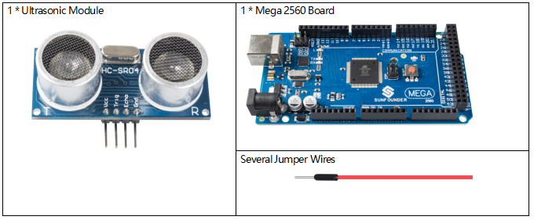
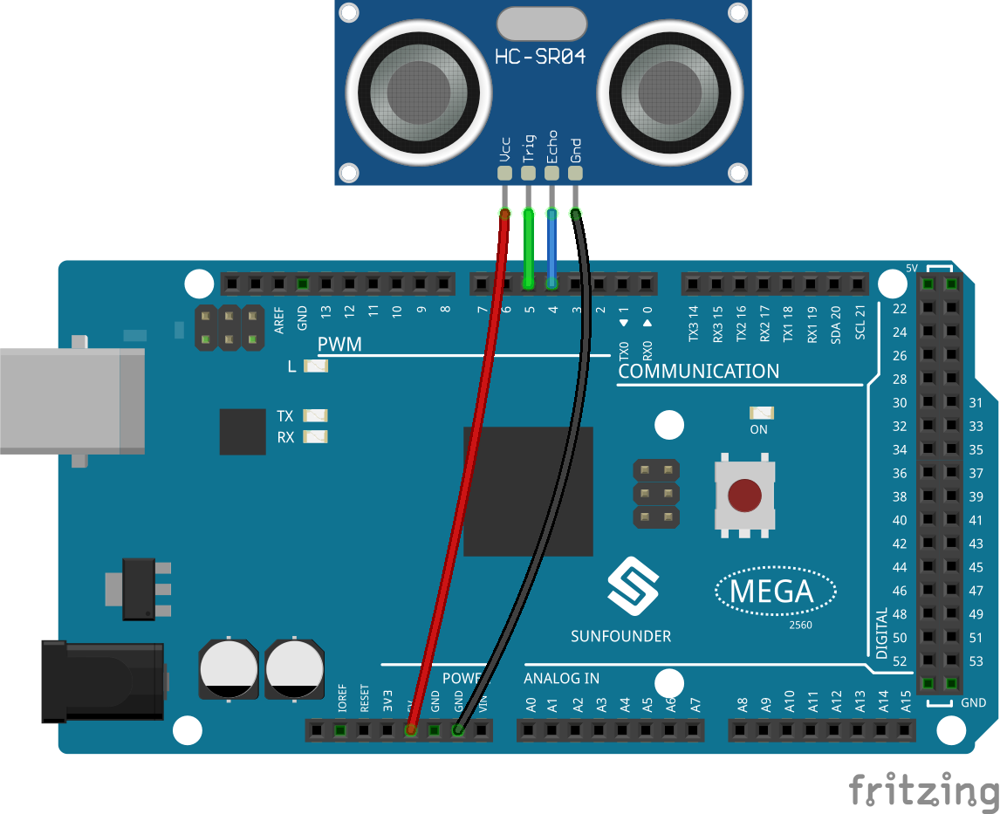
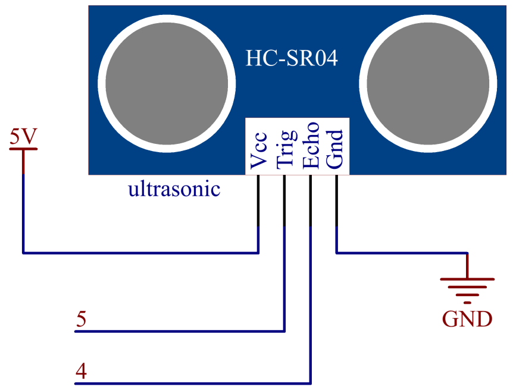
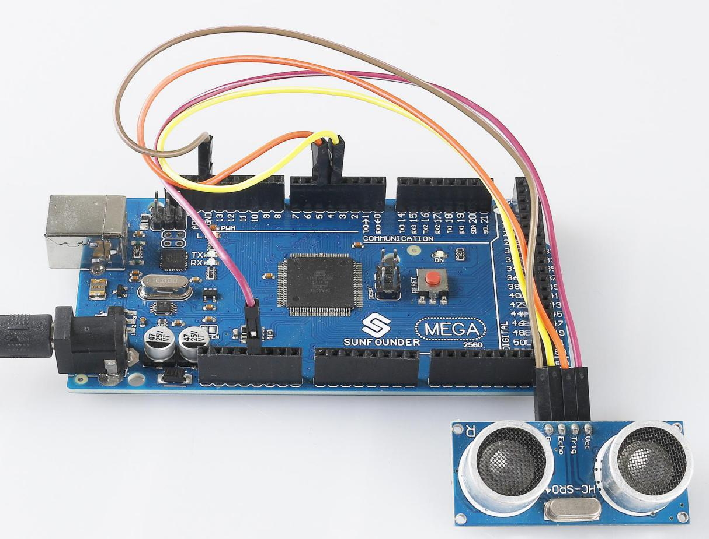

.. _ar_ultrasonic:

2.33 Ultrasonic Module
======================

Overview
------------

In this lesson, you will learn how to use Ultrasonic module.

Components Required
-------------------------

* :ref:`cpn_mega2560`
* :ref:`cpn_wires`
* :ref:`cpn_ultrasonic`

Fritzing Circuit
---------------------

In this example, we directly connect the pins of Ultrasonic Module with
the pins of Mega 2560 Board. And then we get VCC of the Ultrasonic
Module connected to 5V, GND to GND, Trig to the digital pin 5, Echo to
the digital pin 4.

Schematic Diagram
----------------------

Code
----------

.. note::

    * You can open the file ``2.33_ultrasonicModule.ino`` under the path of ``sunfounder_vincent_kit_for_arduino\code\2.33_ultrasonicModule`` directly.
    * Or copy this code into Arduino IDE.

.. raw:: html

    <iframe src=https://create.arduino.cc/editor/sunfounder01/8254174a-93c8-4a72-a440-26f1ab63ca07/preview?embed style="height:510px;width:100%;margin:10px 0" frameborder=0></iframe>

After uploading the codes to the Mega2560 board, the serial monitor will
display the distance of obstacles ahead that the ultrasonic sensor has
detected.

Code Analysis
--------------------

About the application of ultrasonic sensor, we can directly check the
subfunction.

.. code-block:: arduino

    float readSensorData(){// ...}

PING is triggered by a HIGH pulse of 2 or more microseconds. (Give a
short LOW pulse beforehand to ensure a clean HIGH pulse.)

.. code-block:: arduino

    digitalWrite(trigPin, LOW); 
    delayMicroseconds(2);
    digitalWrite(trigPin, HIGH); 
    delayMicroseconds(10);
    digitalWrite(trigPin, LOW); 

The echo pin is used to read signal from PING, a HIGH pulse whose
duration is the time (in microseconds) from the sending of the ping to
the reception of echo of the object.

.. code-block:: arduino

    microsecond=pulseIn(echoPin, HIGH);

The speed of sound is 340 m/s or 29 microseconds per centimeter.

This gives the distance travelled by the ping, outbound and return, so
we divide by 2 to get the distance of the obstacle.

.. code-block:: arduino

    float distance = microsecond / 29.00 / 2;  

Phenomenon Picture
------------------------

