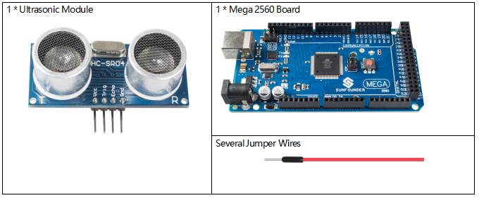
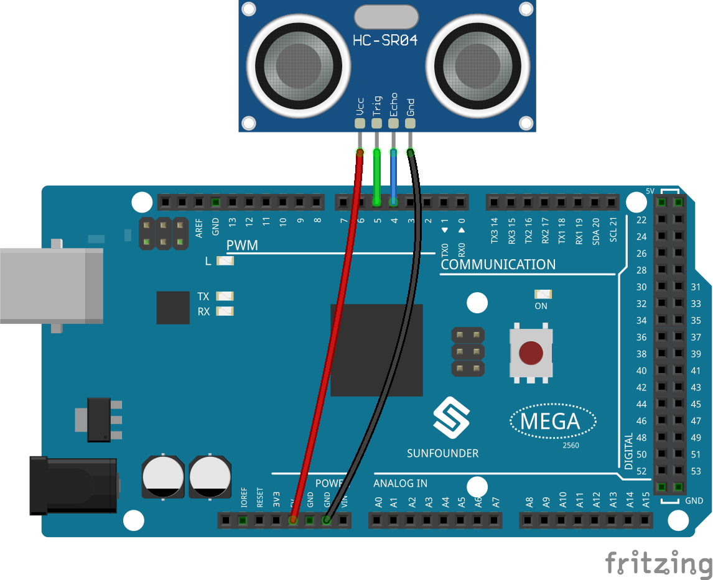
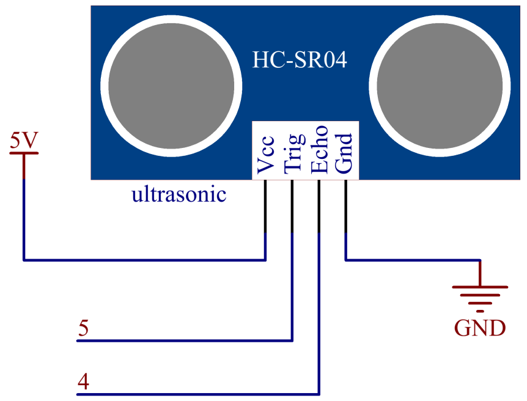
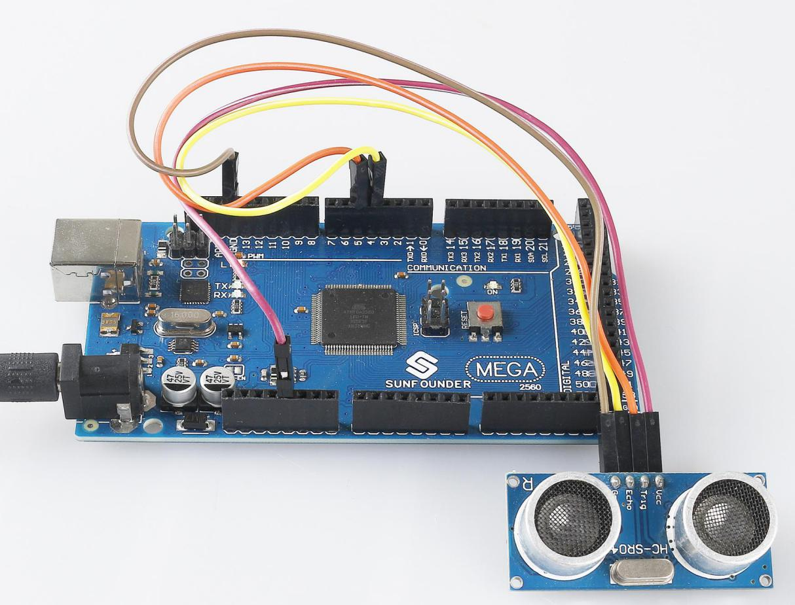

.. note:: 

    Bonjour et bienvenue dans la communauté des passionnés de Raspberry Pi, Arduino et ESP32 sur Facebook, animée par SunFounder ! Explorez plus en profondeur l'univers de Raspberry Pi, Arduino et ESP32 avec d'autres passionnés.

    **Pourquoi nous rejoindre ?**

    - **Support d'experts** : Résolvez vos problèmes après-vente et vos défis techniques avec l'aide de notre communauté et de notre équipe.
    - **Apprendre et partager** : Échangez des conseils et des tutoriels pour améliorer vos compétences.
    - **Aperçus exclusifs** : Bénéficiez d'un accès anticipé aux annonces de nouveaux produits et d'aperçus exclusifs.
    - **Réductions spéciales** : Profitez de réductions exclusives sur nos derniers produits.
    - **Promotions festives et concours** : Participez à des concours et des promotions pendant les fêtes.

    👉 Prêt à explorer et créer avec nous ? Cliquez sur [|link_sf_facebook|] et rejoignez-nous dès aujourd'hui !

.. _ar_ultrasonic:

2.33 Module Ultrasonique
============================

Aperçu
----------

Dans cette leçon, vous apprendrez à utiliser un module ultrasonique.

Composants requis
--------------------

* :ref:`cpn_mega2560`
* :ref:`cpn_wires`
* :ref:`cpn_ultrasonic`

Circuit Fritzing
-------------------

Dans cet exemple, nous connectons directement les broches du module 
ultrasonique aux broches de la carte Mega 2560. Ensuite, nous connectons 
la broche VCC du module ultrasonique à 5V, GND à GND, Trig à la broche 
numérique 5 et Echo à la broche numérique 4.

**Schéma de câblage**
-------------------------

Code
-------

.. note::

    * Vous pouvez ouvrir directement le fichier ``2.33_ultrasonicModule.ino`` situé dans le dossier ``sunfounder_vincent_kit_for_arduino\code\2.33_ultrasonicModule``.
    * Ou copiez ce code dans l'IDE Arduino.

.. raw:: html

    <iframe src=https://create.arduino.cc/editor/sunfounder01/8254174a-93c8-4a72-a440-26f1ab63ca07/preview?embed style="height:510px;width:100%;margin:10px 0" frameborder=0></iframe>

Une fois le code téléchargé sur la carte Mega2560, le moniteur série 
affichera la distance des obstacles détectés par le capteur ultrasonique.

Analyse du code
-------------------

Concernant l'application du capteur ultrasonique, nous pouvons directement 
vérifier la sous-fonction suivante.

.. code-block:: arduino

    float readSensorData(){// ...}

Le PING est déclenché par une impulsion HIGH de 2 microsecondes ou plus. 
(Donner une courte impulsion LOW au préalable pour garantir une impulsion 
HIGH propre.)

.. code-block:: arduino

    digitalWrite(trigPin, LOW); 
    delayMicroseconds(2);
    digitalWrite(trigPin, HIGH); 
    delayMicroseconds(10);
    digitalWrite(trigPin, LOW); 

La broche echo est utilisée pour lire le signal de PING, une impulsion HIGH 
dont la durée est le temps (en microsecondes) qui s'écoule entre l'envoi du 
ping et la réception de l'écho de l'objet.

.. code-block:: arduino

    microsecond=pulseIn(echoPin, HIGH);

La vitesse du son est de 340 m/s, soit 29 microsecondes par centimètre.

Cela donne la distance parcourue par le ping, aller-retour, nous divisons donc par 2 pour obtenir la distance réelle de l'obstacle.

.. code-block:: arduino

    float distance = microsecond / 29.00 / 2;  

Illustration du phénomène
----------------------------

