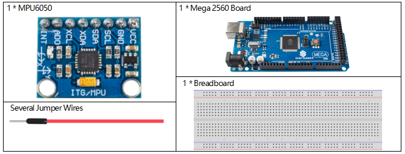
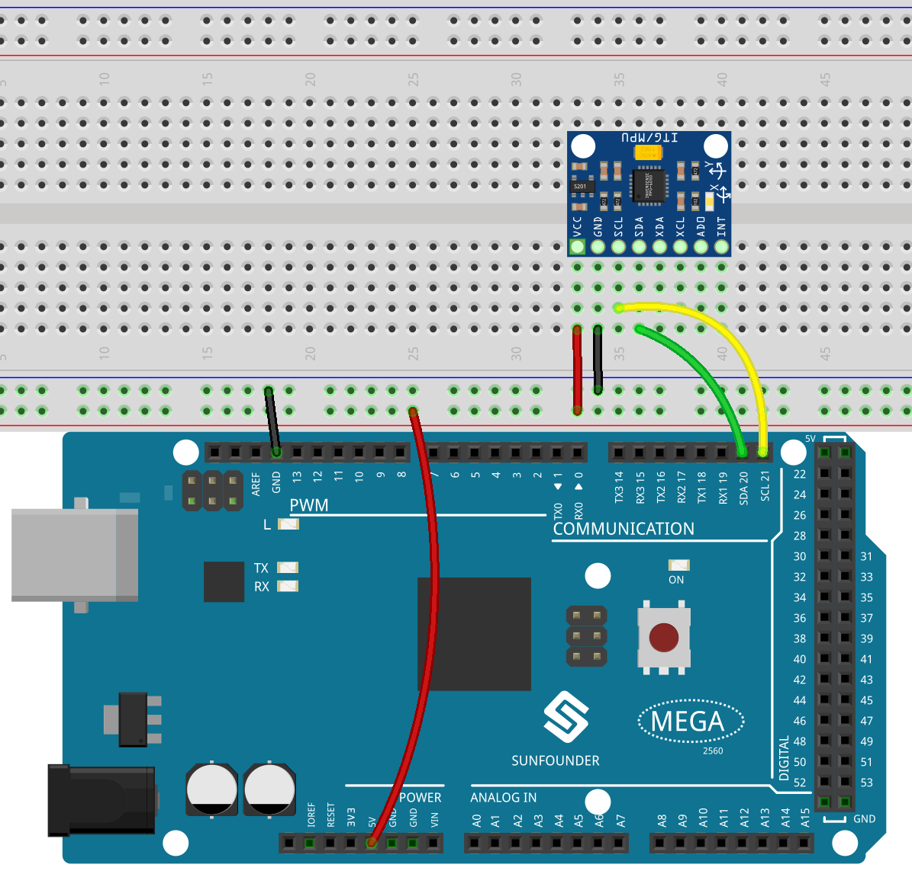
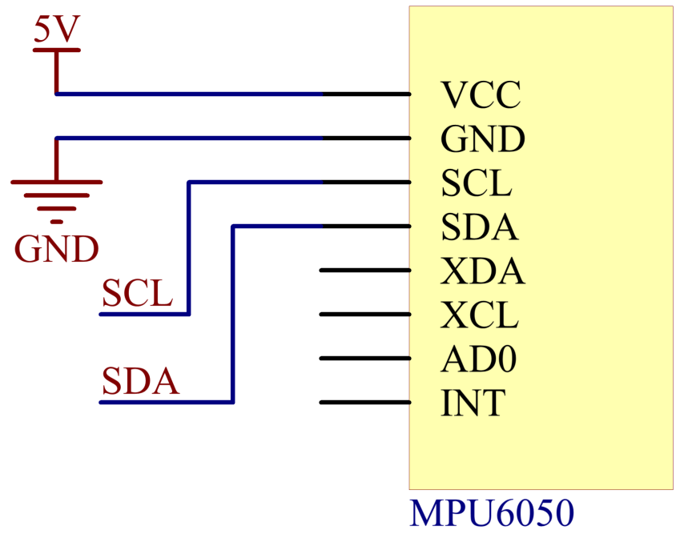
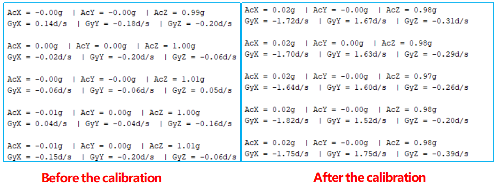
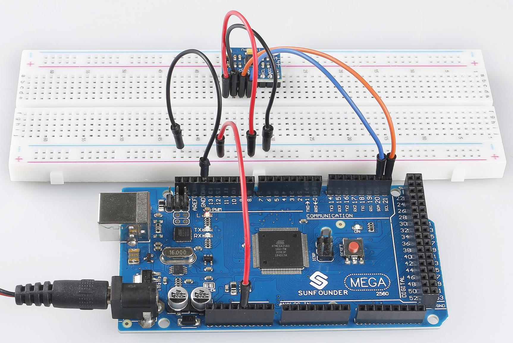

.. _ar_mpu6050:

2.34 MPU6050-Modul
====================

Überblick
-------------

In dieser Lektion lernen Sie, wie Sie MPU6050 verwenden. MPU-6050 ist ein 6-Achsen-Bewegungsverfolgungsgerät (kombiniert aus 3-Achsen-Gyroskop und 3-Achsen-Beschleunigungsmesser). Es wird häufig für Augmented Reality und elektronische Bildstabilisierung (EIS: Electronic Image Stabilization), optische Bildstabilisierung (OIS: Optical Image Stabilization) und „Zero Touch“-Gesten-Benutzeroberfläche verwendet.

Erforderliche Komponenten
-----------------------------

* :ref:`cpn_mega2560`
* :ref:`cpn_breadboard`
* :ref:`cpn_wires`
* :ref:`cpn_mpu6050`

Fritzing-Schaltung
------------------------

In dieser Lektion lernen Sie, wie Sie MPU6050 verwenden. MPU-6050 ist ein 6-Achsen-Bewegungsverfolgungsgerät (kombiniert aus 3-Achsen-Gyroskop und 3-Achsen-Beschleunigungsmesser). Es wird häufig für Augmented Reality und elektronische Bildstabilisierung (EIS: Electronic Image Stabilization), optische Bildstabilisierung (OIS: Optical Image Stabilization) und „Zero Touch“-Gesten-Benutzeroberfläche verwendet.

Schematische Darstellung
----------------------------

Code
-------------

.. note::

    * Sie können die Datei ``2.34_MPU6050.ino`` unter dem Pfad ``sunfounder_vincent_kit_for_arduino\code\2.34_MPU6050`` direkt öffnen.
    * Oder kopieren Sie diesen Code in Arduino IDE 1/2.
    * Oder klicken Sie auf Code öffnen, um ihn im `Web Editor <https://docs.arduino.cc/cloud/web-editor/tutorials/getting-started/getting-started-web-editor>`_ zu öffnen .
    * Laden Sie dann :ref:`ar_upload_code` auf das Board hoch.

.. raw:: html

   <iframe src=https://create.arduino.cc/editor/sunfounder01/7bfae41b-b651-41c2-830b-f2d9ea70efe8/preview?embed style="height:510px;width:100%;margin:10px 0" frameborder=0></iframe>

Nachdem Sie die Codes auf das Mega2560-Board hochgeladen haben, können Sie den seriellen Monitor öffnen, um die Schwerkraftbeschleunigung und Winkelgeschwindigkeit von MPU6050 in jeder Richtung zu sehen.

Code-Analyse
--------------------

Im stationären Desktop-Zustand beträgt die Beschleunigung der Z-Achse 1 Gravitationseinheit und die X- und Y-Achse sind 0.

Vor der Verwendung müssen Sie das Modul kalibrieren, die Methoden sind wie folgt:

1. MPU6050-Module werden horizontal auf dem Schreibtisch platziert und können dann mit Klemmen oder Klebeband befestigt werden.

2. Führen Sie die Beispielcodes aus, um die ROHDATEN von MPU6050 zu erhalten, wenn es statisch ist.

3. Fügen Sie eine Kompensation gemäß den Messwerten hinzu, wenn MPU6050 statisch ist.

Nehmen Sie die MPU6050, die wir als Beispiel verwenden, und die Ergebnisse der Kompensation sind wie folgt:

.. code-block:: arduino

   Serial.print(AcX / 65536  * ACCELE_RANGE - 0.02); 
   Serial.print(AcY / 65536  * ACCELE_RANGE + 0);
   Serial.print(AcZ/65536  * ACCELE_RANGE + 0.02); 
   Serial.print(GyX / 65536  * GYROSC_RANGE + 1.70);
   Serial.print(GyY/65536  * GYROSC_RANGE - 1.70);
   Serial.print(GyZ/65536*GYROSC_RANGE + 0.25);

Phänomen Bild
------------------------

