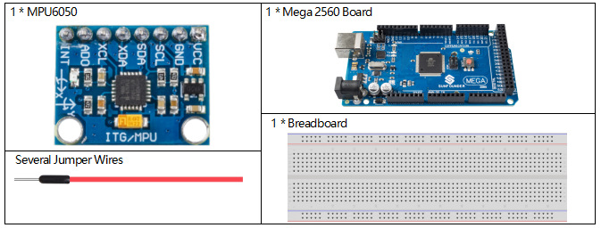
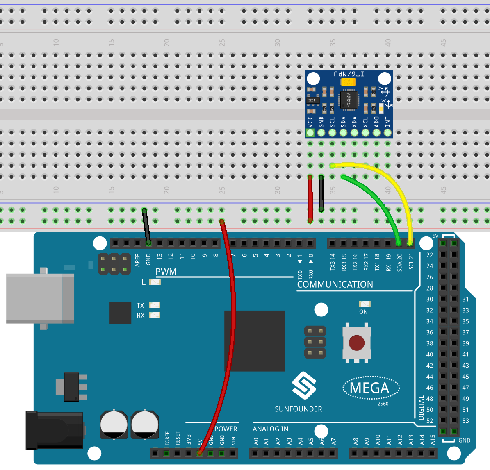
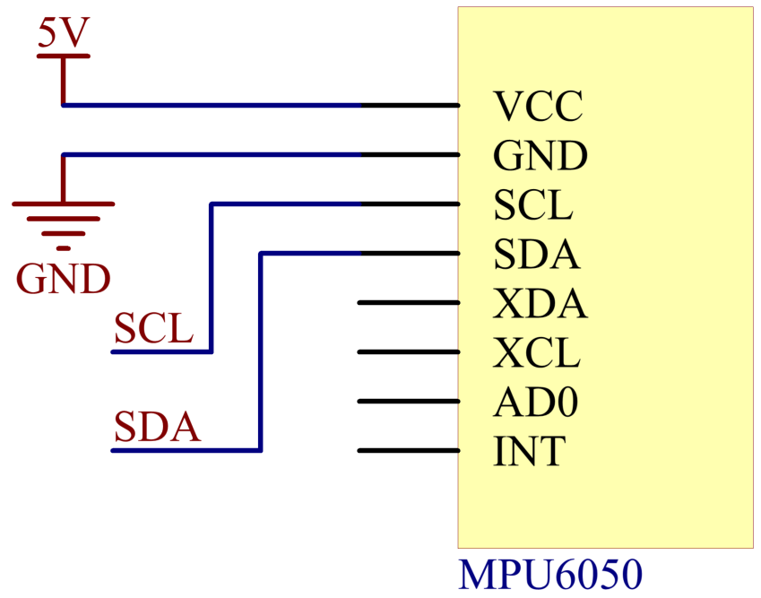
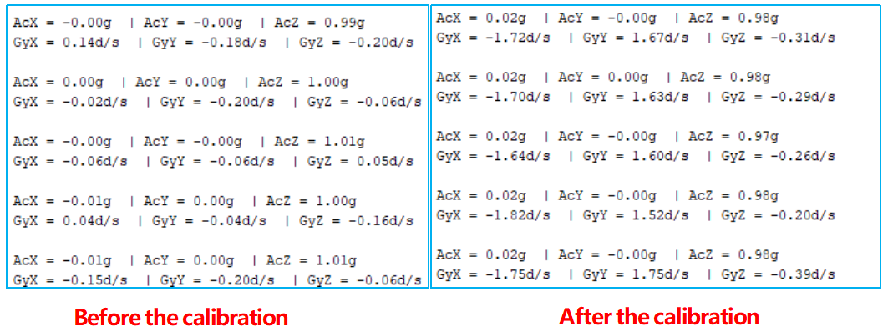
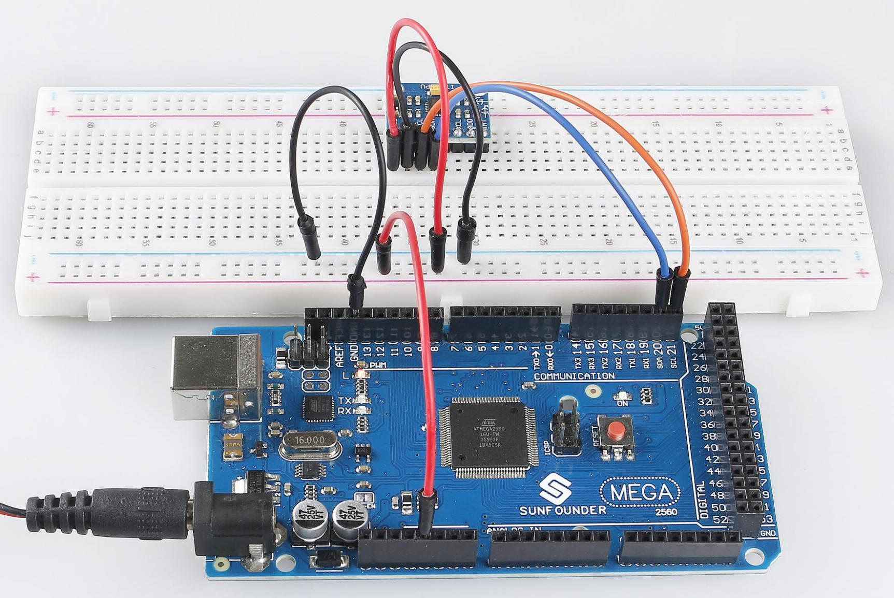

.. note:: 

    Bonjour et bienvenue dans la communauté des passionnés de Raspberry Pi, Arduino et ESP32 sur Facebook, animée par SunFounder ! Explorez plus en profondeur l'univers de Raspberry Pi, Arduino et ESP32 avec d'autres passionnés.

    **Pourquoi nous rejoindre ?**

    - **Support d'experts** : Résolvez vos problèmes après-vente et vos défis techniques avec l'aide de notre communauté et de notre équipe.
    - **Apprendre et partager** : Échangez des conseils et des tutoriels pour améliorer vos compétences.
    - **Aperçus exclusifs** : Bénéficiez d'un accès anticipé aux annonces de nouveaux produits et d'aperçus exclusifs.
    - **Réductions spéciales** : Profitez de réductions exclusives sur nos derniers produits.
    - **Promotions festives et concours** : Participez à des concours et des promotions pendant les fêtes.

    👉 Prêt à explorer et créer avec nous ? Cliquez sur [|link_sf_facebook|] et rejoignez-nous dès aujourd'hui !

.. _ar_mpu6050:

2.34 Module MPU6050
======================

Aperçu
----------

Dans cette leçon, vous apprendrez à utiliser le MPU6050. Le MPU-6050 est un 
dispositif de suivi de mouvement à 6 axes (combinant un gyroscope à 3 axes et 
un accéléromètre à 3 axes). Il est souvent utilisé dans la réalité augmentée, 
la stabilisation d'image électronique (EIS : Electronic Image Stabilization), 
la stabilisation d'image optique (OIS : Optical Image Stabilization), et pour 
l'interface utilisateur basée sur des gestes "Zero touch".

Composants requis
--------------------

* :ref:`cpn_mega2560`
* :ref:`cpn_breadboard`
* :ref:`cpn_wires`
* :ref:`cpn_mpu6050`

Circuit Fritzing
--------------------

Dans cet exemple, nous pilotons le MPU6050 via IIC. Nous insérons le MPU6050 
dans la breadboard et connectons la broche VCC à 5V, GND à GND, SCL à la broche 
SCL 21, et SDA à la broche SDA 20.

**Schéma de câblage**
-------------------------

Code
------

.. note::

    * Vous pouvez ouvrir directement le fichier ``2.34_MPU6050.ino`` situé dans le dossier ``sunfounder_vincent_kit_for_arduino\code\2.34_MPU6050``.
    * Ou copiez ce code dans l'IDE Arduino.

.. raw:: html

   <iframe src=https://create.arduino.cc/editor/sunfounder01/7bfae41b-b651-41c2-830b-f2d9ea70efe8/preview?embed style="height:510px;width:100%;margin:10px 0" frameborder=0></iframe>

Après avoir téléchargé le code sur la carte Mega2560, vous pouvez ouvrir le 
moniteur série pour voir l'accélération gravitationnelle et la vitesse angulaire 
du MPU6050 dans chaque direction.

Analyse du code
-------------------

Dans un état stationnaire sur le bureau, l'accélération sur l'axe Z est de 1 
unité gravitationnelle, et les axes X et Y sont à 0.

Avant d'utiliser le module, vous devez le calibrer, voici la méthode :

1. Placez les modules MPU6050 horizontalement sur le bureau et fixez-les à 
   l'aide de pinces ou de ruban adhésif.

2. Exécutez les codes d'exemple pour obtenir les données brutes (RAW DATA) du MPU6050 lorsqu'il est à l'état statique.

3. Ajoutez des compensations selon les lectures lorsque le MPU6050 est statique.

Prenons l'exemple du MPU6050 que nous utilisons, et les résultats de 
compensation sont les suivants :

.. code-block:: arduino

   Serial.print(AcX / 65536  * ACCELE_RANGE - 0.02); 
   Serial.print(AcY / 65536  * ACCELE_RANGE + 0);
   Serial.print(AcZ/65536  * ACCELE_RANGE + 0.02); 
   Serial.print(GyX / 65536  * GYROSC_RANGE + 1.70);
   Serial.print(GyY/65536  * GYROSC_RANGE - 1.70);
   Serial.print(GyZ/65536*GYROSC_RANGE + 0.25);

Illustration du phénomène
-----------------------------

