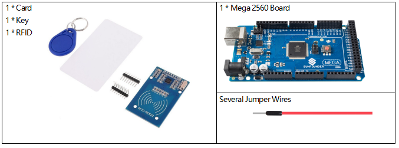
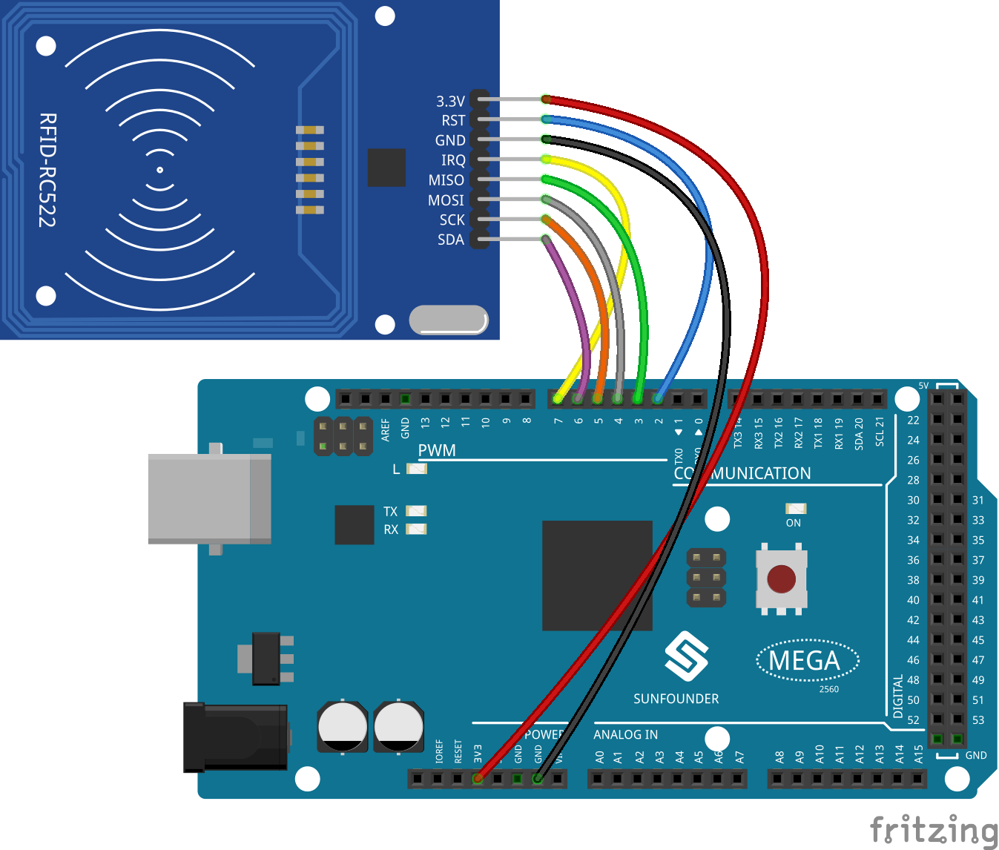
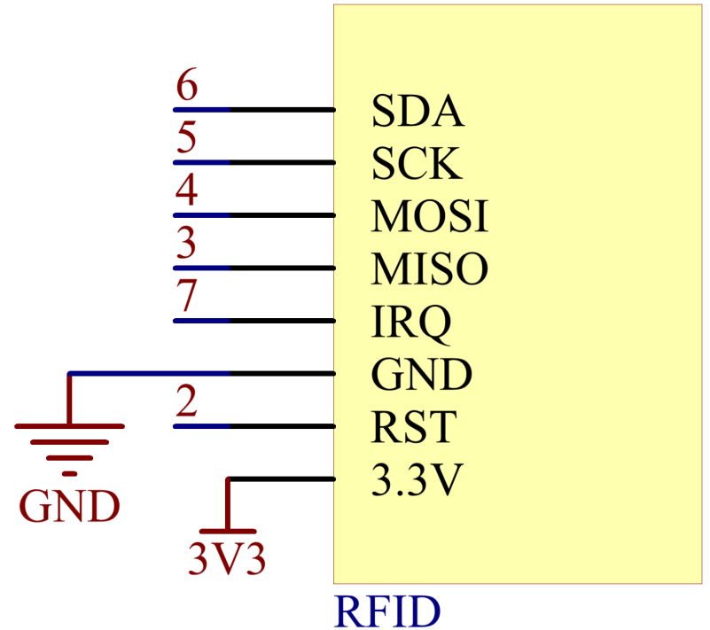
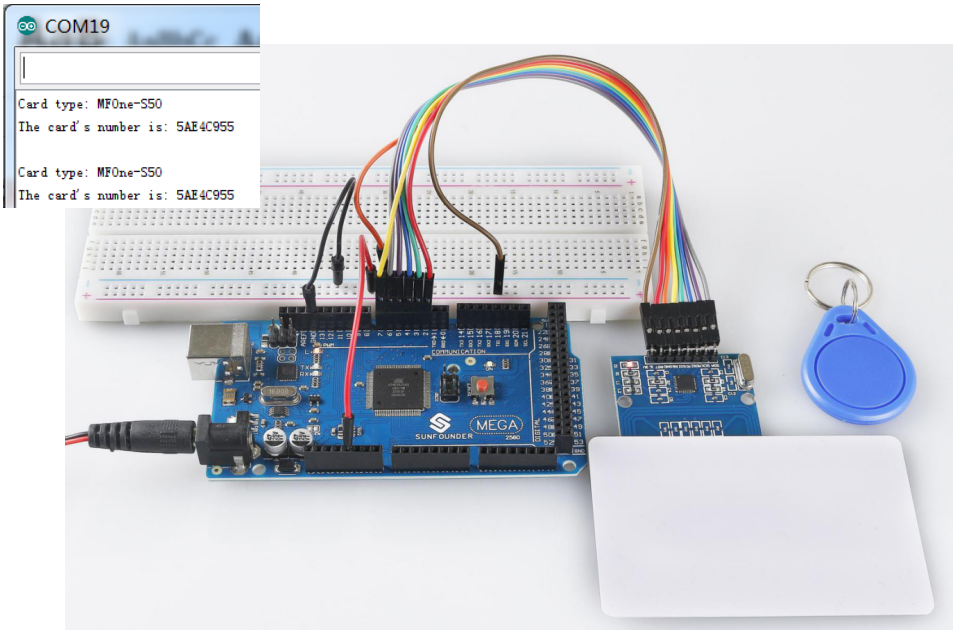

.. note:: 

    Hola, ¡bienvenido a la comunidad de entusiastas de SunFounder Raspberry Pi, Arduino y ESP32 en Facebook! Profundiza en Raspberry Pi, Arduino y ESP32 junto a otros entusiastas.

    **¿Por qué unirse?**

    - **Soporte de expertos**: Resuelve problemas posventa y desafíos técnicos con ayuda de nuestra comunidad y equipo.
    - **Aprende y Comparte**: Intercambia consejos y tutoriales para mejorar tus habilidades.
    - **Avances exclusivos**: Accede anticipadamente a anuncios de nuevos productos y adelantos.
    - **Descuentos especiales**: Disfruta de descuentos exclusivos en nuestros productos más recientes.
    - **Promociones y sorteos festivos**: Participa en sorteos y promociones especiales por festividades.

    👉 ¿Listo para explorar y crear con nosotros? Haz clic en [|link_sf_facebook|] y únete hoy mismo.

.. _ar_rfid:

2.35 Módulo RFID-RC522
=========================

Descripción general
-----------------------

En esta lección, aprenderás a utilizar el módulo RFID. RFID es la abreviatura 
de Identificación por Radiofrecuencia. Su principio de funcionamiento consiste 
en llevar a cabo una comunicación de datos sin contacto entre el lector y la 
etiqueta para lograr el objetivo de identificar el objetivo. La aplicación de 
RFID es muy amplia, siendo los usos típicos actuales chips para animales, 
inmovilizadores, control de accesos, control de estacionamiento, automatización 
de cadenas de producción, gestión de materiales, entre otros.

Componentes necesarios
-----------------------

* :ref:`cpn_mega2560`
* :ref:`cpn_wires`
* :ref:`cpn_rfid`

Circuito Fritzing
---------------------

En este ejemplo, insertamos el módulo RFID en la protoboard. Conecta el 
pin de 3.3V del RFID a 3.3V, GND a GND, RST al pin 2, SDA al pin 6, SCK 
al pin 5, MOSI al pin 4, MISO al pin 3, e IRQ al pin 7.

Diagrama esquemático
-------------------------

Código
-----------

.. note::

    * Puedes abrir el archivo ``2.35_RFID.ino`` en la ruta ``sunfounder_vincent_kit_for_arduino\code\2.35_RFID`` directamente.
    * Aquí se utiliza la librería ``RFID1``; consulta :ref:`install_lib_man` para un tutorial de instalación.

.. raw:: html

    <iframe src=https://create.arduino.cc/editor/sunfounder01/81d293e2-aba5-4bc2-9c16-ddb45b6357a8/preview?embed style="height:510px;width:100%;margin:10px 0" frameborder=0></iframe>

Cargados los códigos en la placa Mega2560, acerca tu tarjeta RFID 
(clave secreta) al lector RFID. El módulo leerá la información de 
la tarjeta y la imprimirá en el monitor serial.

Análisis del Código
----------------------

Las funciones del módulo están incluidas en la librería rfid1.h.

.. code-block:: arduino

    #include <rfid1.h>

**Funciones de la librería：**

.. code-block:: arduino

    RFID1

Crea una nueva instancia de la clase rfid1 que representa un módulo 
RFID específico conectado a tu Arduino.

.. code-block:: arduino

    void begin(IRQ_PIN,SCK_PIN,MOSI_PIN,MISO_PIN,SDA_PIN,RST_PIN)

Configuración de pines.

* ``IRQ_PIN, SCK_PIN, MOSI_PIN, MISO_PIN``: los pines usados para la comunicación SPI.
* ``SDA_PIN``: Adaptador de datos sincrónico.
* ``RST_PIN``: El pin usado para el reinicio.

.. code-block:: arduino

    void init()

Inicializa el RFID.

.. code-block:: arduino

    uchar request(uchar reqMode, uchar *TagType);

Busca la tarjeta y lee el tipo de tarjeta, devolviendo el estado de lectura 
actual del RFID y MI_OK si tiene éxito.

* ``reqMode``: Métodos de búsqueda. PICC_REQIDL está definido como 0x26 en bits de comando (busca tarjetas que no están en modo de suspensión en el área de la antena).
* ``*TagType``: Se usa para almacenar el tipo de tarjeta, y su valor puede ser de 4 bytes (p. ej., 0x0400).

.. code-block:: arduino

    char * readCardType(uchar *TagType)

Esta función decodifica el número hexadecimal de cuatro dígitos de ``*TagType`` 
en el tipo de tarjeta específico y devuelve una cadena. Si se pasa 0x0400, se 
devolverá "MFOne-S50".

.. code-block:: arduino

    uchar anticoll(uchar *serNum);

Previene conflictos y lee el número de serie de la tarjeta. La función 
devolverá el estado de lectura actual del RFID, regresando MI_OK si es exitoso.

* ``*serNum``: Se usa para almacenar el número de serie de la tarjeta, 
devolviendo el número de serie de 4 bytes. El quinto byte es el byte de 
verificación (por ejemplo, el ID de mi tarjeta magnética es 5AE4C955).

Imagen del Fenómeno
---------------------------

