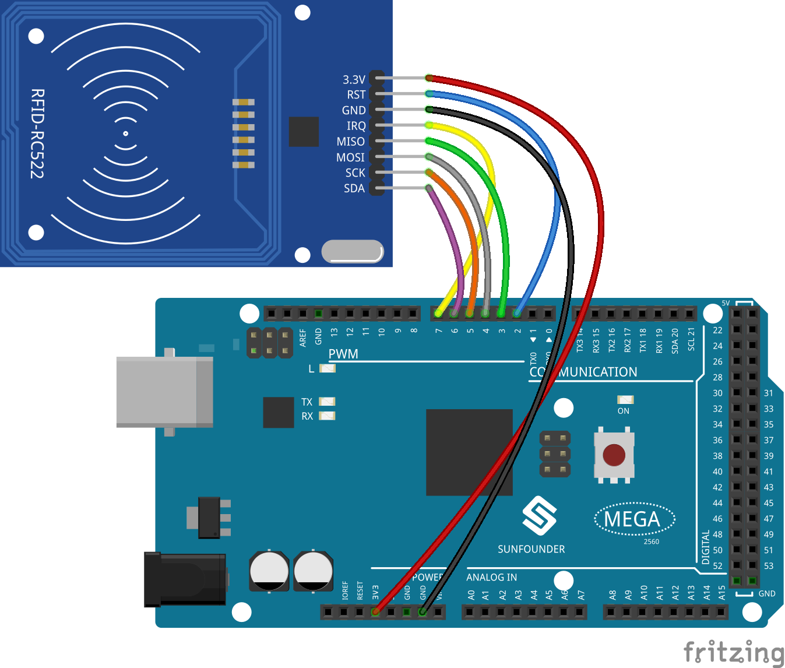
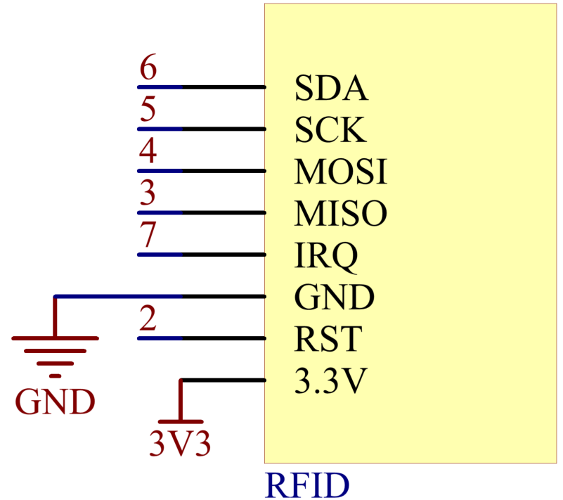

.. _ar_rfid:

2.35 RFID-RC522 Module
=======================

Overview
-------------

In this lesson, you will learn how to use RFID Module. RFID is the
abbreviation of Radio Frequency Identification. Its working principle is
to carry on the contactless data communication between the reader and
the label to achieve the goal of identifying the target. The application
of RFID is very extensive, currently the typical applications are animal
chips, immobilizer, access control, parking control, production chain
automation, material management and so on.

Components Required
-------------------------

.. image:: img/Part_two_35.png

* :ref:`cpn_mega2560`
* :ref:`cpn_wires`
* :ref:`cpn_rfid`

Fritzing Circuit
---------------------

In this example, we insert the RFID into the breadboard. Get the 3.3V of
RFID connected to 3.3V, GND to GND, RST to pin 2, SDA to pin 6, SCK to
pin 5, MOSI to pin 4, MISO to pin 3 and IRQ to pin 7.

Schematic Diagram
-------------------------

Code
-----------

.. note::

    * You can open the file ``2.35_RFID.ino`` under the path of ``sunfounder_vincent_kit_for_arduino\code\2.35_RFID`` directly.
    * Or copy this code into Arduino IDE 1/2.
    * Then :ref:`ar_upload_code` to the board.
    * Please make sure you have added the library called ``rfid1``, detailed tutorials refer to :ref:`add_libraries_ar`.

.. raw:: html

    <iframe src=https://create.arduino.cc/editor/sunfounder01/81d293e2-aba5-4bc2-9c16-ddb45b6357a8/preview?embed style="height:510px;width:100%;margin:10px 0" frameborder=0></iframe>

Uploaded the codes to the Mega2560 board, you can get your RFID card (secret key) 
close to the RFID Reader. The module will read the card information and then print it on the serial monitor.  

Code Analysis
-------------------

The functions of the module are included in the library rfid1.h.

.. code-block:: arduino

    #include <rfid1.h>

**Library Functions：**

.. code-block:: arduino

    RFID1

Create a new instance of the rfid1 class that represents a particular
RFID module attached to your Arduino .

.. code-block:: arduino

    void begin(IRQ_PIN,SCK_PIN,MOSI_PIN,MISO_PIN,SDA_PIN,RST_PIN)

Pin configuration.

* ``IRQ_PIN,SCK_PIN,MOSI_PIN,MISO_PIN``: the pins used for the SPI communication.
* ``SDA_PIN``: Synchronous data adapter.
* ``RST_PIN``: The pins used for reset.

.. code-block:: arduino

    void init()

Initialize the RFID.

.. code-block:: arduino

    uchar request(uchar reqMode, uchar *TagType);

Search card and read card type, and the function will return the current
read status of RFID and return MI_OK if successed.

* ``reqMode``: Search methods. PICC_REQIDL is defined that 0x26 command bits (Search the cards that does not in the sleep mode in the antenna area).
* ``*TagType``: It is used to store card type, and its value can be 4byte (e.g. 0x0400).

.. code-block:: arduino

    char * readCardType(uchar *TagType)

This function decodes the four-digit hexadecimal number of ``*tagType``
into the specific card type and returns a string. If passed 0x0400,
"MFOne-S50" will be returned.

.. code-block:: arduino

    uchar anticoll(uchar *serNum);

Prevent conflict, and read the card serial number. The function will
return the current reading status of RFID. It returns MI_OK if
successed.

* ``*serNum``: It is used to store the card serial number, and return the 4 bytes card serial number. The 5th byte is recheck byte(e.g. e.g. my magnetic card ID is 5AE4C955).

Phenomenon Picture
---------------------------

