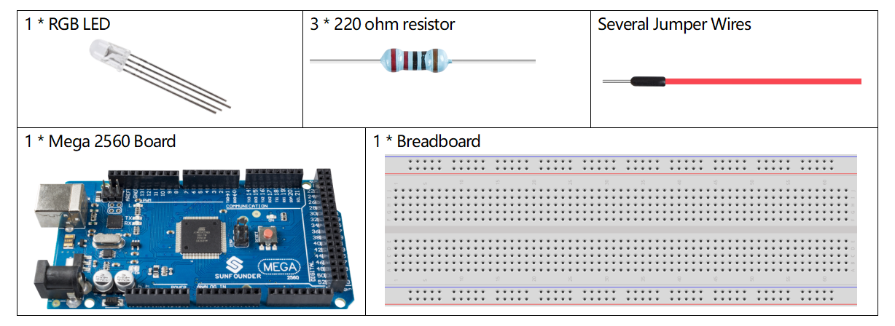
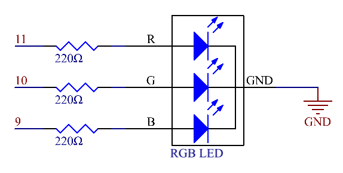
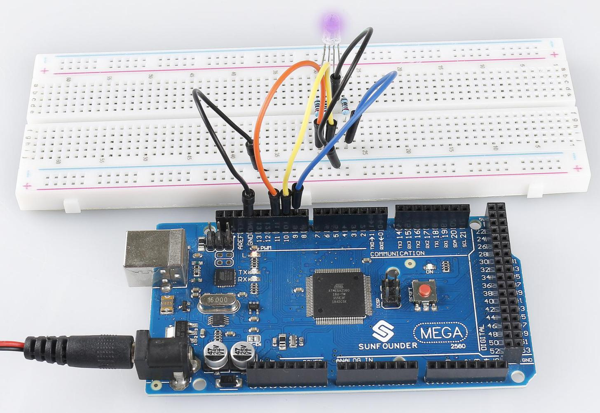

.. _ar_rgb:

2.3 RGB LED
===========

Overview
--------

In this lesson, you will learn about how to use RGB LED. A RGB LED
packages three LEDs in red, green and blue into one transparent or
semitransparent plastic shell. It displays a broad array of colors by
changing the input voltage of three pins and adding the three colors
together in different ways. As is said in a statistic, RGB LED can
create 16,777,216 different colors.

Components Required
-------------------

* :ref:`cpn_mega2560`
* :ref:`cpn_breadboard`
* :ref:`cpn_wires`
* :ref:`cpn_rgb`
* :ref:`cpn_resistor`

Fritzing Circuit
----------------

.. image:: img/image425.png

Here we input a value between 0 and 255 to the three pins of the RGB LED
to make it display different colors. After connecting the pins of R, G,
and B to a current limiting resistor, connect them to the pin 9, pin 10,
and pin 11 respectively. The longest pin (GND) of the LED connects to
the GND of the Mega 2560. When the three pins are given different PWM
values, the RGB LED will display different colors.

Schematic Diagram
-----------------

Code
----

.. note::

    * You can open the file ``2.3_rgbLed.ino`` under the path of ``sunfounder_vincent_kit_for_arduino\code\2.3_rgbLed`` directly.
    * Or copy this code into Arduino IDE.

.. raw:: html

    <iframe src=https://create.arduino.cc/editor/sunfounder01/3032b0a1-49e3-4d88-a73a-eeacf3761935/preview?embed style="height:510px;width:100%;margin:10px 0" frameborder=0></iframe>

Code Analysis
-------------

In this example, the function used to assign values to the three pins of RGB is packaged in an independent subfunction color().  

.. code-block:: arduino

    void color (unsigned char red, unsigned char green, unsigned char blue)// the color generating function  
    {    
    analogWrite(redPin, red);   
    analogWrite(greenPin, green); 
    analogWrite(bluePin, blue); 
    }

In loop(), RGB value works as an input argument to call the function color() to realize that the RGB can emit different colors.   

.. code-block:: arduino

    void loop()  // run over and over again  
    {    
    color(255, 0, 0); // turn the RGB LED red 
    delay(1000); // delay for 1 second  
    color(0,255, 0); // turn the RGB LED green  
    delay(1000); // delay for 1 second  
    color(0, 0, 255); // turn the RGB LED blue  
    delay(1000); // delay for 1 second 
    // ... 
    }  

Phenomenon Picture
------------------

