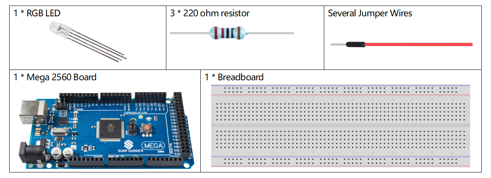
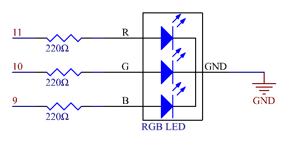
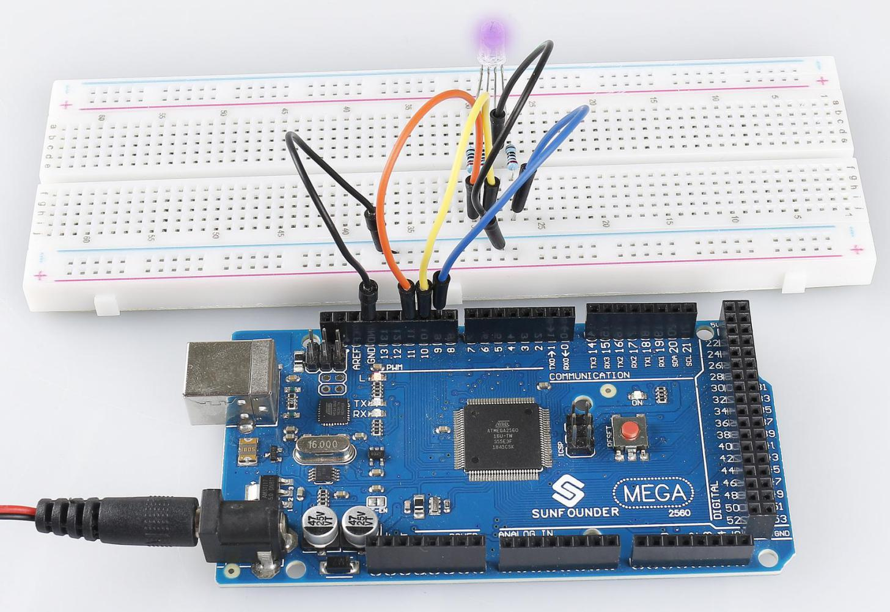

.. note::  

    Ciao, benvenuto nella comunità di appassionati di SunFounder Raspberry Pi & Arduino & ESP32 su Facebook! Immergiti nel mondo affascinante di Raspberry Pi, Arduino ed ESP32 insieme ad altri appassionati.

    **Perché unirti a noi?**

    - **Supporto esperto**: Risolvi problemi post-vendita e sfide tecniche con l'aiuto della nostra comunità e del nostro team.
    - **Impara e condividi**: Scambia consigli e tutorial per migliorare le tue competenze.
    - **Anteprime esclusive**: Ottieni accesso anticipato a nuovi annunci di prodotti e contenuti esclusivi.
    - **Sconti speciali**: Approfitta di sconti esclusivi sui nostri prodotti più recenti.
    - **Promozioni festive e concorsi**: Partecipa a concorsi e promozioni speciali durante le festività.

    👉 Sei pronto a esplorare e creare con noi? Clicca su [|link_sf_facebook|] e unisciti oggi!

.. _ar_rgb:

2.3 LED RGB
=============

Panoramica
------------

In questa lezione imparerai a utilizzare un LED RGB. Un LED RGB integra tre 
LED (rosso, verde e blu) in un unico involucro trasparente o semitrasparente. 
Questo LED può visualizzare un'ampia gamma di colori variando la tensione in 
ingresso sui tre pin e combinando i colori in modi differenti. Secondo le 
statistiche, un LED RGB è in grado di generare fino a 16.777.216 colori diversi.

Componenti Necessari
-----------------------

* :ref:`cpn_mega2560`
* :ref:`cpn_breadboard`
* :ref:`cpn_wires`
* :ref:`cpn_rgb`
* :ref:`cpn_resistor`

Circuito con Fritzing
------------------------

.. image:: img/image425.png

In questo esempio, viene assegnato un valore tra 0 e 255 ai tre pin del LED 
RGB per generare diversi colori. Dopo aver collegato i pin R, G e B a una 
resistenza limitatrice di corrente, connettili ai pin 9, 10 e 11 rispettivamente. 
Il pin più lungo (GND) del LED si collega al GND della scheda Mega2560. 
Quando i tre pin ricevono valori PWM differenti, il LED RGB mostrerà colori variabili.

Schema del Circuito
---------------------

Codice
---------

.. note::

    * Puoi aprire direttamente il file ``2.3_rgbLed.ino`` che si trova nel percorso ``sunfounder_vincent_kit_for_arduino\code\2.3_rgbLed``.
    * Oppure copia questo codice nell'Arduino IDE.

.. raw:: html

    <iframe src=https://create.arduino.cc/editor/sunfounder01/3032b0a1-49e3-4d88-a73a-eeacf3761935/preview?embed style="height:510px;width:100%;margin:10px 0" frameborder=0></iframe>

Analisi del Codice
---------------------

In questo esempio, la funzione utilizzata per assegnare i valori ai tre pin del LED RGB è incapsulata in una sottoprocedura indipendente chiamata color().

.. code-block:: arduino

    void color (unsigned char red, unsigned char green, unsigned char blue) // funzione per generare colori  
    {    
    analogWrite(redPin, red);   
    analogWrite(greenPin, green); 
    analogWrite(bluePin, blue); 
    }

Nel loop(), i valori RGB vengono passati come argomenti alla funzione color() per ottenere l'emissione di diversi colori dal LED RGB.

.. code-block:: arduino

    void loop()  // esecuzione ripetitiva  
    {    
    color(255, 0, 0); // accende il LED RGB in rosso 
    delay(1000); // attende 1 secondo  
    color(0, 255, 0); // accende il LED RGB in verde  
    delay(1000); // attende 1 secondo  
    color(0, 0, 255); // accende il LED RGB in blu  
    delay(1000); // attende 1 secondo 
    // ... 
    }  

Immagine del Fenomeno
-----------------------

