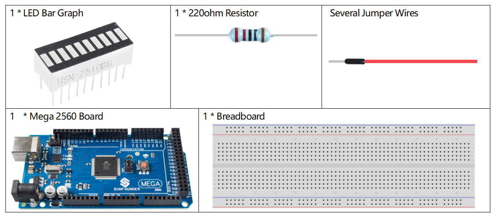
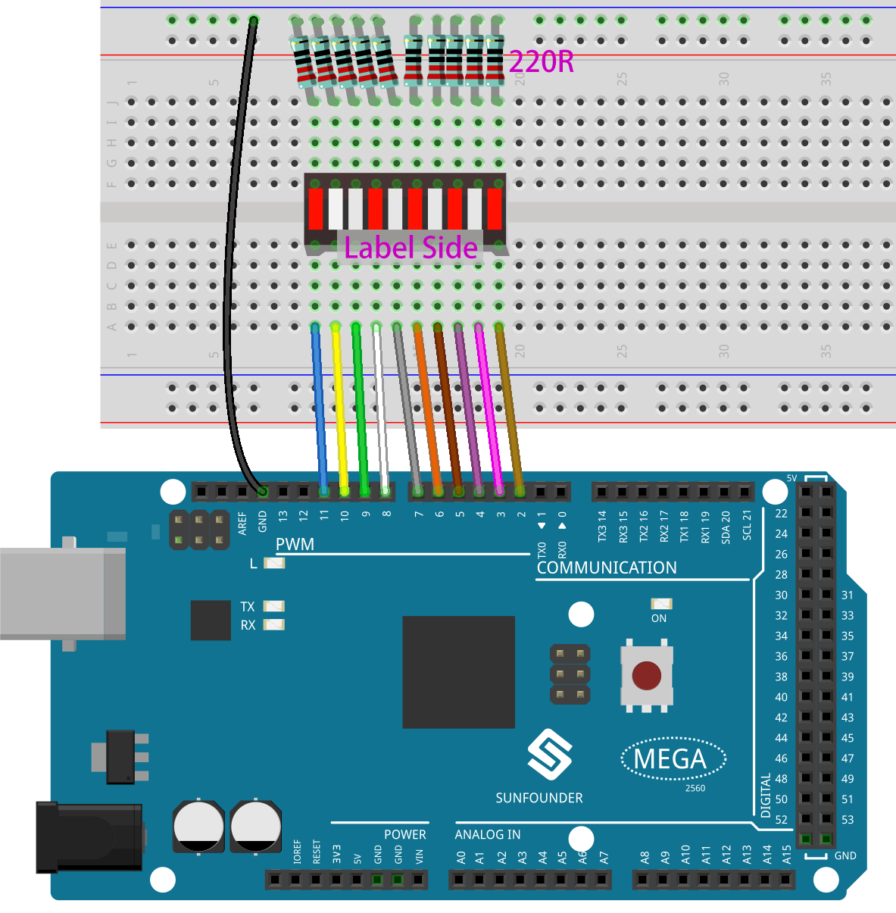
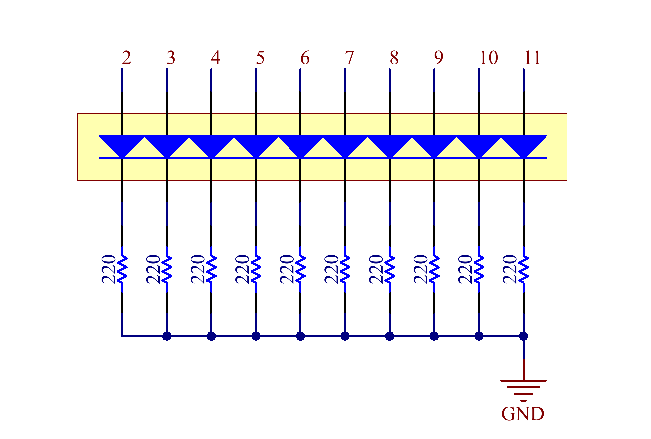
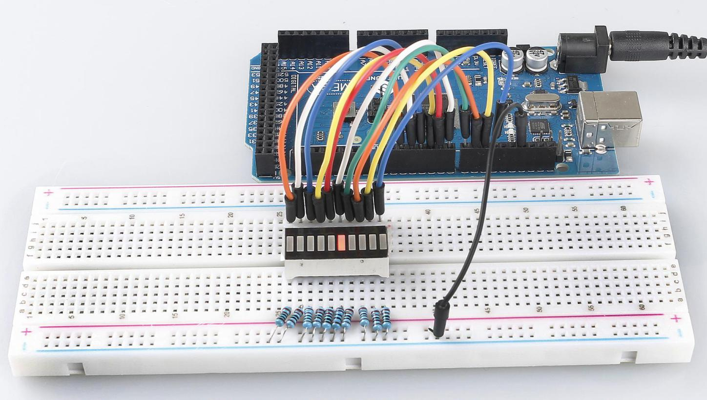

.. _ar_bar_graph:

2.4 LED-Balkendiagramm
============================

Überblick
---------------

In dieser Lektion lernen Sie etwas über LED-Balkendiagramme. Im Allgemeinen funktioniert LED-Balkendiagramm als Batteriestandsanzeige, Audiogerät, industrielles Bedienfeld. Wenn wir wollen, können wir auch seine andere Anwendung finden.

Erforderliche Komponenten
-----------------------------

* :ref:`cpn_mega2560`
* :ref:`cpn_breadboard`
* :ref:`cpn_wires`
* :ref:`cpn_bar_graph`
* :ref:`cpn_resistor`

Fritzing-Schaltung
------------------------------

In diesem Beispiel verwenden wir die digitalen Pins 2 bis 11, um das LED-Balkendiagramm anzusteuern. LED-Balkendiagramm hat zehn separate LEDs im Inneren und jede LED hat zwei Pins. Die linken Pins 1~10 des LED-Balkendiagramms sind jeweils mit den digitalen Pins 2~11 verbunden; Die Pins 11 bis 20 auf der rechten Seite werden separat auf die gleiche Seite dieser 220-Ohm-Widerstände verlängert, deren andere Seiten identisch mit GND verbunden sind.

Schematische Darstellung
---------------------------------

Code
-------

.. note::

    * Sie können die Datei ``2.4_ledBarGraph.ino`` unter dem Pfad ``sunfounder_vincent_kit_for_arduino\code\2.4_ledBarGraph`` direkt öffnen.
    * Oder kopieren Sie diesen Code in Arduino IDE. 

.. raw:: html

    <iframe src=https://create.arduino.cc/editor/sunfounder01/0614541f-58d0-4f5c-b7c9-c3b893178fda/preview?embed style="height:510px;width:100%;margin:10px 0" frameborder=0></iframe>

Wenn Sie die Codes auf die Mega2560-Platine hochgeladen haben, können Sie sehen, dass die LEDs auf dem LED-Balkendiagramm nacheinander blinken.

Code-Analyse
----------------

Die Codes in setup() verwenden die for-Schleife, um die Pins 2~11 der Reihe nach in den Ausgabemodus zu initialisieren.

.. code-block:: arduino

    for(int i=2;i<=11;i++)
    {
        pinMode(i,OUTPUT);
    }

Die for-Schleife wird in loop() verwendet, um die LED nacheinander blinken zu lassen (0,5 s einschalten, dann 0,5 s ausschalten).

.. code-block:: arduino

    for(int i=2;i<=11;i++)
    {
        digitalWrite(i,HIGH);
        delay(500);
    digitalWrite(i,LOW);
        delay(500);
    }

Siehe :ref:`ar_digital_write` für weitere Einzelheiten über die Steuerung der LED mit digitalen Pins.

Phänomen Bild
------------------

