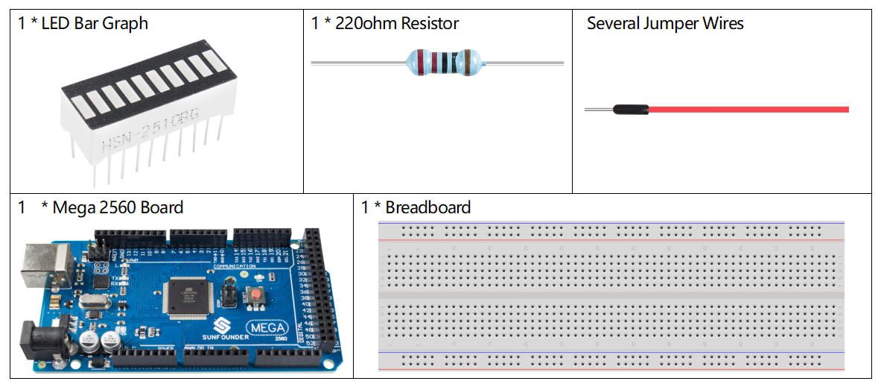
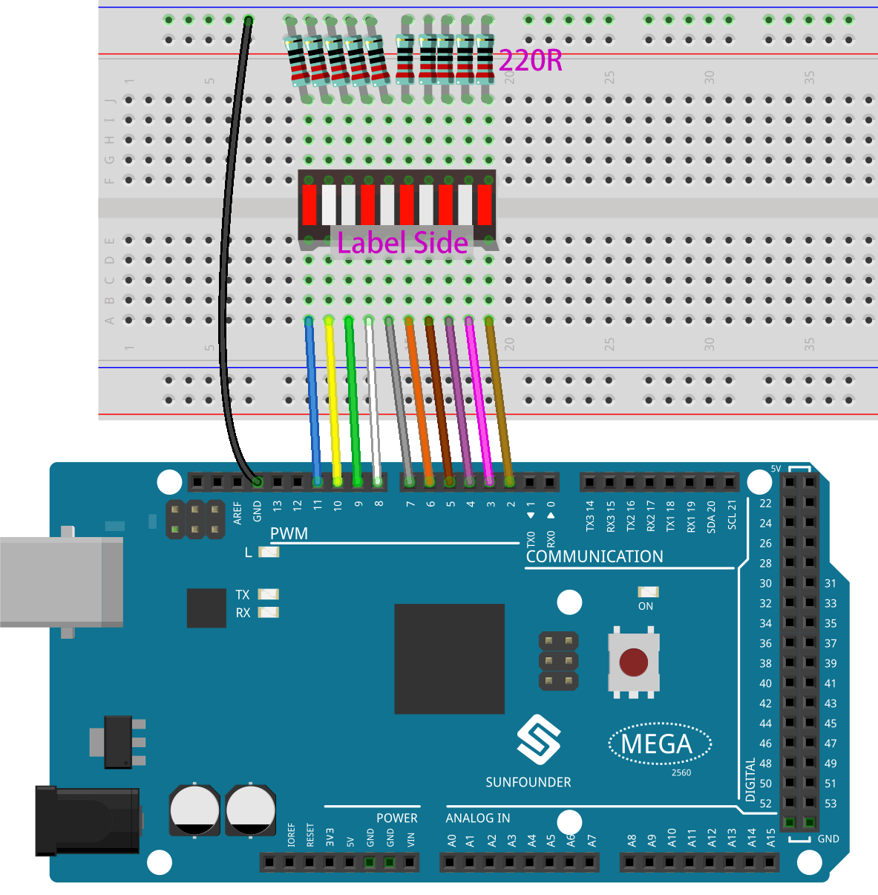
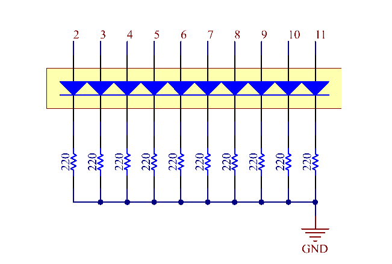
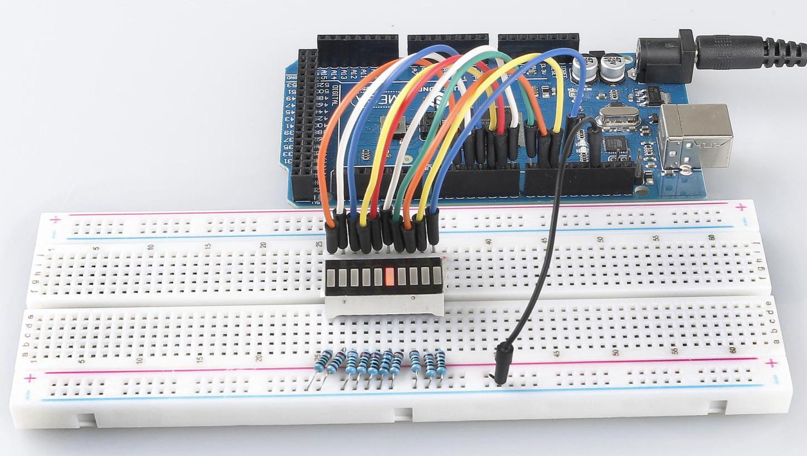

.. note:: 

    Bonjour et bienvenue dans la communauté des passionnés de Raspberry Pi, Arduino et ESP32 de SunFounder sur Facebook ! Plongez dans l'univers du Raspberry Pi, d'Arduino et de l'ESP32 avec d'autres passionnés.

    **Pourquoi nous rejoindre ?**

    - **Assistance d'experts** : Résolvez vos problèmes post-achat et vos défis techniques avec l'aide de notre communauté et de notre équipe.
    - **Apprendre et partager** : Échangez des astuces et des tutoriels pour améliorer vos compétences.
    - **Aperçus exclusifs** : Accédez en avant-première aux annonces de nouveaux produits et aux avant-premières.
    - **Réductions spéciales** : Profitez de réductions exclusives sur nos derniers produits.
    - **Promotions festives et concours** : Participez à des concours et des promotions spéciales pendant les fêtes.

    👉 Prêt à explorer et à créer avec nous ? Cliquez sur [|link_sf_facebook|] et rejoignez-nous dès aujourd'hui !

.. _ar_bar_graph:

2.4 Graphique à Barres LED
============================

Aperçu
--------

Dans cette leçon, vous allez découvrir le Graphique à Barres LED. En général, 
ce composant fonctionne comme un indicateur de niveau de batterie, dans des 
équipements audio ou des panneaux de contrôle industriels. Nous pouvons 
également trouver d'autres applications en fonction de nos besoins.

Composants requis
-------------------

* :ref:`cpn_mega2560`
* :ref:`cpn_breadboard`
* :ref:`cpn_wires`
* :ref:`cpn_bar_graph`
* :ref:`cpn_resistor`

Schéma de Connexion
---------------------

Dans cet exemple, nous utilisons les broches numériques 2 à 11 pour piloter 
le Graphique à Barres LED. Celui-ci comporte dix LED indépendantes, chacune 
avec deux broches. Les broches de gauche 1 à 10 sont connectées aux broches 
numériques 2 à 11 respectivement ; les broches de droite 11 à 20 sont reliées 
à des résistances de 220 ohms, toutes connectées à la masse (GND).

Diagramme Schématique
------------------------

Code
----

.. note::

    * Vous pouvez ouvrir directement le fichier ``2.4_ledBarGraph.ino`` situé dans le chemin ``sunfounder_vincent_kit_for_arduino\code\2.4_ledBarGraph``.
    * Ou copiez ce code dans l'IDE Arduino.

.. raw:: html

    <iframe src=https://create.arduino.cc/editor/sunfounder01/0614541f-58d0-4f5c-b7c9-c3b893178fda/preview?embed style="height:510px;width:100%;margin:10px 0" frameborder=0></iframe>

Une fois le code téléchargé sur la carte Mega2560, vous verrez les LED du Graphique à Barres clignoter successivement.

Analyse du Code
------------------

Le code dans `setup()` utilise une boucle for pour initialiser en sortie les broches de 2 à 11, l'une après l'autre.

.. code-block:: arduino

    for(int i=2;i<=11;i++)
    {
        pinMode(i,OUTPUT);
    }

La boucle `for` est utilisée dans `loop()` pour faire clignoter les LED (allumage pendant 0,5s, puis extinction pendant 0,5s) en séquence.

.. code-block:: arduino

    for(int i=2;i<=11;i++)
    {
        digitalWrite(i,HIGH);
        delay(500);
        digitalWrite(i,LOW);
        delay(500);
    }

Pour plus de détails sur le contrôle des LED à l'aide des broches numériques, consultez la section **Partie 1-1.2 Écriture Numérique**.

:ref:`ar_digital_write`

Illustration du Phénomène
----------------------------

