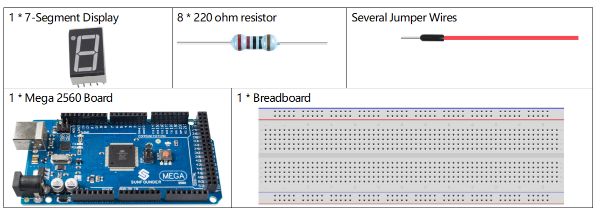
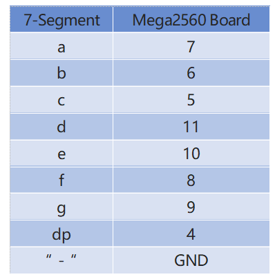
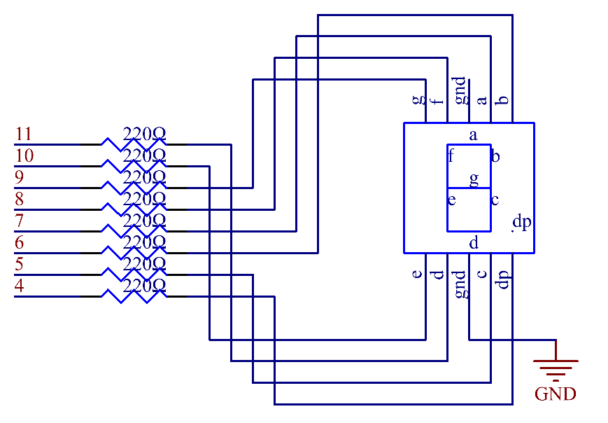
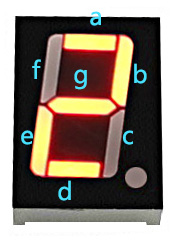
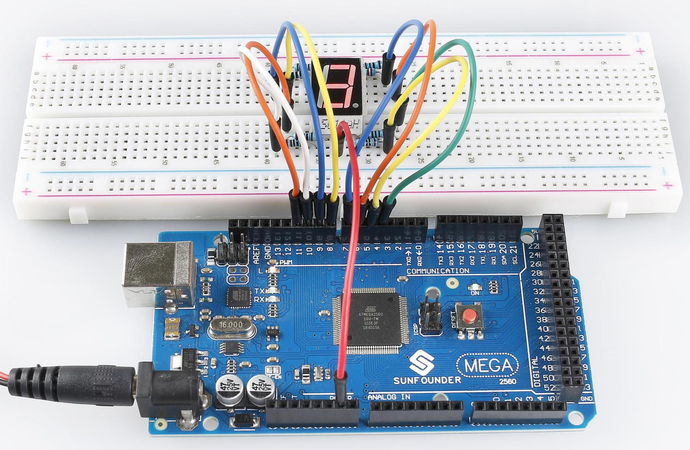

.. note:: 

    ¡Hola, bienvenido a la Comunidad de Entusiastas de Raspberry Pi, Arduino y ESP32 en Facebook! Profundiza en Raspberry Pi, Arduino y ESP32 junto a otros entusiastas.

    **¿Por qué unirse?**

    - **Soporte experto**: Resuelve problemas postventa y desafíos técnicos con la ayuda de nuestra comunidad y equipo.
    - **Aprender y compartir**: Intercambia consejos y tutoriales para mejorar tus habilidades.
    - **Vistas previas exclusivas**: Obtén acceso anticipado a nuevos anuncios de productos y avances.
    - **Descuentos especiales**: Disfruta de descuentos exclusivos en nuestros productos más nuevos.
    - **Promociones festivas y sorteos**: Participa en sorteos y promociones especiales de temporada.

    👉 ¿Listo para explorar y crear con nosotros? Haz clic en [|link_sf_facebook|] y únete hoy mismo.

.. _ar_7_segment:

2.5 Pantalla de 7 Segmentos
=============================

Resumen
----------

En esta lección, aprenderás sobre la pantalla de 7 segmentos. La pantalla de 7 segmentos tiene muchas ventajas, por lo que se usa ampliamente en equipos eléctricos, especialmente en electrodomésticos que muestran información numérica, como pantallas, aires acondicionados, calentadores de agua, refrigeradores, entre otros. Los LEDs de la pantalla de 7 segmentos emiten luz mediante la entrada de diferentes señales eléctricas en sus pines correspondientes. La información numérica que puede mostrar incluye tiempo, fecha, temperatura, entre otros.

Componentes necesarios
------------------------

* :ref:`cpn_mega2560`
* :ref:`cpn_breadboard`
* :ref:`cpn_wires`
* :ref:`cpn_7_segment`
* :ref:`cpn_resistor`

Circuito Fritzing
-------------------

.. image:: img/image429.png

Conecta cada pin de a-g de la pantalla de 7 segmentos a una resistencia 
limitadora de corriente de 220 ohmios respectivamente y luego a los pines 
4–11. GND se conecta a GND.

La conexión entre la pantalla de 7 segmentos y la placa Mega2560 se muestra 
a continuación:

Diagrama esquemático
-----------------------

Código
---------

.. note::

    * Puedes abrir el archivo ``2.5_7segment.ino`` en la ruta ``sunfounder_vincent_kit_for_arduino\code\2.5_7segment`` directamente.
    * O copiar este código en el IDE de Arduino.

.. raw:: html

    <iframe src=https://create.arduino.cc/editor/sunfounder01/c8b782c0-162e-447a-8406-c32a1378cc59/preview?embed style="height:510px;width:100%;margin:10px 0" frameborder=0></iframe>

Una vez cargado el código, verás que la pantalla de 7 segmentos muestra en secuencia los caracteres 1, 2, 3, 4, 5, 6, 7, 8, 9, A, b, C, d, E, F.

Análisis del código
----------------------

Toma los números de los pines en la pantalla de 7 segmentos como nombres y declara los pines en la placa Mega2560.

.. code-block:: arduino

    const int a=7; //a de 7 segmentos se conecta al pin digital 7
    const int b=6; //b de 7 segmentos se conecta al pin digital 6
    const int c=5; //c de 7 segmentos se conecta al pin digital 5
    const int d=11;//d de 7 segmentos se conecta al pin digital 11
    const int e=10;//e de 7 segmentos se conecta al pin digital 10
    const int f=8;//f de 7 segmentos se conecta al pin digital 8
    const int g=9;//g de 7 segmentos se conecta al pin digital 9
    const int dp=4;//dp de 7 segmentos se conecta al pin digital 4

Crea una serie de subfunciones para definir el estado de cada segmento durante 
la visualización de números en la pantalla de 7 segmentos. Por ejemplo, cuando 
se muestra el carácter 「2」, los segmentos F y C están apagados y los otros 
están encendidos.

Primero, necesitamos entender cómo aparece el número **2** en la pantalla de 7 segmentos. Esto se logra alimentando los segmentos a, b, d, e y g. En la programación, los pines conectados a estos segmentos se configuran en nivel Alto mientras que c y f se configuran en nivel Bajo. Comenzamos usando la función ``turnOffAllSegments()`` para apagar todos los segmentos y luego encender solo los necesarios.

Después de ejecutar esta parte, la pantalla de 7 segmentos mostrará **2**. De manera similar, se muestra el resto de los caracteres. Como las letras B y D en mayúscula se verían igual que los números 8 y 0 en la pantalla, se muestran en minúscula.

.. code-block:: arduino

   ...
   void digital_2()  // mostrar el número 2 en la pantalla de 7 segmentos
   {
     turnOffAllSegments();
     digitalWrite(a, HIGH);
     digitalWrite(b, HIGH);
     digitalWrite(g, HIGH);
     digitalWrite(e, HIGH);
     digitalWrite(d, HIGH);
   }
   ... 

En loop(), llama a la función que muestra el número correspondiente.

.. code-block:: arduino

    void loop()
    {
    digital_1(); // mostrar el número 1 en la pantalla de 7 segmentos
    delay(1000); // espera un segundo
    digital_2(); // mostrar el número 2 en la pantalla de 7 segmentos
    delay(1000); // espera un segundo
    digital_3(); // mostrar el número 3 en la pantalla de 7 segmentos
    //... 
    }

Imagen del fenómeno
----------------------

