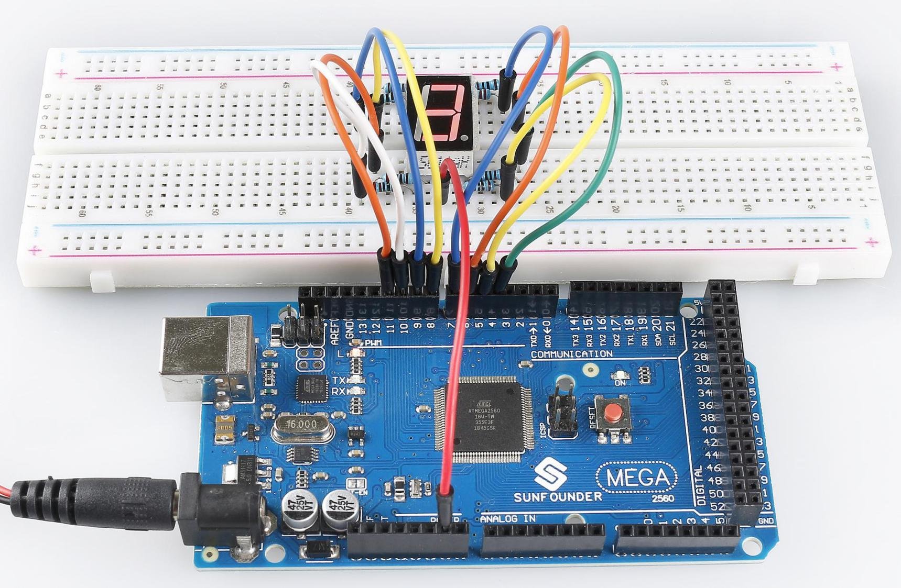

.. _ar_7_segment:

2.5 7-Segment-Anzeige
======================

Überblick
-----------

In dieser Lektion lernen Sie etwas über die 7-Segment-Anzeige. Die 7-Segment-Anzeige hat so viele Vorteile, dass sie in elektrischen Geräten weit verbreitet ist, insbesondere in Haushaltsgeräten, die numerische Informationen anzeigen, wie z. B. Displays, Klimaanlagen, Warmwasserbereiter, Kühlschränke usw. LEDs auf der 7-Segment-Anzeige emittieren Licht durch die Eingabe verschiedener elektrischer Signale an die verschiedenen Pins davon. Zu den numerischen Informationen, die angezeigt werden können, gehören Uhrzeit, Datum, Temperatur und so weiter.

Erforderliche Komponenten
-----------------------------

.. image:: img/list_2.5.png

* :ref:`cpn_mega2560`
* :ref:`cpn_breadboard`
* :ref:`cpn_wires`
* :ref:`cpn_7_segment`
* :ref:`cpn_resistor`

Fritzing-Schaltung
---------------------

.. image:: img/image429.png

Verbinden Sie jeden Pin ag der 7-Segment-Anzeige mit jeweils einem 220-Ohm-Strombegrenzungswiderstand und dann mit Pin 4–11. GND wird mit GND verbunden.

Die Verkabelung zwischen der 7-Segment-Anzeige und der Mega2560-Platine wie unten gezeigt:

.. image:: img/image430.png

Schematische Darstellung
---------------------------------------

.. image:: img/image431.png

Code
----

.. note::

    * Sie können die Datei ``2.5_7segment.ino`` unter dem Pfad ``sunfounder_vincent_kit_for_arduino\code\2.5_7segment`` direkt öffnen.
    * Oder kopieren Sie diesen Code in Arduino IDE. 

.. raw:: html

    <iframe src=https://create.arduino.cc/editor/sunfounder01/c8b782c0-162e-447a-8406-c32a1378cc59/preview?embed style="height:510px;width:100%;margin:10px 0" frameborder=0></iframe>

Sobald Sie die Codes hochgeladen haben, können Sie die 7-Segment-Anzeige sehen, die nacheinander 1, 2, 3, 4, 5, 6, 7, 8, 9, A, b, C, d, E, F anzeigt.

Code-Analyse
-------------

Nehmen Sie die Pin-Nummern auf 7-Segment als Namen und deklarieren Sie die Pins auf der Mega2560-Platine.

.. code-block:: arduino

    const int a=7; //a of 7-segment attach to digital pin 7
    const int b=6; //b of 7-segment attach to digital pin 6
    const int c=5; //c of 7-segment attach to digital pin 5
    const int d=11;//d of 7-segment attach to digital pin 11
    const int e=10;//e of 7-segment attach to digital pin 10
    const int f=8;//f of 7-segment attach to digital pin 8
    const int g=9;//g of 7-segment attach to digital pin 9
    const int dp=4;//dp of 7-segment attach to digital pin 4

Installieren Sie eine Reihe von Unterfunktionen, um den Füllstandsstatus an jedem Block während der Zahlenanzeige des 7-Segments zu packen. Wenn beispielsweise das Zeichen 「2」 angezeigt wird, werden der Block F und der Block c ausgeschaltet; die anderen Blöcke sind beleuchtet.

.. image:: img/image89.jpeg

Zuerst müssen wir verstehen, wie die Ziffer **2** auf der 7-Segment-Anzeige erscheint. Dies wird erreicht, indem die Segmente a, b, d, e und g eingeschaltet werden. In der Programmierung werden die Pins, die mit diesen Segmenten verbunden sind, auf ein hohes Niveau gesetzt, während c und f auf ein niedriges Niveau gesetzt werden. Wir beginnen damit, die Funktion ``turnOffAllSegments()`` zu verwenden, um alle Segmente auszuschalten und dann nur die erforderlichen anzuschalten.

Nach Ausführung dieses Teils zeigt die 7-Segment-Anzeige **2** an. Ähnlich ist es bei anderen Zeichen. Da sich der Buchstabe b in Großbuchstaben (also **B**) genauso wie eine **8** und der Buchstabe d in Großbuchstaben (also **D**) genauso wie eine **0** darstellen würde, werden sie stattdessen in Kleinbuchstaben angezeigt.

.. code-block:: arduino

   ...
   void digital_2()  //diaplay 2 to the 7-segment
   {
     turnOffAllSegments();
     digitalWrite(a, HIGH);
     digitalWrite(b, HIGH);
     digitalWrite(g, HIGH);
     digitalWrite(e, HIGH);
     digitalWrite(d, HIGH);
   }
   ... 

Rufen Sie in ``loop()`` die Funktion auf, die die Zahl anzeigt.

.. code-block:: arduino

    void loop()
    {
    digital_1();//diaplay 1 to the 7-segment
    delay(1000);//wait for a second
    digital_2();//diaplay 2 to the 7-segment
    delay(1000); //wait for a second
    digital_3();//diaplay 3 to the 7-segment
    //... 
    }

Phänomen Bild
------------------

