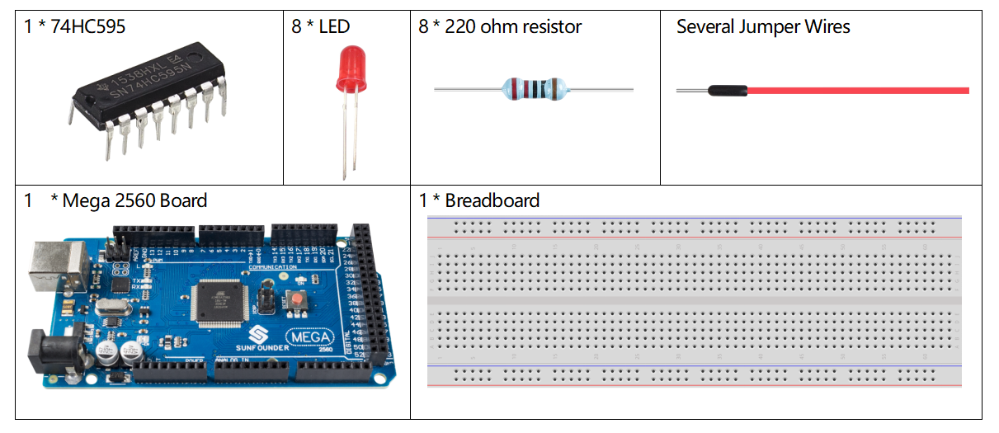
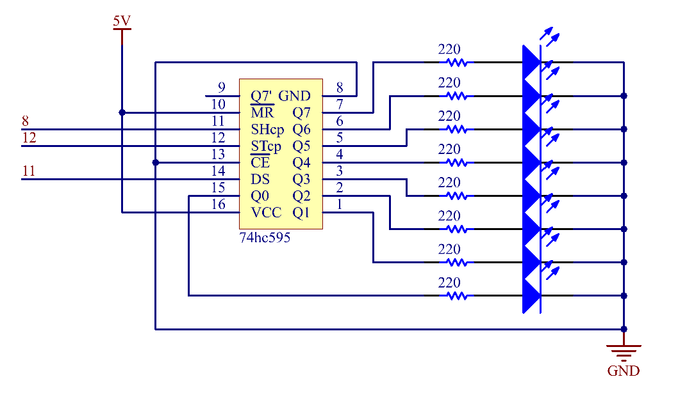
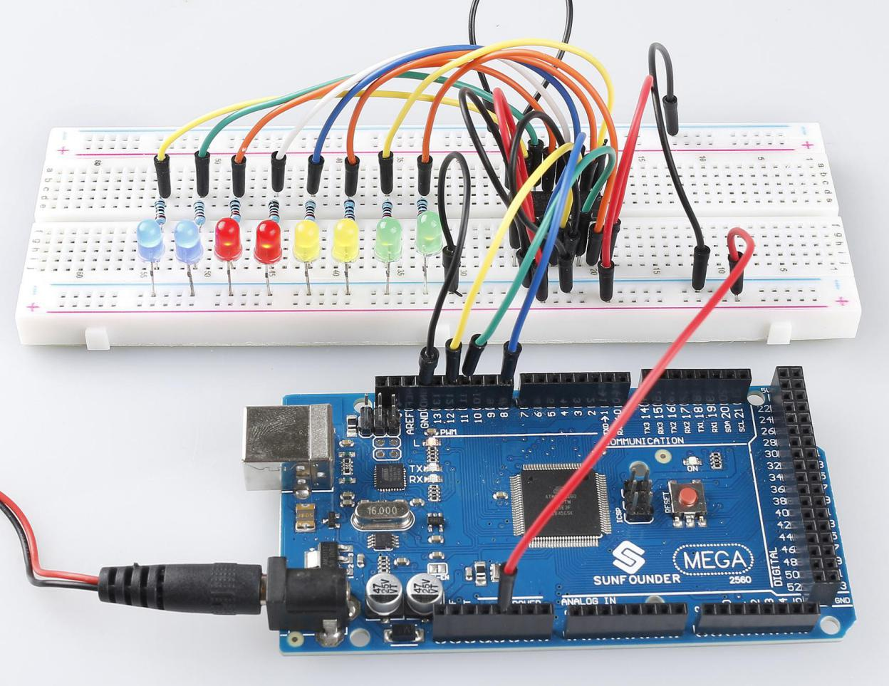

.. _ar_74hc595:

2.6 74HC595
=============================

Überblick
-----------------

In dieser Lektion lernen Sie, wie Sie 74HC595 verwenden. 74HC595 besteht aus einem 8-Bit-Schieberegister und einem Speicherregister mit parallelen Ausgängen mit drei Zuständen. Es wandelt die serielle Eingabe in eine parallele Ausgabe um, sodass Sie IO-Ports einer MCU einsparen können.

Erforderliche Komponenten
--------------------------------

* :ref:`cpn_mega2560`
* :ref:`cpn_breadboard`
* :ref:`cpn_wires`
* :ref:`cpn_led`
* :ref:`cpn_resistor`
* :ref:`cpn_74hc595`

Fritzing-Schaltung
--------------------------

.. image:: img/image433.png

In diesem Beispiel verwenden wir 74HC595 zur Steuerung der LED. Geben Sie jedem Datenausgangsstift (Q0-Q7) einen 220-Ohm-Widerstand und verbinden Sie ihn dann mit der LED. Der Schaltplan ist wie folgt:

.. image:: img/image434.png

Schematische Darstellung
---------------------------

Code
---------------

.. note::

    * Sie können die Datei ``2.6_74HC595.ino`` unter dem Pfad ``sunfounder_vincent_kit_for_arduino\code\2.6_74HC595`` direkt öffnen.
    * Oder kopieren Sie diesen Code in Arduino IDE 1/2.
    * Oder klicken Sie auf Code öffnen, um ihn im `Web Editor <https://docs.arduino.cc/cloud/web-editor/tutorials/getting-started/getting-started-web-editor>`_ zu öffnen .
    * Laden Sie dann :ref:`ar_upload_code` auf das Board hoch.

.. raw:: html

    <iframe src=https://create.arduino.cc/editor/sunfounder01/05372471-c560-489b-9ef4-dba100c47038/preview?embed style="height:510px;width:100%;margin:10px 0" frameborder=0></iframe>

Wenn Sie die Codes auf das Mega2560-Board hochgeladen haben, können Sie sehen, wie die LEDs nacheinander aufleuchten.

Code-Analyse
--------------------

Deklarieren Sie ein Array, speichern Sie mehrere 8-Bit-Binärzahlen, die verwendet werden, um den Arbeitszustand der acht LEDs zu ändern, die von 74HC595 gesteuert werden.

.. code-block:: arduino

    int datArray[] = {B00000000, B00000001, B00000011, B00000111, B00001111, B00011111, B00111111, B01111111, B11111111};

Setzen Sie ``STcp`` zuerst auf Low-Pegel und dann auf High-Pegel. Er erzeugt einen ansteigenden Flankenimpuls von ``STcp``.

.. code-block:: arduino

    digitalWrite(STcp,LOW); 

``shiftOut()`` wird verwendet, um ein Datenbyte bitweise herauszuschieben, was bedeutet, dass ein Datenbyte in datArray[num] mit dem DS-Pin in das Schieberegister verschoben wird. MSBFIRST bedeutet, sich von hohen Bits zu bewegen.

.. code-block:: arduino

    shiftOut(DS,SHcp,MSBFIRST,datArray[num]);

Nachdem ``digitalWrite(STcp,HIGH)`` ausgeführt wurde, befindet sich STcp an der steigenden Flanke. Zu diesem Zeitpunkt werden die Daten im Schieberegister in das Speicherregister verschoben.

.. code-block:: arduino

    digitalWrite(STcp,HIGH);

Nach 8 Mal wird ein Datenbyte in das Speicherregister übertragen. Dann werden die Daten des Speicherregisters an den Bus (Q0-Q7) ausgegeben. Zum Beispiel schaltet Shiftout「B00000001」 die von Q0 gesteuerte LED ein und schaltet die von Q1~Q7 gesteuerte LED aus.

Phänomen Bild
----------------------------

