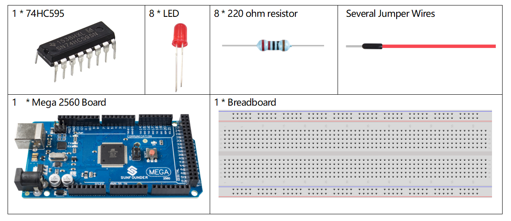
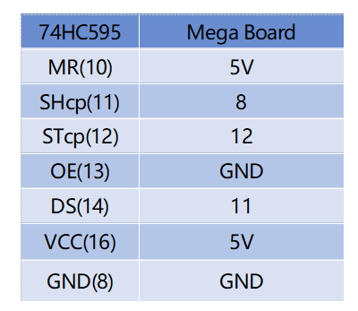
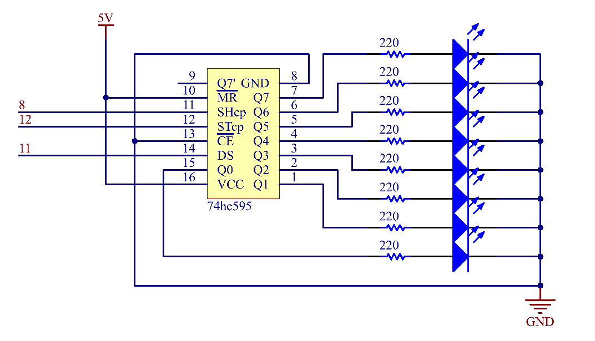
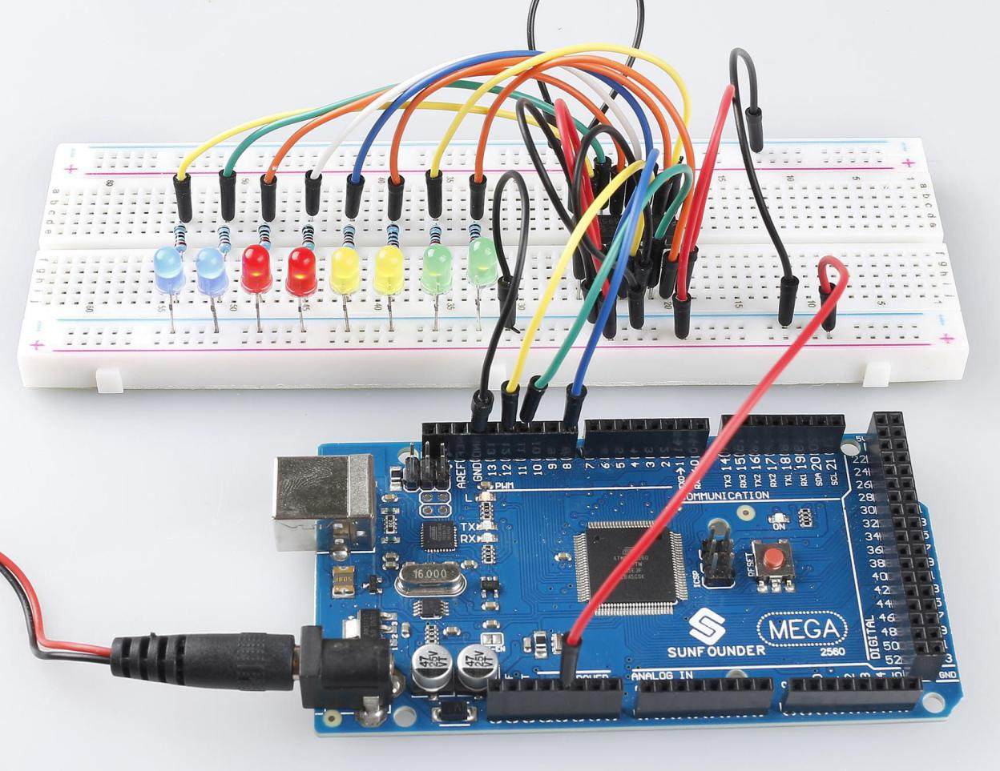

.. note:: 

    Bonjour et bienvenue dans la communauté des passionnés de Raspberry Pi, Arduino et ESP32 de SunFounder sur Facebook ! Plongez dans l'univers du Raspberry Pi, d'Arduino et de l'ESP32 avec d'autres passionnés.

    **Pourquoi nous rejoindre ?**

    - **Assistance d'experts** : Résolvez vos problèmes après achat et vos défis techniques avec l'aide de notre communauté et de notre équipe.
    - **Apprendre et partager** : Échangez des astuces et des tutoriels pour perfectionner vos compétences.
    - **Aperçus exclusifs** : Accédez en avant-première aux annonces de nouveaux produits et aux aperçus.
    - **Réductions spéciales** : Profitez de réductions exclusives sur nos derniers produits.
    - **Promotions festives et concours** : Participez à des concours et promotions pendant les fêtes.

    👉 Prêt à explorer et créer avec nous ? Cliquez sur [|link_sf_facebook|] et rejoignez-nous dès aujourd'hui !

.. _ar_74hc595:

2.6 74HC595
=============================

Aperçu
-----------------

Dans cette leçon, vous apprendrez à utiliser le 74HC595. Le 74HC595 est 
composé d'un registre à décalage de 8 bits et d'un registre de stockage 
avec des sorties parallèles à trois états. Il convertit l'entrée série 
en sortie parallèle, permettant d'économiser les ports d'E/S d'un microcontrôleur.

Composants requis
--------------------------------

* :ref:`cpn_mega2560`
* :ref:`cpn_breadboard`
* :ref:`cpn_wires`
* :ref:`cpn_led`
* :ref:`cpn_resistor`
* :ref:`cpn_74hc595`

Schéma de Connexion
--------------------------

.. image:: img/image433.png

Dans cet exemple, nous utilisons le 74HC595 pour contrôler une série de LEDs. 
Connectez chaque broche de sortie de données (Q0-Q7) à une résistance de 220 
ohms, puis aux LEDs. Le schéma de câblage est le suivant :

Diagramme Schématique
---------------------------

Code
---------------

.. note::

    * Vous pouvez ouvrir directement le fichier ``2.6_74HC595.ino`` situé dans le chemin ``sunfounder_vincent_kit_for_arduino\code\2.6_74HC595``.
    * Ou copiez ce code dans l'IDE Arduino.

.. raw:: html

    <iframe src=https://create.arduino.cc/editor/sunfounder01/05372471-c560-489b-9ef4-dba100c47038/preview?embed style="height:510px;width:100%;margin:10px 0" frameborder=0></iframe>

Après avoir téléversé le code sur la carte Mega2560, vous verrez les LEDs s'allumer successivement.

Analyse du Code
--------------------

Déclarez un tableau pour stocker plusieurs nombres binaires de 8 bits utilisés pour changer l'état des huit LEDs contrôlées par le 74HC595. 

.. code-block:: arduino

    int datArray[] = {B00000000, B00000001, B00000011, B00000111, B00001111, B00011111, B00111111, B01111111, B11111111};

Placez d'abord STcp à un niveau bas, puis à un niveau haut, ce qui génère une impulsion de front montant pour STcp.

.. code-block:: arduino

    digitalWrite(STcp,LOW); 

La fonction shiftOut() envoie un octet de données bit par bit, transférant les données dans datArray[num] vers le registre à décalage via la broche DS. MSBFIRST indique un déplacement des bits les plus significatifs aux moins significatifs.

.. code-block:: arduino

    shiftOut(DS,SHcp,MSBFIRST,datArray[num]);

Après l'exécution de digitalWrite(STcp, HIGH), STcp passe au front montant, déplaçant alors les données du registre à décalage vers le registre de stockage. 

.. code-block:: arduino

    digitalWrite(STcp,HIGH);

Après 8 itérations, un octet de données est transféré dans le registre de stockage, puis les données du registre de stockage sont envoyées au bus (Q0-Q7). Par exemple, shiftOut("B00000001") allumera la LED contrôlée par Q0 et éteindra celles contrôlées par Q1 à Q7.

Illustration du Phénomène
----------------------------

