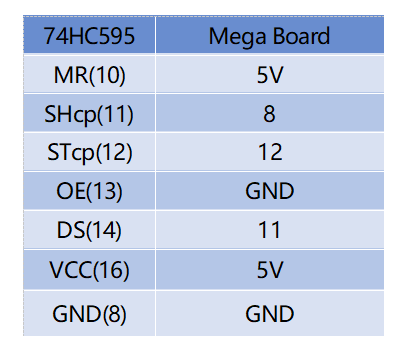

.. _ar_74hc595:

2.6 74HC595
=============================

Overview
-----------------

In this lesson, you will learn how to use 74HC595. 74HC595 consists of
an 8−bit shift register and a storage register with three−state parallel
outputs. It converts serial input into parallel output so you can save
IO ports of an MCU.

Components Required
--------------------------------

.. image:: img/list_2.6.png

* :ref:`cpn_mega2560`
* :ref:`cpn_breadboard`
* :ref:`cpn_wires`
* :ref:`cpn_led`
* :ref:`cpn_resistor`
* :ref:`cpn_74hc595`

Fritzing Circuit
--------------------------

.. image:: img/image433.png

In this example, we use 74HC595 to control LED. Give each data output
pin（Q0-Q7）a 220 ohm resistor then connect them to LED. The wiring
diagram is as follows:

Schematic Diagram
---------------------------

Code
---------------

.. note::

    * You can open the file ``2.6_74HC595.ino`` under the path of ``sunfounder_vincent_kit_for_arduino\code\2.6_74HC595`` directly.
    * Or copy this code into Arduino IDE.

.. raw:: html

    <iframe src=https://create.arduino.cc/editor/sunfounder01/05372471-c560-489b-9ef4-dba100c47038/preview?embed style="height:510px;width:100%;margin:10px 0" frameborder=0></iframe>

When you finish uploading the codes to the Mega2560 board, you can see the LEDs turning on one after another.

Code Analysis
--------------------

Declare an array, store several 8 bit binary numbers that are used to change the working state of the eight LEDs controlled by 74HC595. 

.. code-block:: arduino

    int datArray[] = {B00000000, B00000001, B00000011, B00000111, B00001111, B00011111, B00111111, B01111111, B11111111};

Set STcp to low level first and then high level. It will generate a rising edge pulse of STcp.

.. code-block:: arduino

    digitalWrite(STcp,LOW); 

shiftOut() is used to shift out a byte of data one bit at a time, which means to shift a byte of data in datArray[num] to the shifting register with the DS pin. MSBFIRST means to move from high bits.

.. code-block:: arduino

    shiftOut(DS,SHcp,MSBFIRST,datArray[num]);

After digitalWrite(STcp,HIGH) is run, the STcp will be at the rising edge. At this time, the data in the shift register will be moved to the memory register. 

.. code-block:: arduino

    digitalWrite(STcp,HIGH);

A byte of data will be transferred into the memory register after 8 times. Then the data of memory register are output to the bus (Q0-Q7). For example, shiftout「B00000001」will light up the LED controlled by Q0 and turn off the LED controlled by Q1~Q7. 

Phenomenon Picture
----------------------------

