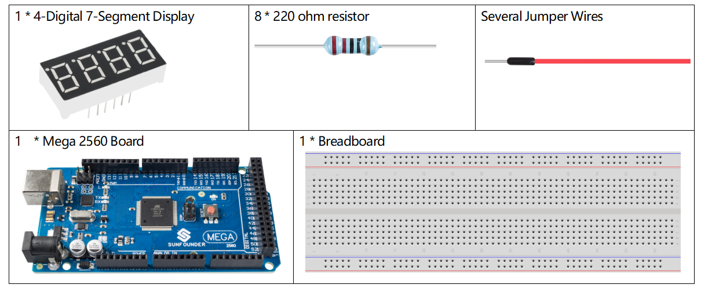
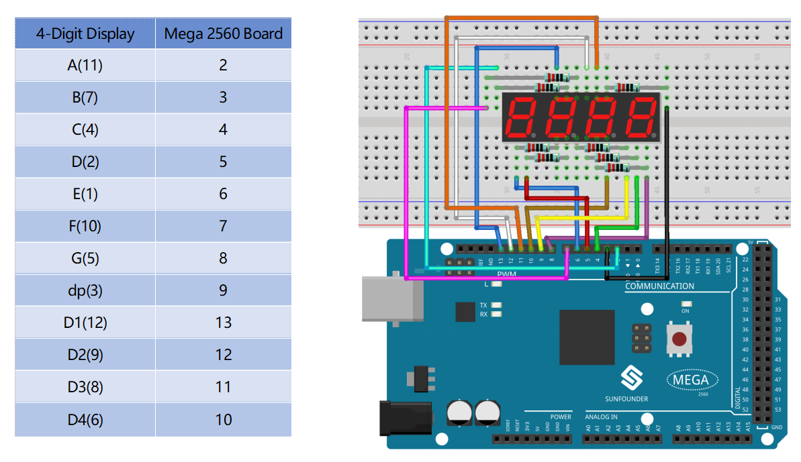
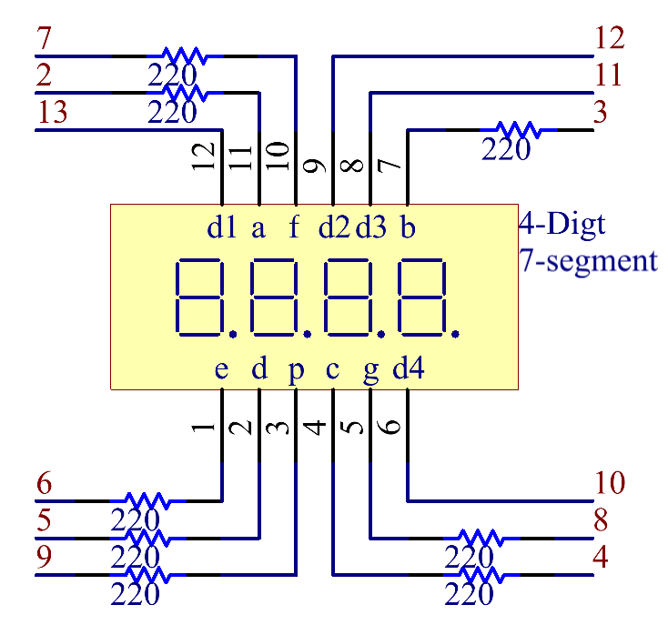
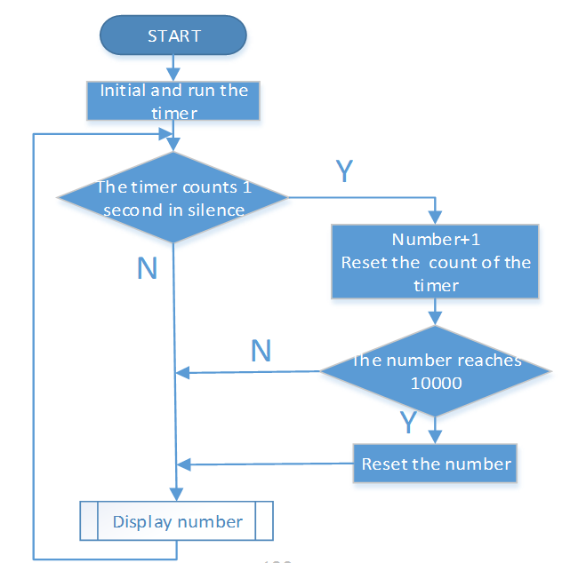
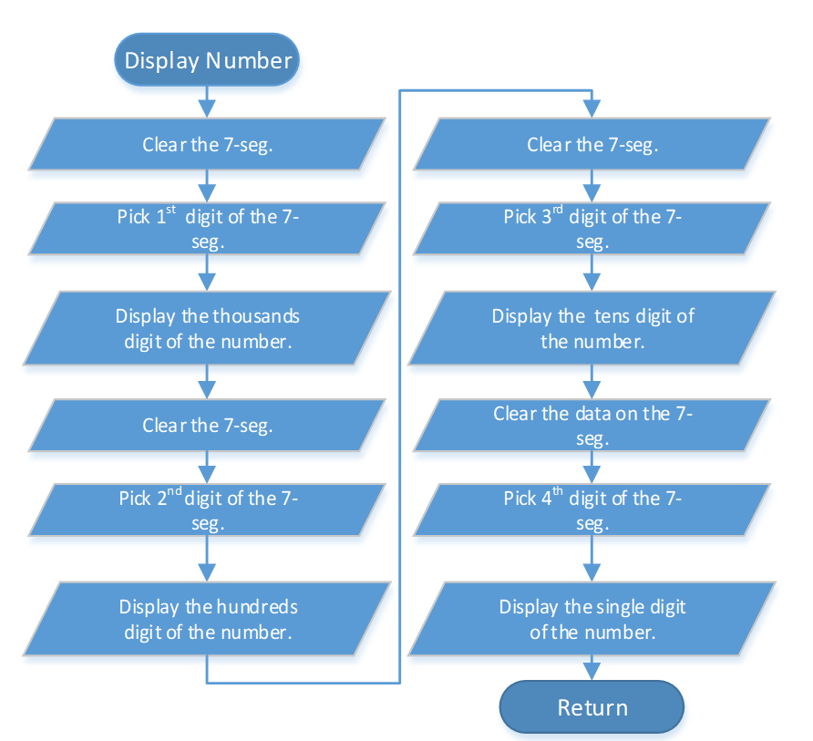
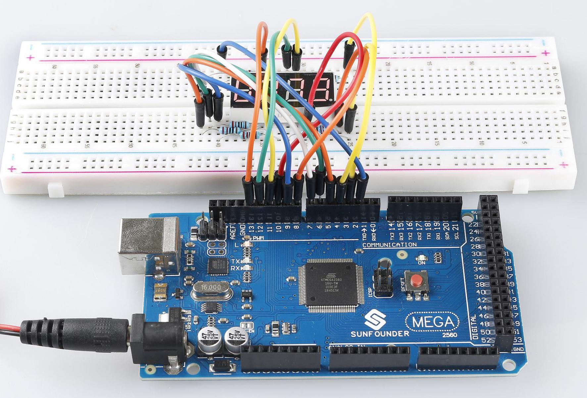

.. _ar_4_digit:

2.7 4-Digital 7-Segment Display
================================

Overview
---------

In this lesson, you will learn about the 4-Digital 7-Segment Display. It
consists of four 7-segment displays working together so as to display 4
digit numbers.

Components Required
-------------------

* :ref:`cpn_mega2560`
* :ref:`cpn_breadboard`
* :ref:`cpn_wires`
* :ref:`cpn_resistor`
* :ref:`cpn_4_digit`

Fritzing Circuit
----------------

Schematic Diagram
-----------------

Code
----

.. note::

    * You can open the file ``2.7_4digitalSegment.ino`` under the path of ``sunfounder_vincent_kit_for_arduino\code\2.7_4digitalSegment`` directly.
    * The ``TimerOne`` library is used here, you can install it from the **Library Manager**.

        .. image:: img/lib_timerone.png
            :align: center
    
.. raw:: html

    <iframe src=https://create.arduino.cc/editor/sunfounder01/1a717c75-35df-4674-be90-a5d290f7065d/preview?embed style="height:510px;width:100%;margin:10px 0" frameborder=0></iframe>

Code Analysis
-------------

There are two points needing your attention:

1. Because every segment display works independently in the 4-Digital 7-Segment Display, the principle of visual persistence is applied to quickly display every 7 segment character in turn to form a continuous character string. 

Refer to :ref:`ar_7_segment` to check the details of the number display of the 4-Digital 7-Segment Display.

2. In this example, a library TimerOne.h is used to realize the function of counting. 

.. code-block:: arduino

    #include "TimerOne.h"

**Library Functions**

.. code-block:: arduino

    void initialize(long microsenconds=1000000)

You must call this method first to use any of the other methods. You can optionally specify the timer's period here (in microseconds), by default it is set at 1 second. 

.. note:: 
    This breaks analogWrite() for digital pins 9 and 10 on Arduino.

.. code-block:: arduino

    void attachInterrupt(void (*isr)(), long microseconds=-1);

Calls a function at the specified interval in microseconds. Be careful about trying to execute too complicated of an interrupt at too high of a frequency, or the CPU may never enter the main loop and your program will 'lock up'. Note that you can optionally set the period with this function if you include a value in microseconds as the last parameter when you call it.

.. code-block:: arduino

    void detachInterrupte();

Disables the attached interrupt.

Phenomenon Picture
------------------

