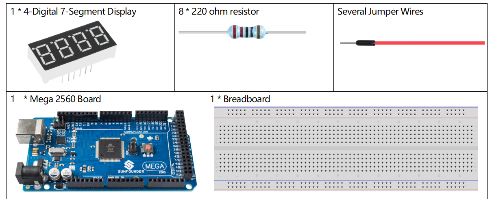
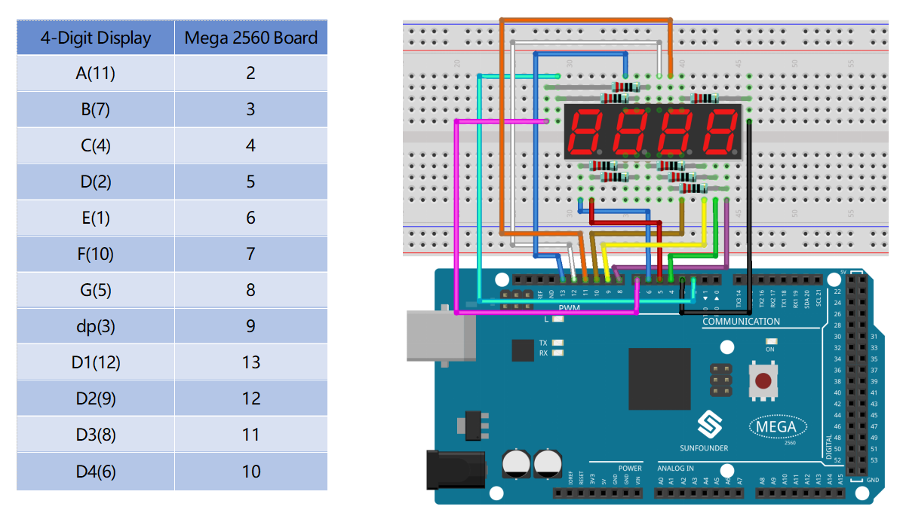
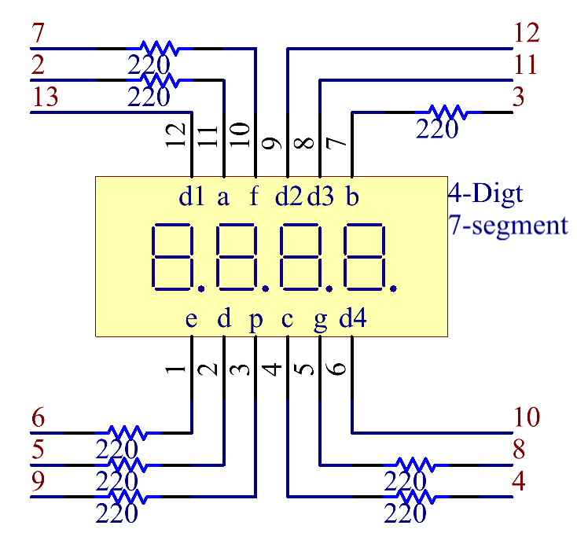
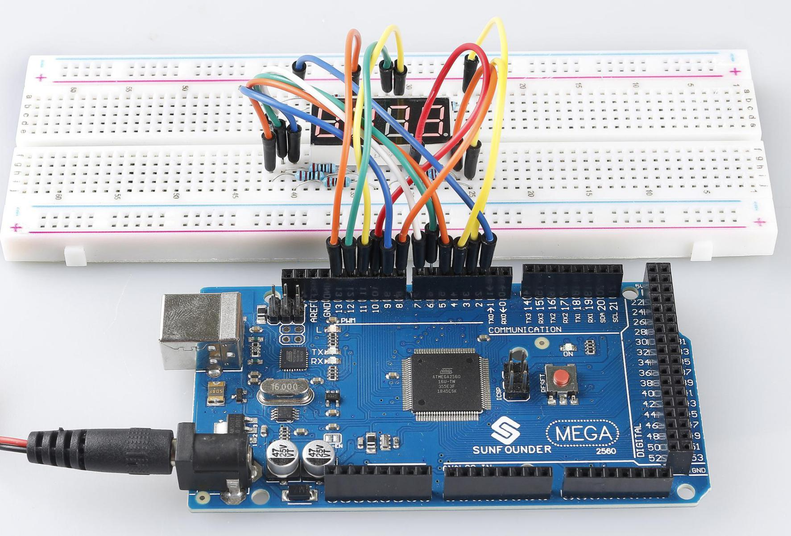

.. note:: 

    ¡Hola, bienvenido a la Comunidad de Entusiastas de Raspberry Pi, Arduino y ESP32 en Facebook! Profundiza en Raspberry Pi, Arduino y ESP32 junto a otros entusiastas.

    **¿Por qué unirse?**

    - **Soporte experto**: Resuelve problemas postventa y desafíos técnicos con la ayuda de nuestra comunidad y equipo.
    - **Aprender y compartir**: Intercambia consejos y tutoriales para mejorar tus habilidades.
    - **Vistas previas exclusivas**: Obtén acceso anticipado a nuevos anuncios de productos y avances.
    - **Descuentos especiales**: Disfruta de descuentos exclusivos en nuestros productos más nuevos.
    - **Promociones festivas y sorteos**: Participa en sorteos y promociones especiales de temporada.

    👉 ¿Listo para explorar y crear con nosotros? Haz clic en [|link_sf_facebook|] y únete hoy mismo.

.. _ar_4_digit:

2.7 Pantalla de 7 Segmentos de 4 Dígitos
==========================================

Resumen
----------

En esta lección, aprenderás sobre la pantalla de 7 segmentos de 4 dígitos. 
Consiste en cuatro pantallas de 7 segmentos que trabajan juntas para mostrar 
números de hasta 4 dígitos.

Componentes necesarios
-------------------------

* :ref:`cpn_mega2560`
* :ref:`cpn_breadboard`
* :ref:`cpn_wires`
* :ref:`cpn_resistor`
* :ref:`cpn_4_digit`

Circuito Fritzing
--------------------

Diagrama esquemático
----------------------

Código
--------

.. note::

    * Puedes abrir el archivo ``2.7_4digitalSegment.ino`` en la ruta ``sunfounder_vincent_kit_for_arduino\code\2.7_4digitalSegment`` directamente.
    
.. raw:: html

    <iframe src=https://create.arduino.cc/editor/sunfounder01/1a717c75-35df-4674-be90-a5d290f7065d/preview?embed style="height:510px;width:100%;margin:10px 0" frameborder=0></iframe>

Análisis del código
---------------------

Esencialmente, este código utiliza el principio de multiplexación para mostrar un número de 4 dígitos en una pantalla de 7 segmentos. Cambiando rápidamente entre los dígitos y mostrando un dígito a la vez, crea la ilusión de que todos los dígitos se muestran simultáneamente. La funcionalidad de cronómetro se logra utilizando la función ``millis()`` para llevar un seguimiento del tiempo e incrementar el número mostrado cada segundo.

#. Definición de variables y constantes:

    .. code-block:: arduino

        int segmentPins[] = {2, 3, 4, 5, 6, 7, 8, 9};
        int digitPins[] = {13, 12, 11, 10};

        long n = 0; // Variable para almacenar el número actual del cronómetro
        int del = 5; // Tiempo de retardo (en milisegundos) para mantener cada dígito iluminado
        unsigned long previousMillis = 0; // Almacena el último tiempo de incremento del cronómetro
        const long interval = 1000; // Intervalo de un segundo (en milisegundos)

    * Los arrays ``segmentPins`` y ``digitPins`` definen los pines conectados a los segmentos y a los dígitos de la pantalla de 7 segmentos, respectivamente.
    * ``n`` es una variable long que lleva el conteo del número del cronómetro, comenzando en 0 e incrementando.
    * ``del`` es un tiempo de retardo para mantener la visualización del dígito actual antes de pasar al siguiente.
    * ``previousMillis`` e ``interval`` están relacionados con el tiempo para decidir cuándo incrementar el cronómetro.

#. Patrones de los números en 7 segmentos:

    El array 2D ``numbers`` define cómo se representa cada uno de los números del 0 al 9 en una pantalla de 7 segmentos de cátodo común. Cada sub-array tiene 8 valores (HIGH o LOW), que corresponden a los 7 segmentos y un punto decimal. Este patrón permite controlar los segmentos adecuados para cada número.

    .. code-block:: arduino

        byte numbers[10][8] = {
            {HIGH, HIGH, HIGH, HIGH, HIGH, HIGH, LOW, LOW},  // 0
            {LOW, HIGH, HIGH, LOW, LOW, LOW, LOW, LOW},      // 1
            {HIGH, HIGH, LOW, HIGH, HIGH, LOW, HIGH, LOW},   // 2
            {HIGH, HIGH, HIGH, HIGH, LOW, LOW, HIGH, LOW},   // 3
            {LOW, HIGH, HIGH, LOW, LOW, HIGH, HIGH, LOW},    // 4
            {HIGH, LOW, HIGH, HIGH, LOW, HIGH, HIGH, LOW},   // 5
            {HIGH, LOW, HIGH, HIGH, HIGH, HIGH, HIGH, LOW},  // 6
            {HIGH, HIGH, HIGH, LOW, LOW, LOW, LOW, LOW},     // 7
            {HIGH, HIGH, HIGH, HIGH, HIGH, HIGH, HIGH, LOW}, // 8
            {HIGH, HIGH, HIGH, HIGH, LOW, HIGH, HIGH, LOW}   // 9
        }; 

#. Función ``setup``:

    .. code-block:: arduino

        void setup() {
            // Configura todos los pines de segmento y dígito como OUTPUT
            for (int i = 0; i < 8; i++) {
                pinMode(segmentPins[i], OUTPUT);
            }
            for (int i = 0; i < 4; i++) {
                pinMode(digitPins[i], OUTPUT);
                digitalWrite(digitPins[i], HIGH); // Apaga inicialmente todos los dígitos (para pantallas de cátodo común, HIGH es OFF)
            }
        }

    * Todos los pines de segmento y dígito se configuran en modo OUTPUT ya que controlarán los segmentos y dígitos de la pantalla.
    * Inicialmente, todos los dígitos se apagan, denotado al escribir HIGH para una pantalla de cátodo común.

#. Bucle principal ``loop``:

    .. code-block:: arduino

        void loop() {
            // Comprueba si ha pasado un segundo desde el último incremento
            if (millis() - previousMillis >= interval) {
                previousMillis += interval; // Actualiza el último tiempo de incremento
                n = (n + 1) % 10000; // Incrementa el número del cronómetro y reinicia en 9999
            }

            displayNumber(n); // Muestra el número actual del cronómetro en la pantalla de 7 segmentos
        }

    * Esta sección comprueba si ha pasado el intervalo (configurado a 1000ms o 1 segundo) desde el último incremento del cronómetro. Si es así, incrementa el número.
    * El número se muestra en la pantalla de 7 segmentos mediante la función ``displayNumber()``.

#. Función ``displayNumber``:

    .. code-block:: arduino

        // Función para mostrar un número de 4 dígitos en la pantalla de 7 segmentos
        void displayNumber(long num) {
            for (int digit = 0; digit < 4; digit++) {
                clearLEDs(); // Apaga todos los segmentos y dígitos
                pickDigit(digit); // Activa el dígito actual
                int value = (num / (int)pow(10, 3 - digit)) % 10; // Extrae el dígito específico del número
                pickNumber(value); // Ilumina los segmentos para mostrar el dígito
                delay(del); // Mantiene el dígito iluminado por un breve tiempo
            }
        }

    * Esta función descompone el número de 4 dígitos en dígitos individuales y muestra cada dígito uno a la vez en rápida sucesión. Esto crea la ilusión de que todos los dígitos se muestran simultáneamente debido a la persistencia de la visión.
    * Para cada dígito, la función primero apaga todos los LEDs, selecciona el dígito correspondiente con ``pickDigit()`` y luego muestra el número en ese dígito usando ``pickNumber()``.
    * El ``delay (del)`` asegura que cada dígito sea visible por un breve tiempo antes de pasar al siguiente.

#. Función ``pickDigit``:

    Esta función selecciona (o enciende) uno de los cuatro dígitos en la pantalla de 7 segmentos. Esto se logra configurando el pin de dígito correspondiente en LOW.

    .. code-block:: arduino

        void pickDigit(int x) {
            digitalWrite(digitPins[x], LOW); // Enciende el dígito seleccionado (para pantallas de cátodo común, LOW es ON)
        }

#. Función ``pickNumber``:

    Dado un solo número (0-9), esta función enciende los segmentos de la pantalla de 7 segmentos para mostrar ese número. Utiliza el array ``numbers`` definido anteriormente para saber qué segmentos encender o apagar.

    .. code-block:: arduino

        void pickNumber(int x) {
            for (int i = 0; i < 8; i++) {
                digitalWrite(segmentPins[i], numbers[x][i]); // Configura cada segmento según el patrón para el número dado
            }
        }

#. Función ``clearLEDs``:

    Como su nombre indica, esta función apaga todos los segmentos y dígitos. Se utiliza para asegurar que solo un dígito esté activo a la vez durante el proceso de multiplexación en la función ``displayNumber``.

    .. code-block:: arduino

        void clearLEDs() {
            for (int i = 0; i < 8; i++) {
                digitalWrite(segmentPins[i], LOW); // Apaga todos los segmentos
            }
            for (int i = 0; i < 4; i++) {
                digitalWrite(digitPins[i], HIGH); // Apaga todos los dígitos
            }
        }

Imagen del fenómeno
----------------------

